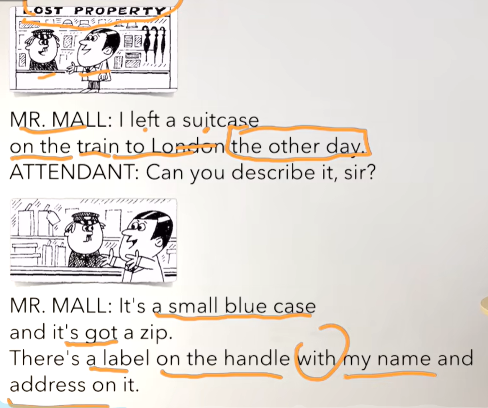
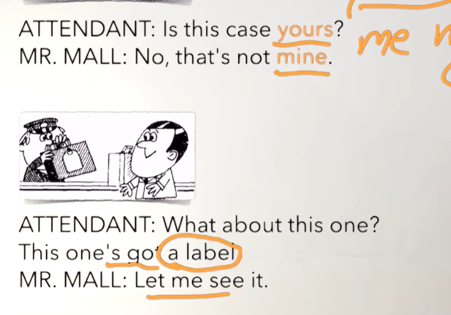
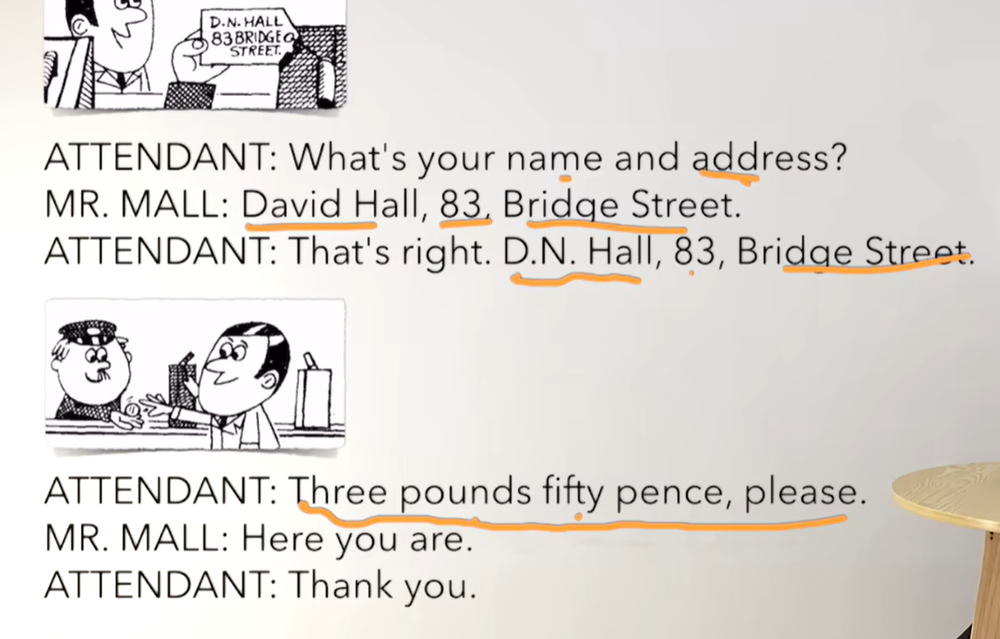
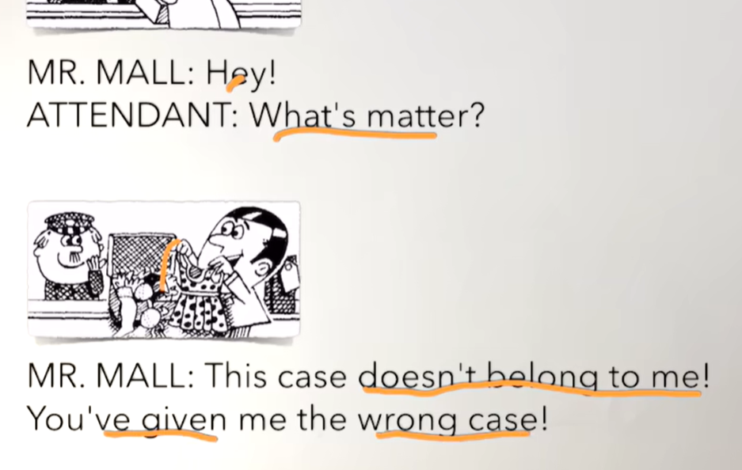
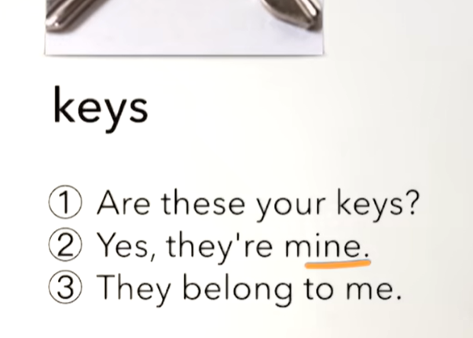
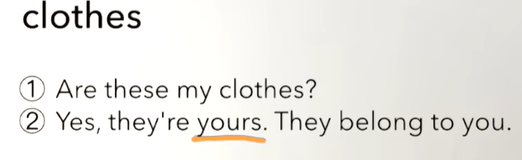
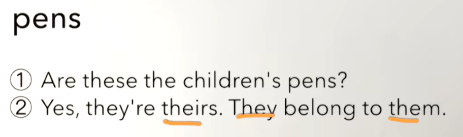
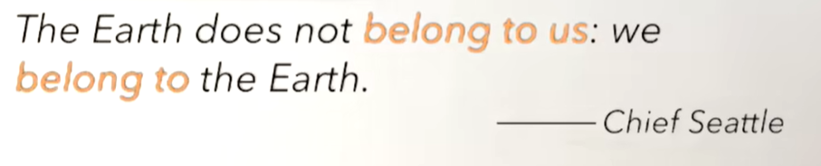

# 52、lesson97-98-handle处理某事&belong属于某人

## lesson97


### 1、Question

#### 	1、如何表达 你能处理某事么？

​		Can you handle this？-- 你能处理某事么


#### 	2、如何表达 属于某人？

​	1、belong to sb -- 属于某人

​	2、This cat belongs to me -- 这个猫属于我


### 2、Word

#### 	1、leave  -- 离开，遗留，落下 -- left left

​	1、I left my bag upstairs -- 我把我的包遗留在楼上了

​	2、I'll get it for you -- 我帮你拿

​	3、Did you leave your bag upstairs？ 你的包落在楼上了吗？

​	4、What did your leave upstairs？ -- 你把什么落在楼上了？


#### 	2、describe -- v 描述

​	1、Can you describe that for me ？ -- 你能帮我描述一下吗？

​	2、I can describe that -- 我可以描述这个东西

​	3、You must describe that first -- 你必须先描述一下这个东西


#### 	3、zip -- n 拉链

​	1、I need to buy a new zip -- 我需要购买一个新拉链

​	2、He's gonna buy a new zip soon -- 他很快就会去买一个新拉链

​	3、You'd better buy a new zip -- 你最好买一个新拉链


#### 	4、label -- n 标签

​	1、There is a label on the bottle have a look at it -- 瓶子上有个标签，你看一下

​	2、Is There a label on the bottle？ -- 瓶子上有个标签吗？


#### 	5、handle -- n v 把手，处理

​	1、He cleans the door handle everyday -- 他每天清理门把手

​	2、Can you handle this ？ -- 你能处理好这节事情吗？


#### 	6、address -- n 地址

​	1、What's your address？ -- 你的地址是什么？


#### 	7、belong -- v 属于

​	1、belong to sb -- 属于某人

​	2、This cat belongs to me -- 这个猫属于我

​	3、Does this cat belong to you？ -- 这个猫属于你吗？ -- 这个用的比较少

​	4、Is this your cat ？ -- 这是你的猫吗？ -- 这个比较常用


### 3、Homework

```
1、绿皮书

2、文章熟读成诵

3、核心知识点
	这节主要讲了 handle除了代表 把手之外，还有另外一个含义是 处理
		Can you handle this？ -- 你能处理这个事情吗？
	然后是belong to sb -- 表示属于某人
		This cat belong to me -- 这个猫属于我
```


### 4、Story




​	我遗失了一个行李箱

​	在几天前去伦敦的火车上

​	你可以描述一下它吗，先生？

​	它是一个小的绿色箱子，而且它有一个拉链

​	在把手上面有一个标签上有我的名字和地址




​	这个箱子是你的吗？

​	不，那不是我的

​	这一个呢？

​	这个有一个标签

​	让我看一下




​	你的名字和地址是什么？

​	戴维 汉 大桥街83号

​	没问题。。。

​	三英镑 五十便士（分）

​	给你

​	谢谢




​	嘿！

​	怎么了？

​	这个箱子不属于我

​	你给错我箱子了


## lesson98


### 1、Practices













