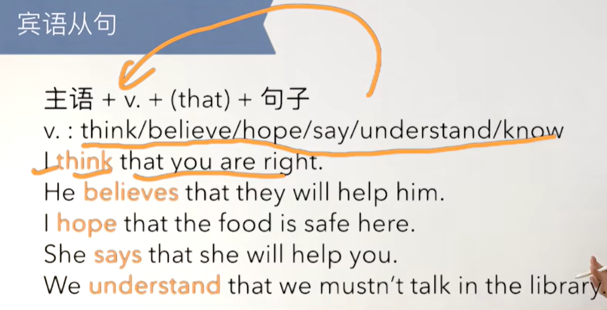
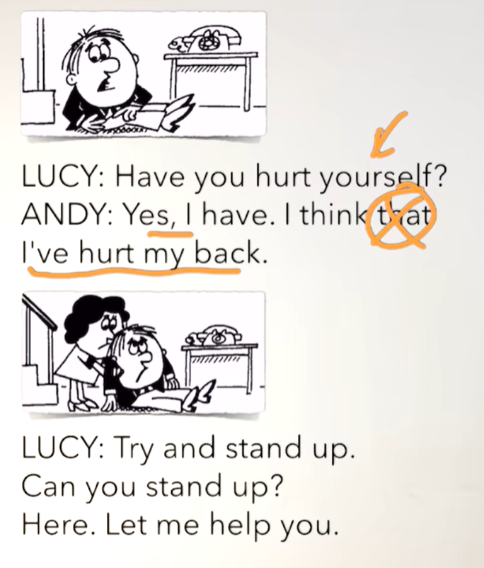
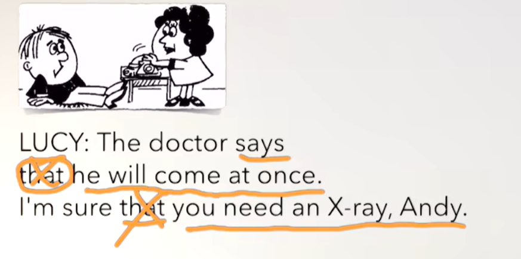

# 53、lesson99-100-宾语从句

# lesson99

## 1、Question

#### 	1、如何使用宾语从句？

​			主语 + v. + （that） + 句子 --- that 可以省略

#### 	2、如何表达 你确定么？

​		Are you sure？

​		Are you sure about this？ -- 关于这个事情你确定吗？

## 2、宾语从句

​	定义：一个句子充当宾语，这个句子叫宾语从句

​	英语的宾语和中文的宾语几乎是类似的，例如 我爱你--你就是宾语，I love you -- 这个you就是宾语

​	如：I hope that you've got some money -- 我希望你有很多钱

​		I 主， hope谓语，that you've got some money是宾语

​	

​	I believe that this house is for sale -- 我相信这个房子是出售的

​		主语 + v. + （that） + 句子 --- that 可以省略

 

## 3、Word

#### 	1、slip -- 滑

​		1、I slipped -- 我滑倒了

​		2、Did you slip？ -- 你滑倒了吗？

​		3、How did you slip？ -- 你怎么滑倒了？

#### 	2、fall fell fallen -- 落下 downstairs -- 楼下

​	1、I fell downstairs -- 我掉到楼下了

​	2、Did you fall downstairs？ -- 你掉到楼下了吗？

​	3、Be careful， don't fall down -- 小心，别掉下去

#### 	3、hurt v -- 伤害了，受伤， back -- 背面

​	1、I hurt my back yesterday -- 我昨天伤了背

​	2、She hurts her back every summer -- 她每年夏天弄伤她的背

​	3、Why does she hurt her back every summer？ -- 为什么她每年夏天都弄伤她的背？

#### 	4、stand up -- 起立 

​		1、sit down -- 坐下

#### 	5、at once -- 立刻，马上

​	 1、Can you come at once？ -- 你能马上来吗？

​	2、Will the doctor see me at once？ -- 医生能立刻看一下我吗？

#### 	6、X-ray -- x光片

​	1、She needs an X-ray -- 她需要一个X光片

​	2、Does she need an X-ray？

​	3、Why does she need an X-ray？

##  4、Story

​	对不起 Lucy

​	我恐怕不能站起来

​	我认为你最好去看医生

​	我这就给Carter医生打电话

​	医生说他会马上过来

 

# lesson100

 

 

