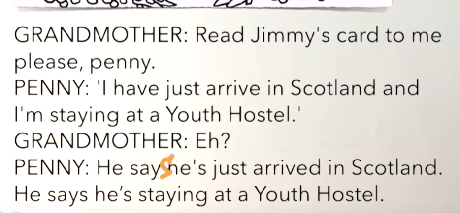
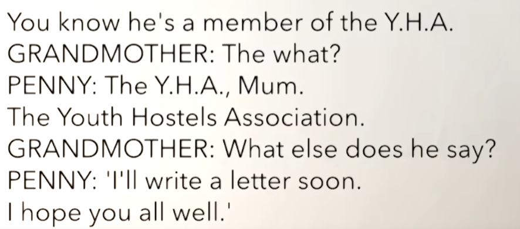
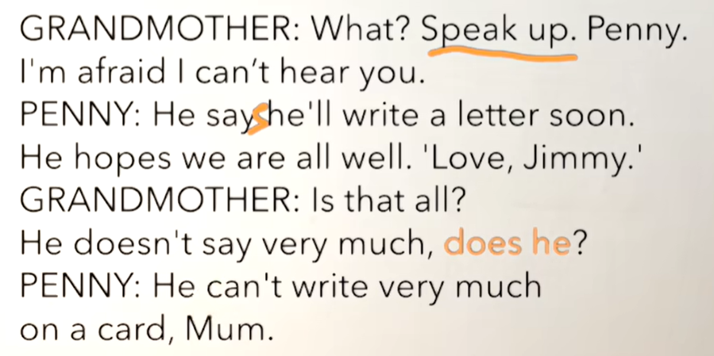
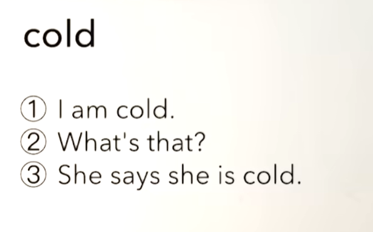

# 54、lesson101-102-直接/间接引语

# lesson101

## 1、Question

#### 	1、直接引语与间接引语？

​		直接引语就是把别人说的话，加上引号直接拿过来

​		间接引语就是把别人说的话，调整一下人称然后再给别人说一遍

​	

​	如：The doctor says，“I will come at once” -- 医生说，我立刻就来

​	间接引语：The doctor says that he will come at once -- 医生说，他很快就来

​		1、间接引语去掉引号，2转换人称，3添加引导词that

​	如：He says “I can do it”

​			He says that he can do it

​			He says，“I feel tired”  间接 He says that he **feels** tired

#### 	2、如何表达 写信给某人？

​	1、write to sb -- 写信给某人

​	2、You haven't written to me for a long time -- 你好久没有给我写信了

## 2、Word

#### 	1、Scotland -- 苏格兰

​	1、Scotland

​	2、England -- 英格兰

​	3、Wales -- 威尔士

​	4、Northern Ireland -- 北爱尔兰

#### 	2、card -- 卡片

​	1、postcard -- 明信卡

​	2、business card -- 商务卡片

​	3、ID card -- 身份卡片

​	4、We bought some postcards yesterday -- 我们昨天买了一些明信片

​	5、He buys a postcard every summer -- 他每年夏天购买一张明信片

​	6、Do you have a business card？ -- 你有一张商务卡吗？

​	7、Show me your ID card please -- 请给我展示一下你的身份证

#### 	3、youth --青年 hostel -- 旅馆，association -- 协会

​	1、YHA -- 青年住宿协会 -- 青年旅社

#### 	4、soon -- 立刻，马上

​		很多时候在一般将来时使用

​	1、He will write a letter soon -- 他马上会写一封信

​	2、Will he a letter soon？

#### 	5、write wrote written -- 写

​	1、write to sb -- 写信给某人

​	2、You haven't written to me for a long time -- 你好久没有给我写信了

​		先确定这个是现在完成时，然后确定一下这个是言之过去还是意在当下，这个 for long time代表说的是过去

​	3、I wrote a letter to him last week -- 我上周给他写了一封信

​	4、I'm gonna write you a letter soon -- 我很快将要给你写一封信

​	5、Did you write to me？ -- 你之前有写信给我吗？

## 3、Story

#### 	1、如何使用反义疑问句？

​		前肯后否，前否后肯

​		He doesn't say very much，does he？-- 他说的不多，是吗？

​		前后人称时态应保持一致

​	例子：

​		1、Leo is in Tokyo，isn't he？ -- Leo在东京，不是吗？

​		2、Leo goes to school on foot，doesn't he ？ -- Leo步行去学校，不是吗？

#### 	2、正文

  

​	penny 请帮我读一下 Jimmy 给我的卡片	

​	我刚刚到苏格兰并且我正待在一个纽约青年旅社

​	他说 他刚刚到达苏格兰

​	他说他正在一个青年旅社

​		你知道他是青年住宿协会的会员

​	什么？

​	是YHA妈妈，青年住宿协会

​	他还说其他什么的了？

​	我很快就会写一封信，我希望你们都还挺好的

​	什么？说大声点Penny，我恐怕我不能听到你

​	他说 他马上回写一封信，我希望我们都都好

​	这就是全部了吗？他说的不多是吗？

​	他没办法在卡片上写很多，妈妈

# lesson102

## 	1、Practices

 

​	

 

