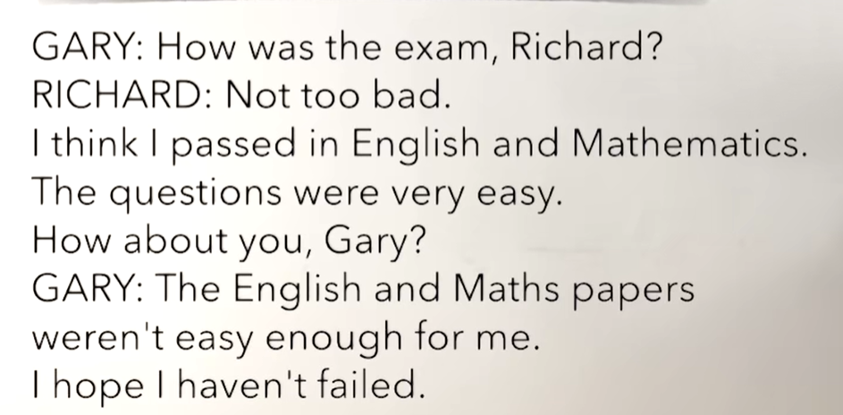
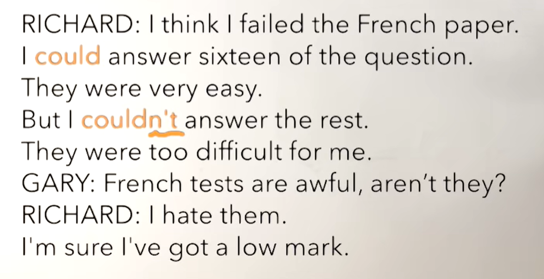
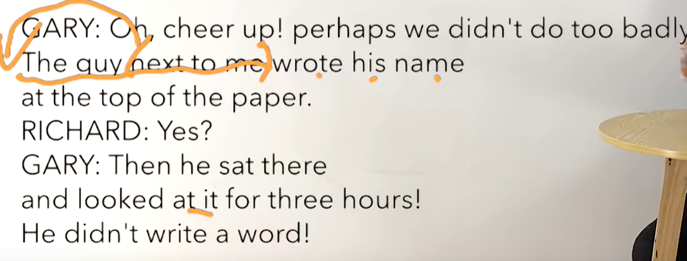
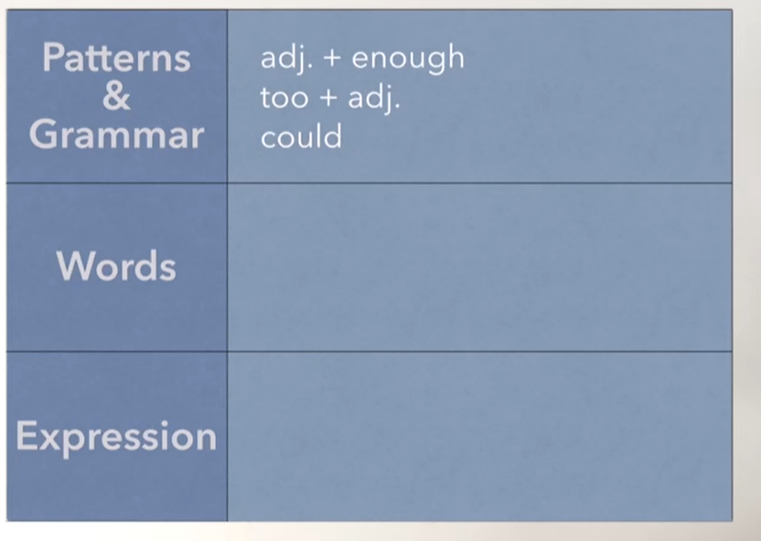

# 55、lesson103-104-如何使用too&enough&could


# lesson103


## 1、Question

#### 	1、如何使用too&enough？

##### 	enough -- 足够 too--也 过于

​	adj+enough 

​	too + adj

​		1、This is big enough

​		2、This is too big -- 这个too有负面的感情色彩


#### 	2、如何表达 共度余生？

​		I wanna spend the rest of my life with him -- 我想要和他共度余生

​		the rest of my life -- 共度余生


#### 	3、如何表达 振作起来？

​		cheer up -- 开心一点，振作起来


## 2、Word

#### 	1、enough -- 足够 too--也 过于

​	adj+enough 

​	too + adj

​		1、This is big enough

​		2、This is too big -- 这个too有负面的感情色彩


#### 	2、exam -- n 考试  pass -- v 通过

​	1、pass the exam -- 通过考试

​	2、I passed the exam -- 之前我通过考试了

​	3、Did you pass the exam？ -- 你之前通过考试了吗？

​	4、How did you pass the exam？ -- 你之前如何通过考试的？


#### 	3、fail -- v 失败，不及格

​	1、fail the exam -- 考试不及格

​	2、He fail the exam -- 他考试不及格

​	3、Did he fail the exam? -- 他之前考试不及格吗？


#### 	4、mathematics  math -- 数学 

​	1、I like math What about you？ -- 我喜欢数学，你呢？

​	2、Do you like math？ -- 你喜欢数学吗？

​	3、Why don't you like math？ -- 你为什么不喜欢数学


#### 	5、Question -- n 问题，answer-- v 回答

​	1、answer my Question -- 回答我的问题

​	2、Can you answer my Question？ -- 你能回答我的问题吗？

​	3、I can't answer your question -- 我不能回答你的问题

​	4、Why can't you answer my question？ -- 你为什么不能回答我的问题

​	5、I have already answered your question -- 我已经回答了你的问题 -- 现在完成时have + done


#### 	6、easy -- adj 容易的，difficult -- adj 困难的 hard也有困难的意思 

​	1、I think that English is very easy -- 我认为英语非常简单

​	2、Math is too difficult -- 数学很难	

​	3、This is so easy -- 这个事情太简单了

​	

#### 	7、paper -- 纸 试卷

​	1、I need some paper -我需要一些纸

​	2、The English paper is too difficult -- 这个英文试卷太难了

​	3、The math paper is easy enough -- 这个数学试卷足够简单


#### 	8、mark -- n 分数，标识， low -- adj 低

​	1、I have got a low mark -- 我得了一个低分

​	2、He has got a low mark

​		have got -- 拥有

​	3、Why hasn't he got a low mark -- 他为什么没有获得一个低分？


#### 	9、hate -- v 厌恶，恨

​	1、I hate you -- 我讨厌你

​	2、Do you hate me？ -- 你讨厌我吗？

​	3、Why do you hate me -- 你为什么恨我？


#### 	10、cheer up -- 开心一点，振作起来


#### 	11、guy -- n 家伙

​	1、I know that guy --- 我认识那个家伙

​	2、Do you know that guy ？


#### 	12、top -- 顶部，在...之上

​	1、on the top of the paper/mountain -- 在试卷的上方、在山的顶上

​	2、Look， that man is standing on the top of the mountain -- 看那个男人站在山的顶部


## 3、Homework

```
1、单词造句 3

2、初级红皮书查看 too enough

3、核心知识点
	这节主要讲了too 和 enough 都是形容词too是太或过于的意思，enough是足够
	too是在形容词的前面，而enough是在形容词的后面，如 too big，big enough。
	然后还讲解了如何表达 攻读余生 The rest of my life with him
	振作起来 cheer up -- 也表示开心一点
	
	
```


## 4、Story

####  	如何使用could？

​			could与can的使用方式一样，代表能的意思




​	刚刚考试怎么样Richard？

​	不是很糟糕

​	我认为我通过了英语和数学，这些问题非常简单，你呢Gary？

​	英语和数学试卷对我来说不是足够的简单

​	我希望我没有不及格




​	我认为我法语试卷不及格

​	我能回答十六个问题，他们非常简单

​	但是我不能回答剩余的

​	他们对我来说太难了


​	法语考试太糟糕了，对吧？

​	我讨厌他们，我确定我得了一个低分




​	噢，开心一点，也许我们没有做的太差

​	在我旁边那家伙在试卷的上方写了他的名字

​	然后呢？

​	然后他在那里看了三个小时试卷，他一个字也没有写





# lesson104

 

## 1、Question

#### 	1、如何表达过于....而不能？

​	too adj + for sb + to do sth

​		It's too big for me to wear -- 这个东西对我来说去穿太大了 --- 它是一个否定的表达


#### 	2、如何表达 足够....而可以？

 	adj + enough + for sb + to do

​	It's big enough for me to wear -- 这个东西足够大对于我来穿 -- 它是一个肯定的表达，表示可以


## 2、Word

#### 	1、cheap -- 便宜的， expensive -- 贵的

​	1、The car is too expensive for me to buy -- 这个车太贵了对于我来说去买

​	2、The bicycle is cheap enough for me to buy -- 这个自行车足够的便宜对我来说去买


#### 	2、clever 聪明的，stupid -- 愚蠢的

​	1、He is too stupid to pass the exam -- 他太笨了以致于不能通过考试

​	2、He is clever enough to pass the exam -- 他足够的聪明通过了考试


#### 	3、fresh -- 新鲜， stale -- 不新鲜

​	1、The bread is fresh enough to eat -- 这个面包足够的新鲜可以去吃

​	2、The bread is too stale to make a sandwich -- 这个面包太不新鲜了，以致于无法做三明治了


#### 	4、loud -- 大声， low -- 低

​	1、The music is loud enough for me to hear -- 这个音乐声音足够大对我来说听得见

​	2、The music is too low for me to hear -- 这个音乐的声音太小了以致于我听不见


#### 	5、high -- 高

​	1、The wall is too high for him to climb -- 这个墙太高了以致于他没办法去爬

​	2、The wall is low enough for me to climb -- 这个墙足够的低对于我来说可以爬


#### 	6、hard -- 硬 soft -- 软

​	1、That apple is too hard to eat -- 那个苹果太硬了没发吃

​	2、That pear is soft enough for her to eat -- 那个梨足够的软 她可以吃


#### 	7、sweet -- 甜  sour -- 酸

​	1、The dish is too sweet for me to eat -- 这个菜太甜了，我没发吃

​	2、The dish is too sour for me to eat -- 这个菜太酸了，我没发吃


## 3、Homework

```
1、绿皮书104

2、核心知识点

	这节主要讲解了 too + adj + for sb + to do sth -- 代表过于...而不能
		然后是adj + enough + for sb + to do sth -- 代表 足够...而可以
		
		
	
	
	
	
	
```


