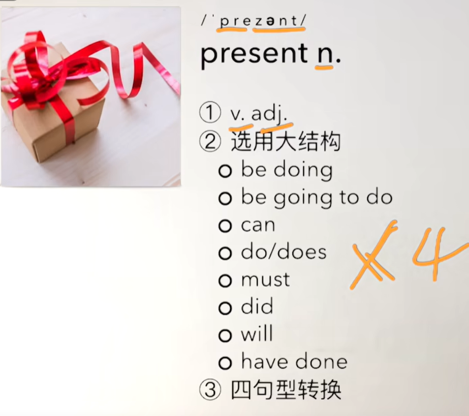
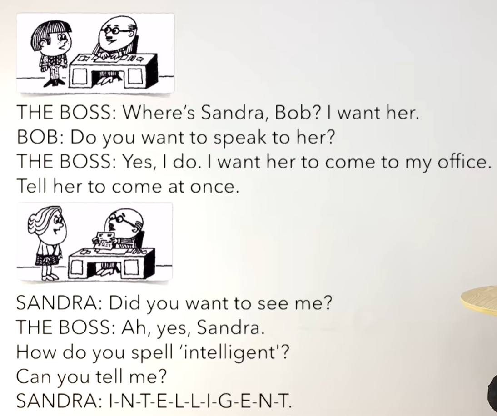
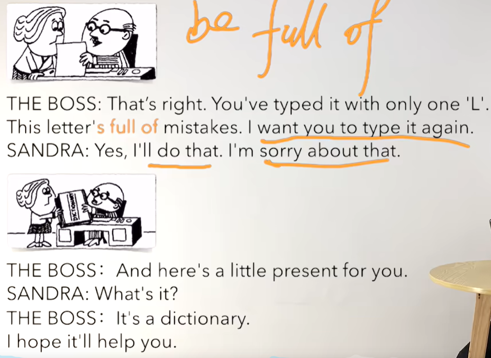

# 56、lesson105-106-want&tell想要和告诉某人做某事


## lesson105


## 1、Question 

#### 	1、如何表达 想做某事？

​		**want to do sth == wanna do sth**

 		I want to buy a new car

​		Do you want to buy a new car？

​		Why do you want to buy a new car？


#### 	2、如何表达 告诉某人做某事？

​		**tell sb to do sth**

​		Please tell him to bring me some coffee -- 请告诉他给我带一些咖啡


#### 	3、如何表达 犯错？

​	1、make a mistake -- 犯错了

​	2、You made a mistake -- 你犯错了


## 2、Word


#### 	1、spell spelt spelt -- 拼写

​	1、Can you spell that for me？ --  你能帮我拼写一下吗？

​	2、How do you spell Leo？ -- 你如何拼写Leo？


#### 	2、intelligent -- adj 智慧的，聪明的

​	1、AI：Artificial intelligent -- 人工智能


#### 	3、mistake -- 错误

​	1、make a mistake -- 犯错了

​	2、You made a mistake -- 你犯错了

​	3、Did I make a mistake？ -- 我之前犯错了吗？

​	4、You're making a mistake -- 你现在正在犯一个错误


#### 	4、present -- n 礼物

​	1、 我们现在看到n名词，造句的话就会考虑到使用什么v动词，然后是选什么结构，然后造句进行句型的转换




#### 5、dictionary -- 字典

​	1、He bought a new dictionary last week -- 他上周买了一本新字典

​	2、He is going to buy a new dictionary -- 他打算去买一本新字典

​	3、Why is he going to buy a new dictionary？ 

​	4、Tell him to buy a new dictionary -- 告诉他去买一本新字典


## 3、Homework

```
1、单词造句

2、尝试使用present 造100句

3、核心知识点


```


## 4、Story




​	Sandra在那里Bob？ 我需要她

​	你想要和她谈话吗？

​	是的，我想要她来到我的办公室，告诉她立刻过来


​	你之前需要见我？

​	噢，是的，Sandra

​	你怎么拼写 intelligent？

​	你能告诉我吗？




​	正确，你之前打字仅仅只有一个L

​	这封信充满了错误，我想让你再次打一封信

​	好的，我会去做的，关于这件事我很抱歉


​	还有这里有个小礼物给你

​	它是什么？

​	它是一本字典

​	我希望它会帮助你


## 5、Homework

```
1、练习105

2、文章熟读成诵

3、核心知识点
	这节的核心知识点就是 句型 1.想要某人做某事，2.告诉某人做某事
	want to do sth
	tell sb to do sth
	
	如何表达犯了错误--make a mistake -- 犯错了
	
	
```


# lesson106


## 1、Question

#### 	1、如何表达 我能留着这个么？

​	I can't keep this --- 我没办法留着这个东西

​	Can I keep this -- 我能保留这个东西吗？


#### 	2、想让某人做某事？

​		want to do sth


## 2、Word

#### 	1、carry -- 携带，拿

​	1、The man is carrying a black bag -- 这个男人正带着一个黑色的包

​	2、Is the man carrying a black bag？

​	3、Why is the man ...

​	4、Tell him to carry it -- 告诉他带上它（这个）

​	5、I want him to carry it -- 我想要他去带上这个东西


#### 	2、keep -- 保留 保存

​	I can't keep this --- 我没办法留着这个东西

​	Can I keep this -- 我能保留这个东西吗？

​	


#### 	3、correct -- 修改 修正 正确

​	1、correct the mistake -- 修正错误

​	2、Tell her to correct the mistake -- 告诉她改正错误

​	3、She is going to correct it -- 她打算去改正

​	4、He corrected the mistake yesterday -- 他昨天改正了错误


#### 	4、suitcase -- 手提箱

​	1、Why is the lady pointing at the suitcase？ -- 这个女士为什么指着这个手提箱

​	2、Because she wants him to carry it -- 因为她想要他拿着它


#### 	5、photograph -- 照片

​	1、Why is he giving her his photograph？ -- 他为什么在给她 他的照片

​	2、Because he wants her to keep it -- 因为他想让她保存它


#### 	6、knife -- 刀

​	1、Why is she taking the knife from him？ -- 她为什么要从他手里拿刀？

​	2、Because she doesn't want him to cut himself -- 因为她不想他切到他自己


#### 	7、policeman -- 警察

​	1、Why is the policeman talking to the man and woman？--警察为什么在和男人和女人说话？

​	2、Because he wants them to move it -- 因为他想让他们转移


#### 	8、be careful -- 小心

​	1、Why is the woman telling the girl to be careful？ -- 为什么这个女人告诉这个女孩要小心？

​	2、Because she doesn't want her to lose it -- 因为她不想让她失去它


#### 	9、hurt himself -- 伤到他自己

​	1、Why is she talking to the little boy ？ -- 她为什么正在和这个小男孩讲话？

​	2、Because she doesn't want him to hurt himself -- 因为她不想让他伤害他自己


#### 	10、describe -- 描述

​	1、Why is the attendant talking to the man？ -- 为什么助理正在和这个男人谈话？

​	2、Because he wants him to describe it -- 因为他想让他描述一下


