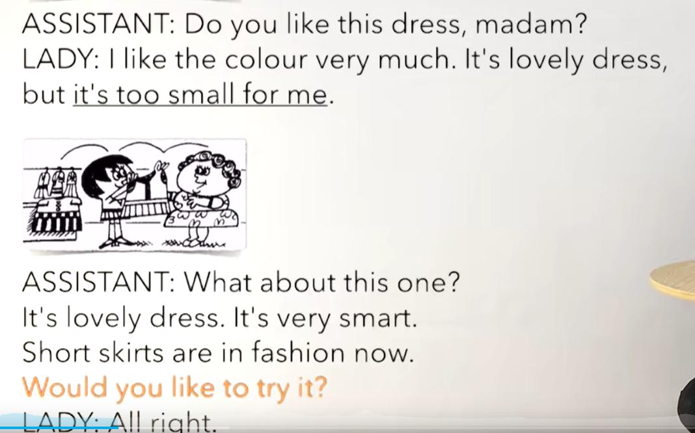
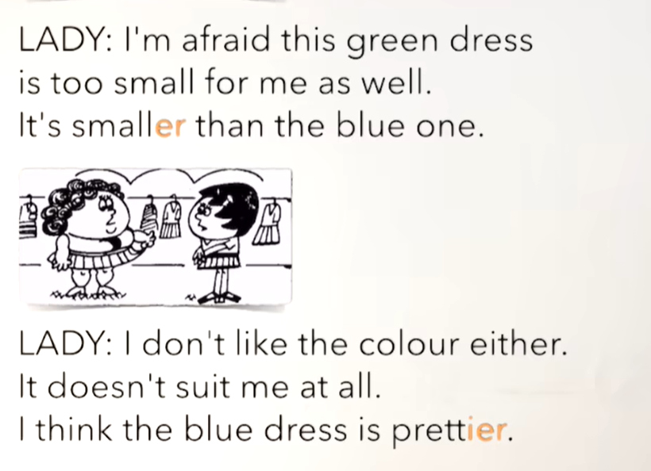
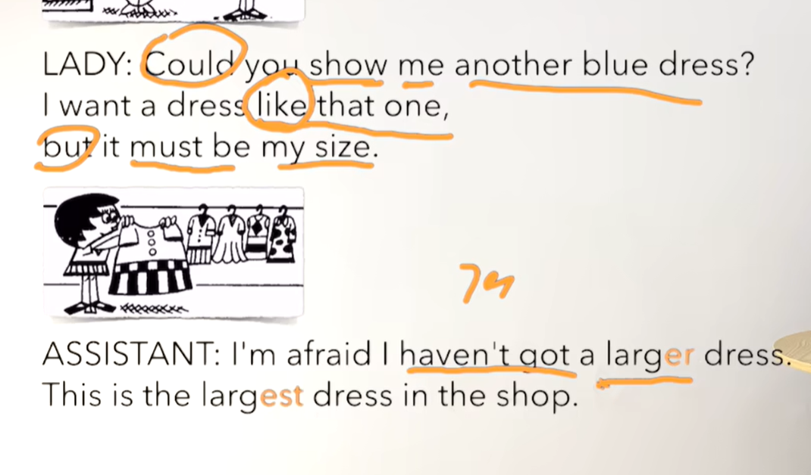
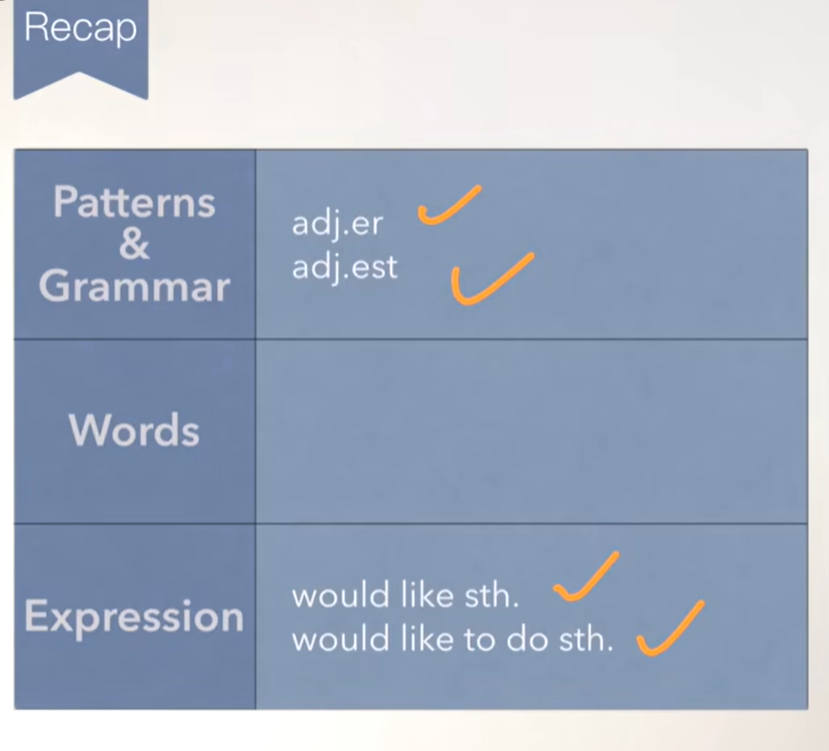
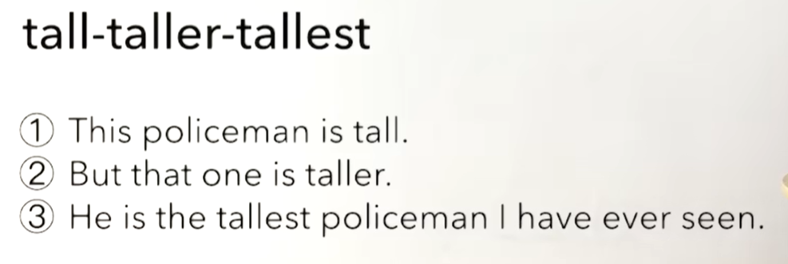

# 57、lesson107-108-比较级&Would使用

# lesson107

## 1、Question

#### 	1、adj比较级&最高级构成？

​		构成：

​		1、单音节(这个单词只要一个元音音标)形容词 + er /est

​		small --- smaller ---- smallest

​		new --- newer -- newest

​		2、单词以e结尾 + r/st

​		large --- larger --- largest

​		nice --- nicer --- nicerst

​		3、辅音字母+y结尾的，把y变为i，加er，est

​		pretty --- prettier --- prettiest

​		easy --- easier --- easiest

​		4、辅元辅，双写末尾辅音字母，加er/est

​		big --- bigger --- biggest

​		hot --- hotter --- hottest

​		fat --- fatter ---- fattest

#### 	2、如何使用adj比较级&最高级？

##### 	1、比较级用法	

​		**主语 + be + adj.er + than + 比较对象**

​	That man is older than this woman

##### 	2、最高级用法

​		**主语 + be + the + adj .est + n + 范围**

​	My father is the coolest guy in the world -- 我父亲是全世界最酷的人

​	My mom is the kindest person in the world --- 我母亲是全世界最善良的人

​		

​		**主语 + be + the adj.est + n** + I've ever met/seen

​		谁是怎么样的人 。。。我所看见（遇见）过的

​		This is the craziest thing I've ever done --- 这是我做过最疯狂的一件事情

​		This is the cutest baby I've ever seen --- 这是我见过最可爱的宝宝

#### 	3、如何表达 随你便？

​			Suit yourself -- 随便你

## 2、Word

#### 	1、madam -- 女士

​	1、Madam，can I help you? --- 女士，我能帮助你吗？

#### 	2、smart -- 聪明，漂亮，pretty -- 漂亮的， as well -- 也

​	1、It's a very smart dress  --- 这是一件非常漂亮的连衣裙

​	2、Yes, and that woman is very pretty，too/as well --- 是的，还有那个女人也很漂亮

#### 	3、suit -- v 适合

​	1、It suits you --- 它很适合你

​	2、Does it suit me ？ 它适合我吗？

​	3、It doesn't suit you --- 它不适合你

​	4、Suit yourself -- 随便你

## 3、Story

## 	

### 1、Question

#### 	1、如何使用would like？

​		**Would like + n**

​		would可以理解为want这个单词的某种委婉的说法

​		I would like some tea --- 我愿意喝一些茶

​		缩写： I’d like some tea

​		一般疑问句：Would you like some tea？

​								与Do you want to some tea 的含义几乎是一致的

​	**Would like + to do sth --- 愿意去做某件事**

​		I would like to help him --- 我愿意去帮助他

### 2、Story

​	你喜欢这个裙子吗 女士？

​	我非常喜欢这个颜色，这个裙子很漂亮

​	但是它对于我来说太小了以致于我没法穿

​	这一件呢？

​	这个衣服很漂亮，非常的漂亮

​	现在流行短裙

​	你愿意试一下它吗？

​	好的

​	我恐怕这个绿色的裙子对我来说还是更小

​	它比蓝色那件更小

​	我也不喜欢这个颜色

​	它一点也不适合我

​	我认为这个蓝色的裙子更漂亮

​	你可以给我展示一下另一个蓝色的裙子吗？

​	我想要一个像那个的裙子

​	但是它必须是我的尺码

​	

​	我恐怕 我没有一个更大的裙子了

​	这个是店里最大的裙子了

### 	3、Recap

# lesson108

## 1、Practices

​	But that one is taller -- 但是那个更高	

You are the strangest boy I have ever met --- 你是我见过最奇怪的男孩

 

