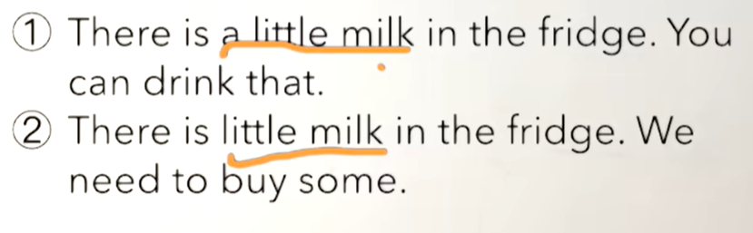
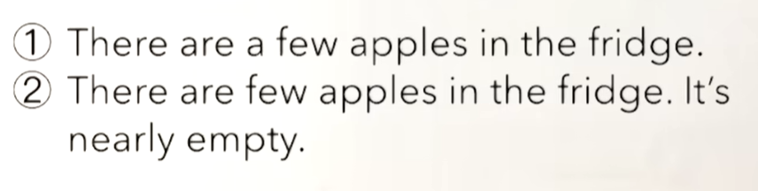
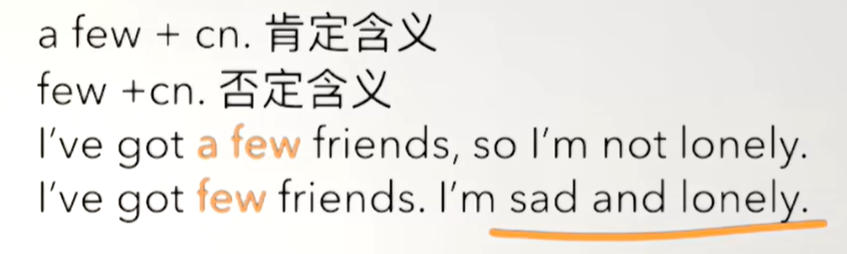
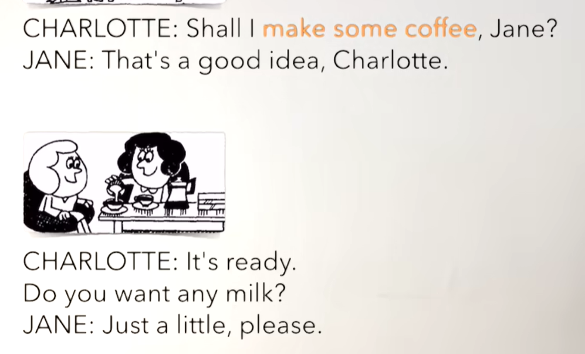
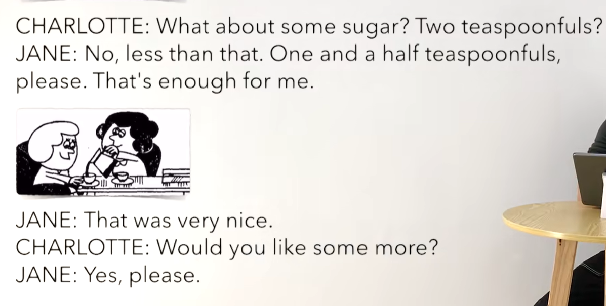
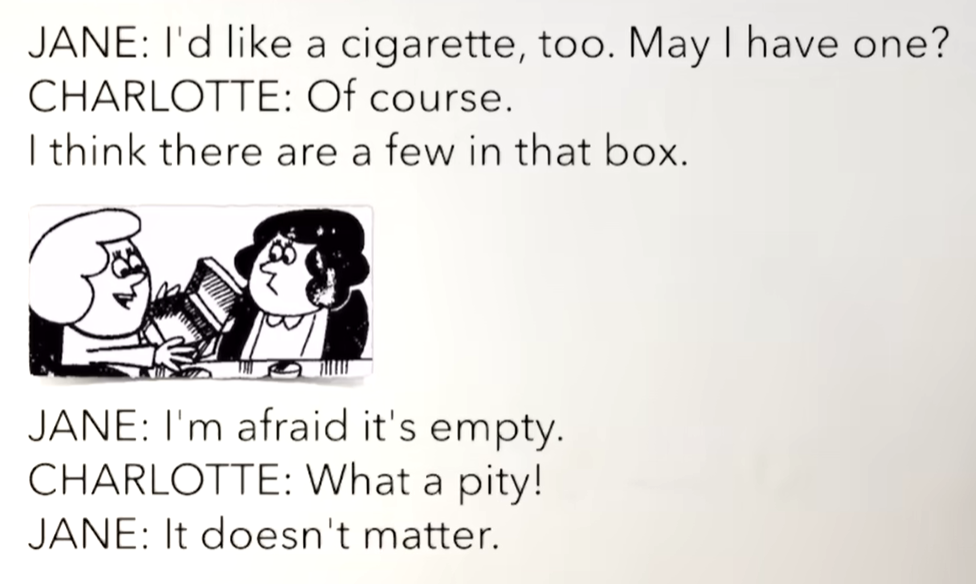
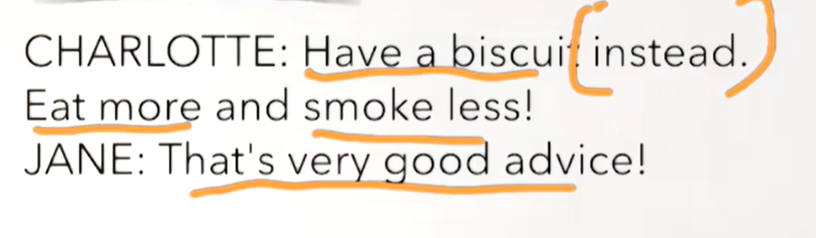

# 58、lesson109-110-区分little&few&不规则比较级使用


# lesson109


## 1、Question

#### 	1、如何区分a little，little，a few，few？

​	a little + un（不可数名词） 肯定含义

​	little + un （不可数名词） 否定含义




​	a few + cn 肯定含义	--	肯定就是不多但是还够做某些事情

​	few + cn 否定含义 -- 否定的含义是 一点不够做某些事情了





​		我有几个朋友，所以我不孤单

​		我几乎没有朋友，我很伤心和孤单


#### 	2、不规则的adj比较级&最高级

#####   	  1、many/much --- more更多 --- most最多

##### 		2、 lettle --- less更少 --- least最少

##### 		3、 few --- fewer --- fewest

##### 		4、good ---- better ---- best

#####  		5、bad --- worse更坏 --- worst 最坏


## 2、Word


#### 	1、idea -- 主意，想法

​	1、I have an idea --- 我有一个主意

​	2、That‘s a good idea -- 那是一个好主意


#### 	2、teaspoonful -- 茶勺

​	1、Do you want any sugar？

​	2、I want two teaspoonful -- 我想要俩勺


#### 	3、pity -- 遗憾

​	1、What a pity！ --- 好遗憾啊

​	2、It's a pity （that） +  句子 --- 很遗憾 ...这个没有发生

​	3、It's a pity he can't come --- 很遗憾 他没法来

​	4、It's a pity he didn't pass the exam --- 很遗憾 他没有通过这个考试


#### 	4、instead -- 替代

​	1、You can eat this cake instead -- 你可以吃这个蛋糕替代它

​	2、Can I eat this cake instead？ --- 我可以替代吃这块蛋糕吗？


#### 	5、advice -- n 建议

​	1、That's good advice --- 那是一个好的建议

​	2、Is that good advice？

​	3、Why is that good advice？


## 3、Homework

```
1、单词造句 3


2、红皮书查看 a little a few

3、核心知识点
	这节的核心知识点就是区分 little和few，它们都是代表少量的意思
	little 修饰的是不可数名词un
	few 修饰的是可数名词cn
	a little 代表的是 肯定，虽然少但是还可以，little代表的是否定，少不足以
	a few 代表的是 肯定，虽然少但是可以， few 代表的是 否定， 很少不足以
	
	然后是学习了比较级的不规则的adj形容词的使用如 bad -- worse --- worset
	
	最后是短语--What a pity -- 好遗憾啊


```


## 4、Question

#### 	1、如何表达 做咖啡？

​			make some coffee --- 煮咖啡


## 5、Story



 我将要做一些咖啡好吗Jane？

 好主意

准备好了

你想要一些牛奶吗？

请给我一点




​	来点糖吗？ 俩勺吗？

​	不，比那少点，请给我一勺半吧

​	那对我来说足够了


​	真是很不错

​	你想要来更多的咖啡吗？

​	是的




​	我想要一支烟 我可以抽一只吗？

​	当然可以

​	我认为那个合里还有几支


​	我恐怕它空了

​	好遗憾啊

​	没关系




​	吃个饼干替代吧

​	吃的越多 那么 抽烟越少

​	那是非常好的建议


# lesson110


## 1、Practices

####  	1、coffee

​	1、I’ve got some coffee -- 我有一些咖啡

​	2、I've got less than you have --- 我有比你少的咖啡

​	3、I‘ve got very little --- 我有非常少的咖啡


