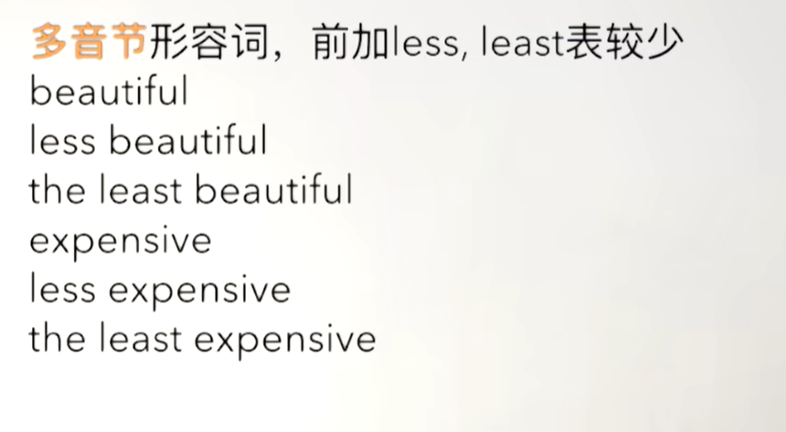
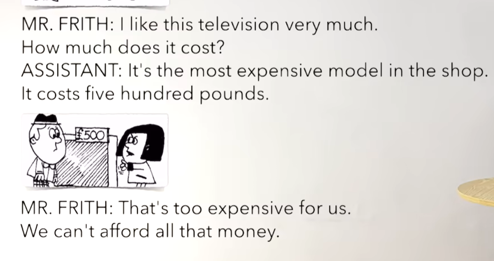
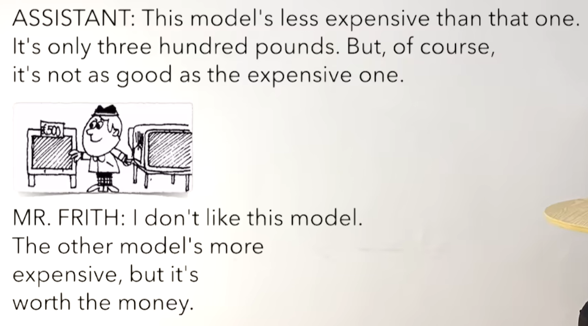
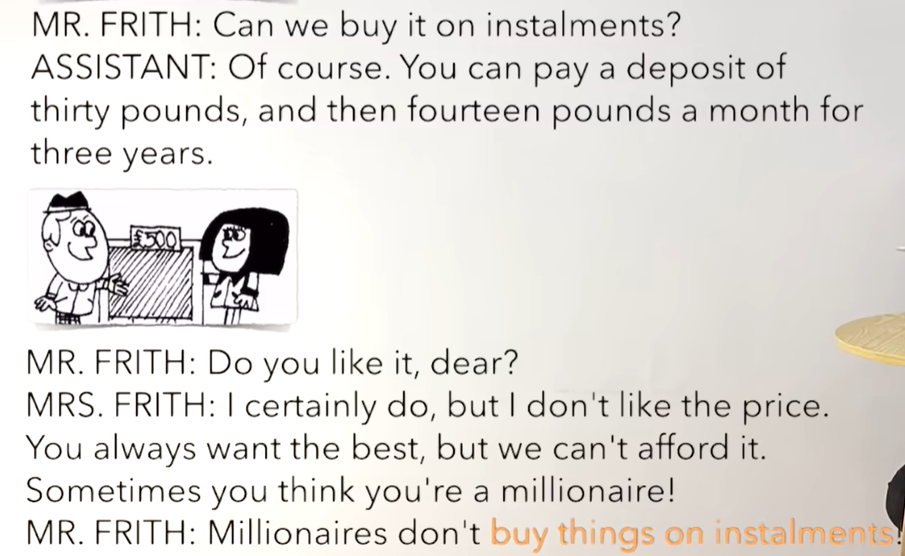
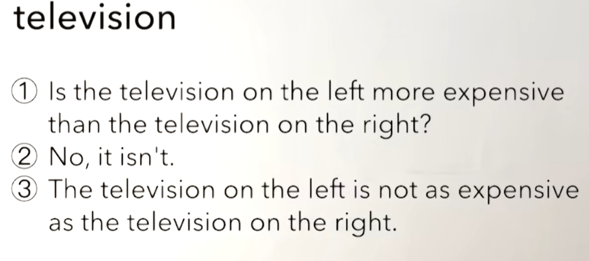
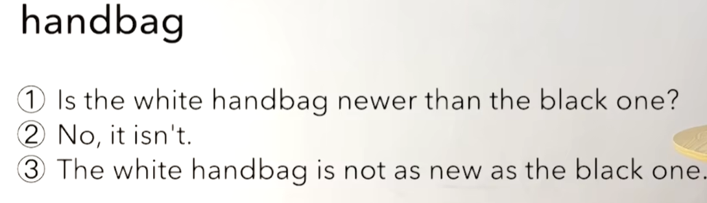

# 59、lesson111-112-most&least+adj&as使用


# lesson111


## 1、Question

#### 	1、adj比较级 & 最高级的新变法？

​		**多音节**形容词，前面加 more，most表示更多

​		多音节 --- 判断一下单词中有多少个元音，多少个元音音标就是多少个音节，多音节>=2就叫多音节

​		例如：beautiful -- 属于多音节，3个元音


​		more beautiful -- 更美

​		the most beautiful -- 最美

​		She is more beautiful than her mom --- 她比她的母亲更美

​		She is the most beautiful woman in her family -- 她是她们家族最美的女人


​		**多音节**形容词，前加less，least表示更少

​		


​		1、This movie is less interesting --- 这个电影没那么有趣

​		2、This movie is the least interesting movie of Li An I've ever seen -- 这个电影是我看过李安电影最无趣的电影


#### 	2、如何使用as...as?

​	expensive --- as expensive as 

​	beautiful  --- as beautiful as

​	The blue car is as clean as the red car --- 这辆蓝车同样的干净 像这辆红车 -- 这辆蓝车同红车一样干净

##### 	1、肯定：as....as ---- 他们同样的.....

​						同.....一样....


​	如：He is as stupid as a donkey --- 他是同驴一样愚蠢

​			She is as beautiful as an angel --- 她同天使一样美丽

​			He is as slow as a snail --- 他同蜗牛一样缓慢


##### 	2、否定：not as ... as ---- ....不如....

​		相当于A不如B

​		The blue car is not as clean as the red car --- 这个蓝车不如红车干净


#### 	3、如何表达 买某物分期付款？

​	1、buy sth on instalment --- 买某个东西分期付款

​	2、He bought this car on instalment --- 他分期付款买了这辆车


## 2、Word


#### 	1、model -- n 模型

​	1、This is a car model -- 这是一个汽车模型

​	2、My car model is bigger than yours --- 我的汽车模型比你的更大	

​	3、My son wants to buy a car model --- 我的儿子想要去买一个汽车模型

​	4、I think that this car model is too expensive --- 我认为这个汽车模型太贵了


#### 	2、afford --- v 支付的起

​	1、It's too expensive。I can't afford it --- 它太贵了，我支付不起

​	2、It's cheap enough We can afford that --- 它足够的便宜，我们能支付的起


#### 	3、deposit -- n 预付

​	1、You can pay a deposit of thirty pounds --- 你可以支付三十英镑的预付款

​	2、Can I pay a deposit of thirty pounds？ --- 我可以支付三十英镑的预付款吗？

​	3、He paid a deposit of thirty pounds ----- 他已经支付了三十磅的预付款  --- 一般过去式

​	4、Did he pay a deposit of thirty pounds？ --- 他已经支付了三十磅的预付款吗？

 


#### 	4、instalment ---  分期付款

​	1、buy sth on instalment --- 买某个东西分期付款

​	2、He bought this car on instalment --- 他分期付款买了这辆车

​	3、Did he buy this car on instalment？ --- 

​	4、Why did he buy this car on instalment？ -- 为什么他分期买了这辆车？


#### 	5、price -- 价格

​	1、Look at that price，It's too expensive. We can't afford that -- 看这个价格，它太贵了，我们支付不起


#### 	6、millionaire --- 百万富翁

​	1、I think that he wants to be a millionaire --- 我认为他想成为一个百万富翁


​	2、Do you want to be a millionaire？ --- 你想成为一个百万富翁吗？

​	3、This millionaire is richer than that one --- 这个百万富翁要比那个更富有


## 3、Homework

```
1、单词造句 3


2、红皮书 as...as

3、核心知识点
	这节主要讲了
	1、在adj形容词前面 加 more/most 表示更多，加less/least表示更少
		如： more beautiful -- 更漂亮
		
	2、as... as 的使用，代表同..一样，not as ... as，代表A不如B
	如：She is as beautiful as an angel --- 她同天使一样美丽

		He is as slow as a snail --- 他同蜗牛一样缓慢
		
		相当于A不如B

		The blue car is not as clean as the red car --- 这个蓝车不如红车干净

	3、分期付款
	1、buy sth on instalment --- 买某个东西分期付款

	2、He bought this car on instalment --- 他分期付款买了这辆车


```


## 4、Story



​	我非常喜欢这个电视

​	它售价多少？

​	它是商店里最贵的型号

​	它卖五百磅


​	那对我们来说太贵了

​	我们不能支付的起全部的金额




​	这个型号比那个便宜一些

​	它只有三百磅。当然，它不如贵的那个好


​	我不喜欢这个型号

​	另一个型号更贵，但是它值这个钱




​	我们可以分期付款买它吗？

​	当然，你可以支付一个预付三十磅，然后每个月十四磅 三年

​	亲爱的你喜欢它吗？


​	我当然喜欢，但是我不喜欢这个价格

​	你总是喜欢最好的，但是我们又无法支付的起

​	有时候 你认为自己是个百万富翁

​	

​	百万富翁不会买东西还分期付款


# lesson112

## 1、Practices


#### 	1、apple

​	1、Is the red apple sweeter than the green one？ -- 这个红色的苹果比绿色那个更甜吗？

​	2、The red apple is as sweet as the green one --- 这个红色苹果同绿色那个一样甜







​	


