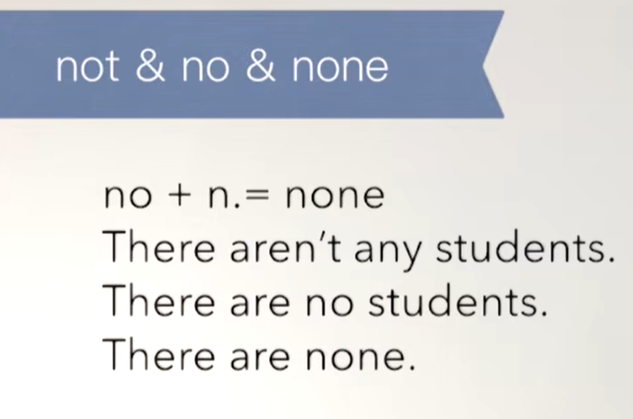
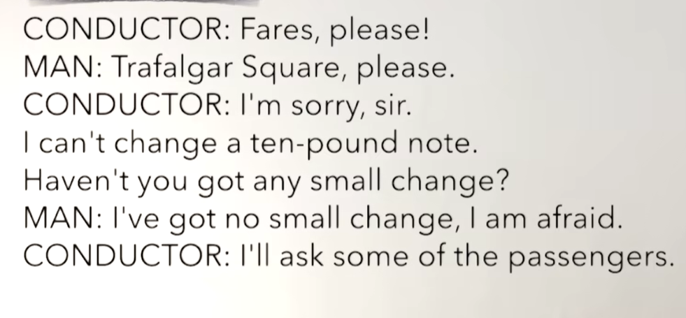
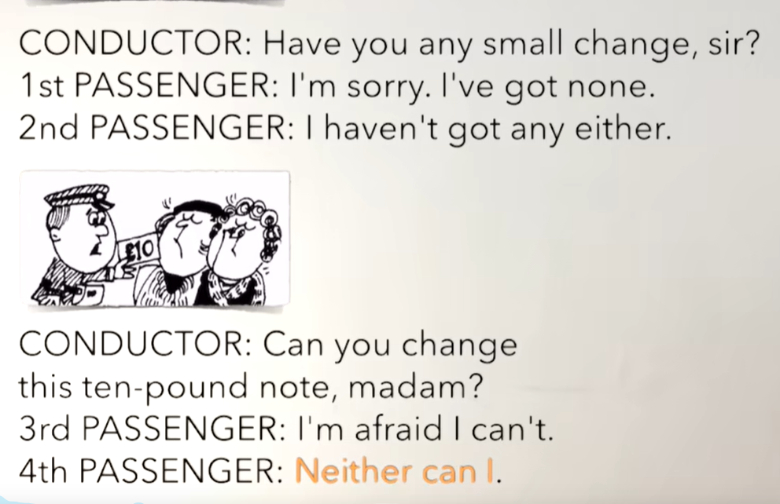
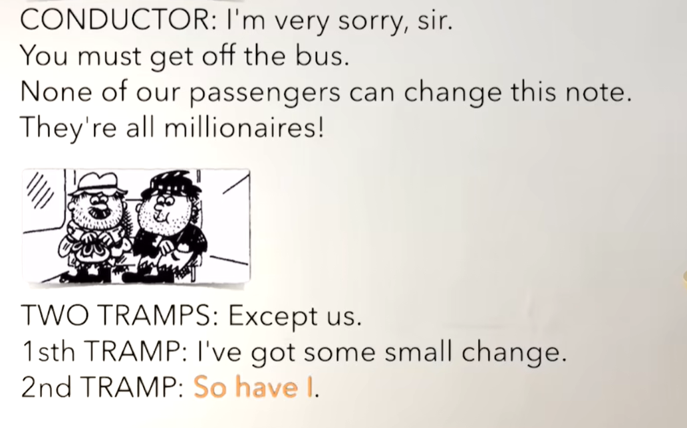
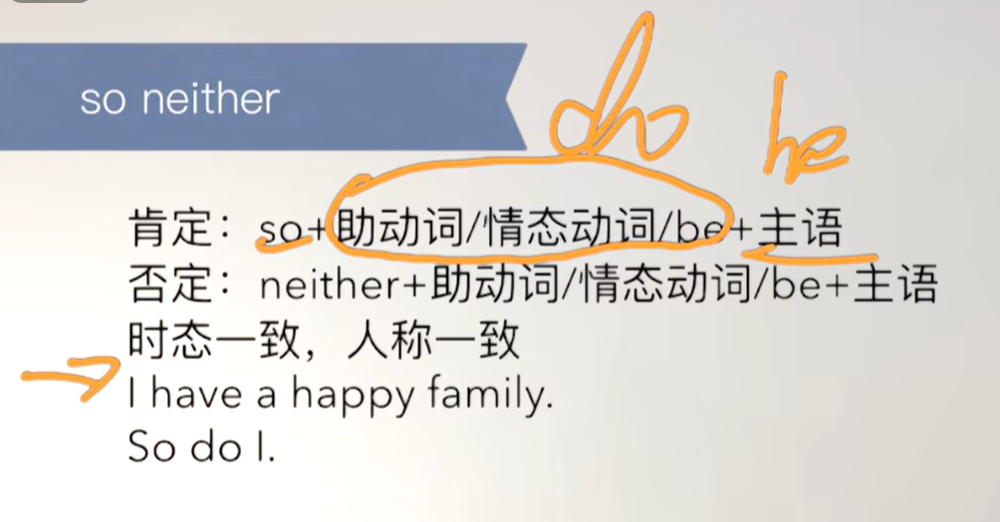
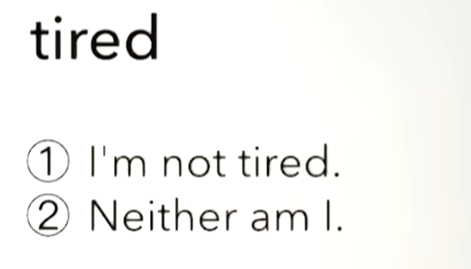
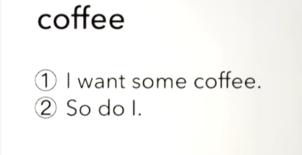

# 60、lesson113-114-no&none使用&so&neither


# lesson131


## 1、Question

#### 	1、如何使用no&none？

 		**not any /a.an = no + n**

​		I didn't see any cars in the street

​		I saw no cars in the street --- 我在街上没有看到汽车


​		I haven't got any time

​		I have got no time -- 我没有时间

​		

​		**no + n = none**

​		Have you got any beer？

​		We haven't got any beer --- 我们没有啤酒了

​		== We have got no beer

​		== We have got none

​		在none的使用的使用我们必须知道上下文出现的这个n名词




## 2、Word

#### 	1、conductor -- 售票员

​	1、This conductor is taller than that one -- 这个售票员比那个高

​	2、This conductor is the kindest guy I've ever seen -- 这个售货员是我见过最善良的人


#### 	2、fare -- n 车票


#### 	3、change -- v 兑换零钱，note -- n 纸币

​	1、I want my change -- 我要找我的零钱

​	2、I can't change a ten pound note -- 我没发找开一个十磅的纸币

​	3、Can you change a ten pound note？ --- 你能找开一个十磅的纸币吗？


#### 	4、passenger -- n 乘客

​	1、This bus is full of young passengers -- 这辆公共汽车满是年轻的乘客

​	2、These passengers are the most interesting people I've ever soon -- 这些乘客是我见过最有趣的人

​	

#### 	5、get off -- 下车

​	1、Look，that little girl is getting off the bus -- 看那个小女孩正在下公交车

​	2、She got off the bus 5 minutes ago -- 她在五分钟前下了这辆公交车

​	3、Did she get off the bus 5 minutes ago？ -- 她在五分钟前下公交车了吗？

​	4、When did she get off the bus？


#### 	6、tramp -- n 流浪汉

​	1、Can we help that tramp？ --- 我们可以帮助那个流浪汉吗？

​	2、We can give him some food -- 我们可以给他一些食物

​	3、This tramp is older than your dad --- 这个流浪汉比你父亲更年长


#### 	7、except -- 除了

​		1、No dog except guide dogs --- 禁止狗 除了 导盲犬


## 3、Homework

```
1、单词造句 3

2、初级红皮书查找语法 no none


3、核心知识点
	这节主要讲了not，no，none的使用及区别
	not + any/a.an  == no + n
		I haven't got any time
		I have got no time -- 我没有时间
	
	no + n == none
		We haven't got any beer --- 我们没有啤酒了

		== We have got no beer

		== We have got none

		在none的使用的使用我们必须知道上下文出现的这个n名词


	
	
	
```


## 4、Story	

#### 	1、如何理解 Neither can I ？

​			我也不能

#### 	2、如何理解 So have I？

​			我也是




​		请买票啦！

​		请到特拉法加广场谢谢

​		抱歉先生，我无法找零一个十磅的纸币

​		难道你没有一些小的零钱吗？

​		我没有小的零钱，我恐怕

​		我去问几个乘客




​	你有一些小的零钱吗，先生？

​	抱歉我没有

​	我也没有

​	你可以找零这个十磅的纸币吗，女士？

​	 我恐怕我不能

​	Neither can I -- 我也不能




​	我非常抱歉先生

​	你必须下这个公交车

​	我们的乘客没有能找开这个纸币的

​	他们都是百万富翁


​	除了我们

​	我有一些零钱

​	So have I --- 我也是


#### 	3、so neither

​	肯定： so + 助动词/情态动词/be + 主语

​		如： so have I -- 我也是


​	否定： neither + 助动词/情态动词/be + 主语

​		如：neither can I --- 我也不能





# lesson114


## 1、Practices







