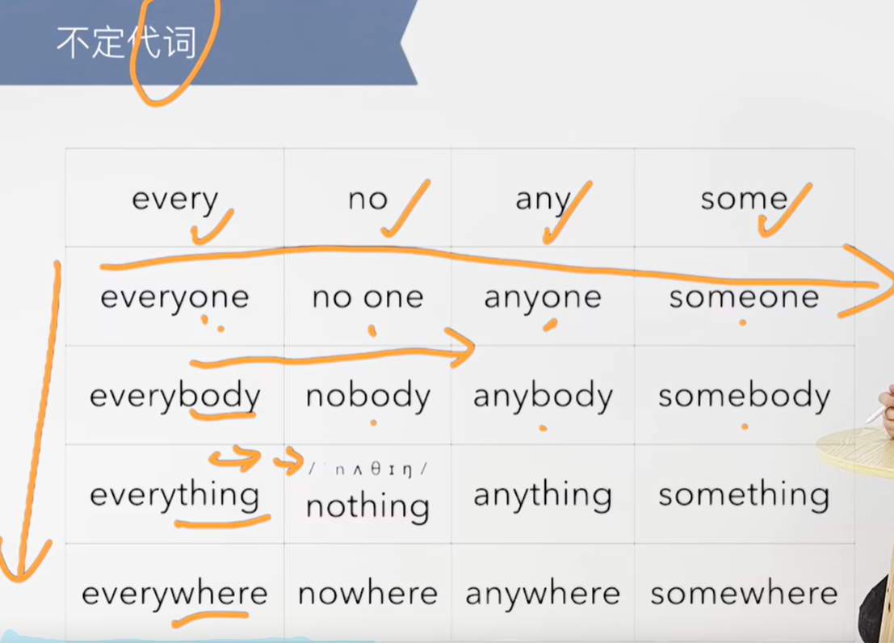
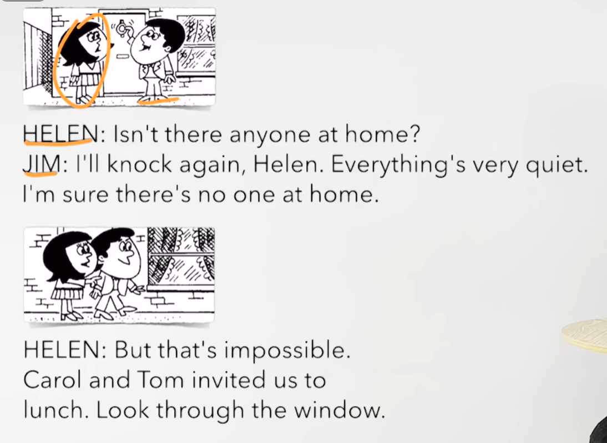
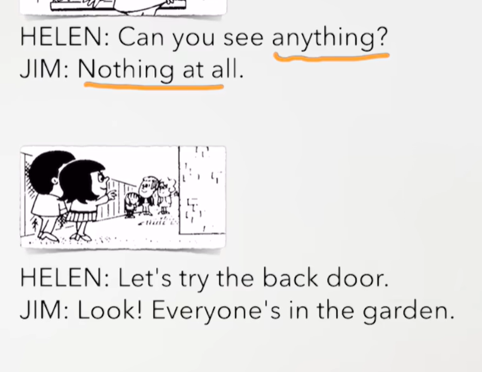
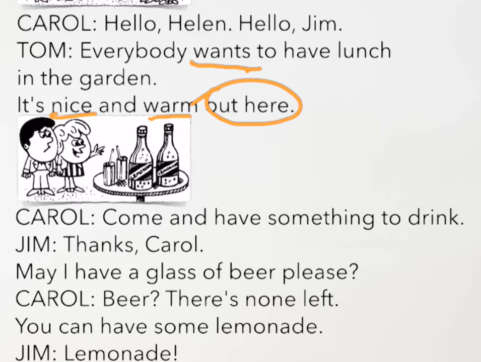
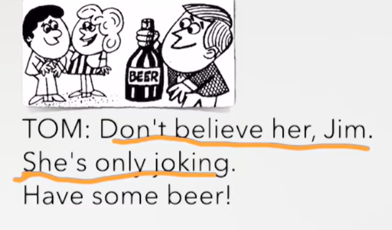

# 61、lesson115-116-不定代词


# lesson115


## 1、Question

#### 	1、如何使用不定代词？

​		代词 --- 比如，你我他其实是人称代词

​		不定代词 ---- 不确定具体指向的代词

​		例如：everyone -- 可以指 每个人，也可以指每个东西，因为它不是确定的指向某个人所以是不定代词

​				someone --- 某些人 --- 因为它也不是具体指向某一个，所以也是不定代词




## 2、Word

#### 	1、knock -- v 敲门

​	1、Someone is knocking at the door --- 某人正在敲门 -- 使用Someone后面是单数形式 + is

​	2、Who is knocking at the door？ -- 谁正在敲门？

​	3、Did you knock at the door？ --- 刚才你在敲门吗？


#### 	2、quiet -- adj -- 安静的

​		1、be quiet -- 安静

​		2、It's been quiet for about 45 minutes --- 已经安静了45分钟了 -- 现在完成时，第二个用法L89，’s代表has


#### 	3、impossible -- adj 不可能的

​	1、im + possible（可能的） --- im是否定的前缀

​	2、Everything is possible --- 一切皆有可能

​	3、Nothing is impossible -- 没有什么是不可能的


#### 	4、invite -- v 邀请

​	1、They invited me to dinner -- 他们邀请我去吃晚餐

​	2、Did they invite you to dinner？


#### 	5、lemonade -- n 柠檬水

​	1、give me some lemonade -- 给我一些柠檬水

​	2、This lemonade is the best I‘ve ever tasted -- 这个柠檬水是我喝过最棒的柠檬水 -- taste味道，品尝

​	3、This lemonade is as good as that one -- 这个柠檬水同那个一样的棒


#### 	6、joke -- v 开玩笑

​	1、She is joking -- 她正开玩笑呢

​	2、Is she joking？

​	3、You can’t joke about this -- 你不能拿这件事开玩笑


## 3、Homework

```
1、单词造句3

2、核心知识点
	这节课主要讲解了不定代词，代词其实就是如你我他的代替叫代词，而不定代词是没有具体特指某个实体，如everyone每个人，因为没有特指那个人，所以叫不定代词
	代词是可以使用在句首就和人称的使用方式是一样的。
	
	
	

```


## 4、Story



​	家里没有一个人吗？

​	我再敲下门，Helen，一切都很安静

​	我确定没有一个人在家里


​	但是那是不可能的，Carol和Tom邀请我们去吃午饭，从窗户看进去




​	你可以看到什么吗？

​	什么也没有

​	咱们去后门试试吧

​	瞧，每个人是在花园里




​	

​	每个人都想去花园里吃午饭

​	外面又好又温暖

​	

​	来喝点东西

​	谢谢Carol

​	我能喝一杯啤酒吗？

​	啤酒？ 没有任何啤酒留下了

​	你可以喝一些柠檬水

​	柠檬水




​	别相信她，Jim

​	她只是在开玩笑

​	喝点啤酒吧


## lesson116

## 1、Practices


#### 	1、asleep -- adj 睡觉

​	1、She is asleep -- 她 在睡觉

​	2、Everyone is asleep


#### 	2、glasses -- n 眼镜

​	1、You are wearing your new glasses -- 你正戴着你的新眼镜

​	2、I bought these new glasses last week -- 我上周买的这幅新眼镜


​	


