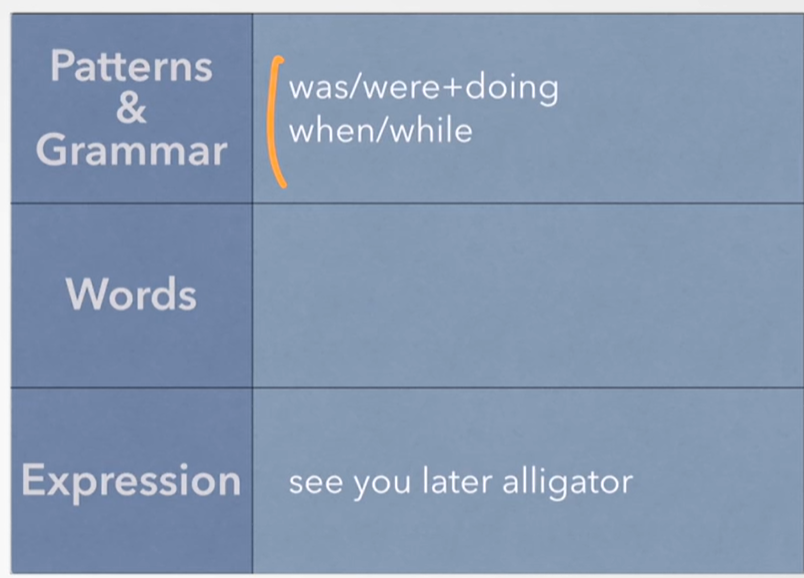
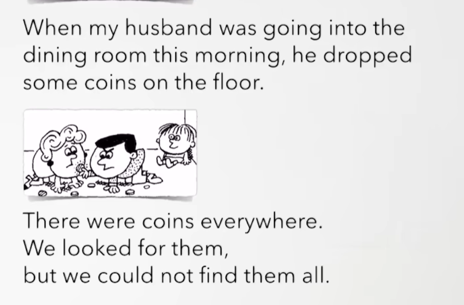
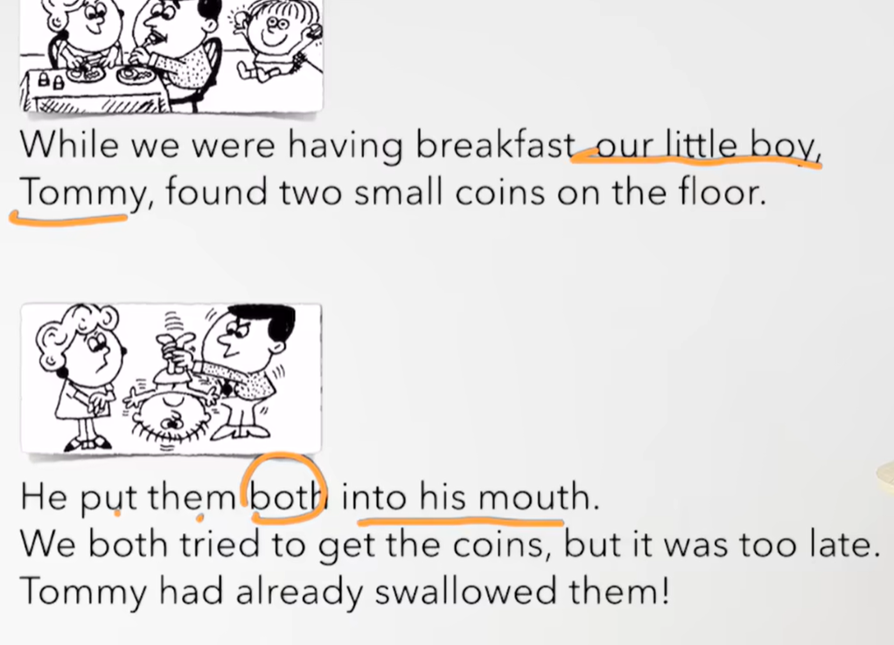
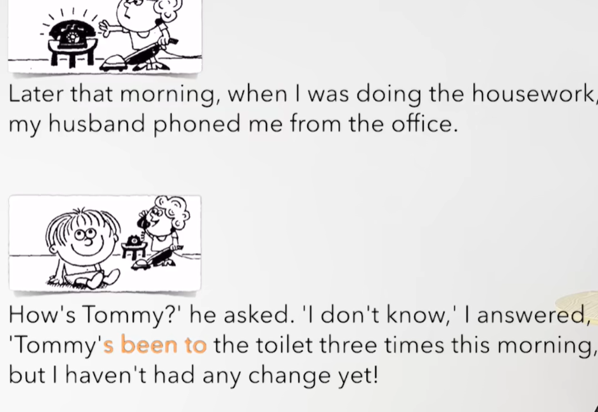

# 62、lesson117-118-过去进行时&时间状语从句


# lesson117


## 1、Question


#### 	1、如何使用过去进行时？

​		过去进行时：was/were + doing --- 一个动作在过去正在发生

​		我们回顾一下现在进行时是（am/is/are + doing） 而过去进行时是将be动词替换为 was/were


​		例如：I was doing my homework at 8 o'clock last night -- 我昨天晚上八点正在做我的作业

​		**否定句** ： 我们在变否定句的时候 be 后面加 not 就可以了

​		**一般疑问句** ： -- 在变一般疑问句的时候 把be动词提到句首就可以了--和之前一样

​		**特殊疑问句**：特殊疑问词提句首 + 一般疑问句--和之前规则一样


#### 	2、如何使用when/while?

##### 		时间状语从句

​		定义：句子作时间状语

​		如： He was cooking a meal at 10 o'clock  -- 我在十点的时候正在做饭

​				 He was cooking a meal **when** he was listening to music -- 当他正在听音乐的时候，他正在做饭，--- 在这里的when不是特殊疑问词了，这里的when代表 当

​			 **when** he was listening to music  而句话我们就叫时间状语从句


​	When + was doing / did

​	While + was doing

​	例： Someone knocked at the door **when** I was having lunch --  当我在吃午饭的时候，有人在敲门

​		这句when I was having lunch -- 这个就是时间状语从句，这个替代了表达的时间

​		She was washing the dishes，when the telephone rage -- 当她在电话响起的时候，她正在清洗盘子


​		She was cooking the dinner，**while** I was watching TV --- 当我在看电视的时候，她正在做晚饭（俩个动作在过去同时进行）


​		When I was driving to London，It rained heavily -- 当我正开车去伦敦的时候，雨下的很大

​		这个时间状语从句也可以在句首，也可以在句尾


## 2、Word


#### 	1、dining room -- 餐厅

 	1、There are seven chairs in the dining room -- 在餐厅里有七把椅子

​	2、Look，they are having lunch in the dining room -- 瞧，他们在餐厅正在吃午餐

​	3、This dining room is big enough for us -- 这个餐厅对我们来说足够的大


#### 	2、coin -- n 硬币

​	1、I've got more coins that you have -- 我的硬币比你的更多 -- L109

​	2、This is the most beautiful coin I've ever seen -- 这是我见过最漂亮的硬币 ---L111

​	3、Do you have any coins？

​	4、I don't have any coins == I have no coins ---L113


#### 	3、mouth -- 嘴 、swallow--v 下咽

​	1、Don't swallow that --  别把它咽下去了

​	2、She swallowed all the pills last night -- 她昨晚咽下了所有的药片

​	3、Did she swallow all the pills last night？


#### 	4、toilet -- n 马桶，厕所

​	1、Where is the toilet？

​	2、Look！There is a toilet -- 瞧，这有一个马桶

​	3、I cleaned the toilet last night

​	4、She has been in the toilet for an hour -- 她在卫生间里呆了一个小时了 -- 过去完成时，has been 持续


## 3、Recap




## 4、Homework

```
1、单词造句 3


2、初级红皮书查找重点语法
	过去进行时，when和while的用法
	
3、核心知识点
	这节主要讲解了 过去进行时
	规则： was/were + doing 是过去进行时
	
	时间状语从句--其实就是把 在某个时间替换为在某个时间的事情
	使用when和while关键字，从句也可以放到句首和句尾不影响含义
		She was washing the dishes，when the telephone rage -- 当她在电话响起的时候，她正在清洗盘子
		She was cooking the dinner，while I was watching TV --- 当我在看电视的时候，她正在做晚饭（俩个动作在过去同时进行）


```


## 5、Story 



​	当我的丈夫今天早晨正进入餐厅的时候，他掉落了一些硬币在地板上。（时间状语从句） -- 过去进行时

​	

​	到处都是硬币

​	我们寻找这些硬币

​	但是我们不能找到全部




​	当我们正吃午饭的时候，我们的小男孩 Tommy

​	在地板上找到俩枚小硬币


​	他把俩枚硬币全部都放进了他的嘴里

​	我们都尝试去拿到这个硬币，但是太晚了

​	Tommy已经把它们咽下去了




​	那天早晨稍晚些，当我正在做家务时，我的丈夫从办公室给我打电话

​	Tommy怎么样？  他问  我不知道 我回答到

​	Tommy今天早晨已经去了三次厕所了

​	但是我还没有得到任何零钱


## lesson118

## 1、practices


#### 	1、having a bath 

​	1、What were you doing when he arrived？ --- 当他来的时候你在干什么？

​	2、I was having a bath -- 我当时正在洗澡

​	3、I was having a bath when he arrived ---- 当他来的时候我当时正在洗澡


#### 	2、washing the dishes

​	1、What was Mary doing when the telephone rang？ -- 当电话响时马力在做什么？

​	2、She was washing the dishes -- 她当时正在清洗盘子

​	3、She was washing the dishes when the telephone rang -- 当电话响的时候她正在清洗盘子


#### 	3、making the bed

​	1、What was your mother doing when the postman came？ -- 当邮递员来的时候，你的妈妈在做什么？

​	2、She was making the bed -- 她当时正在铺床

​	3、She was making the bed when the postman came -- 当邮递员来的时候她正在铺床


 


  


