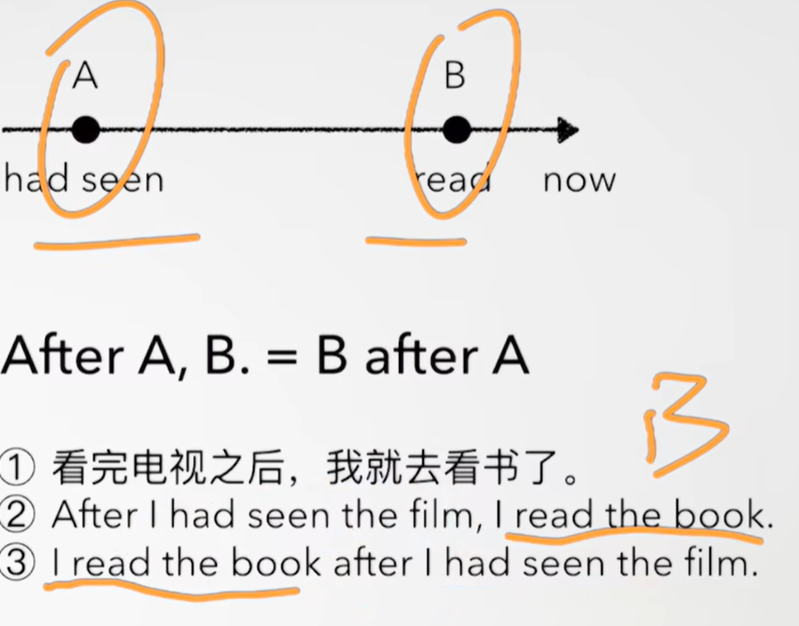
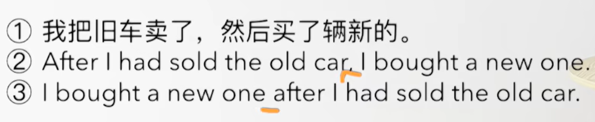
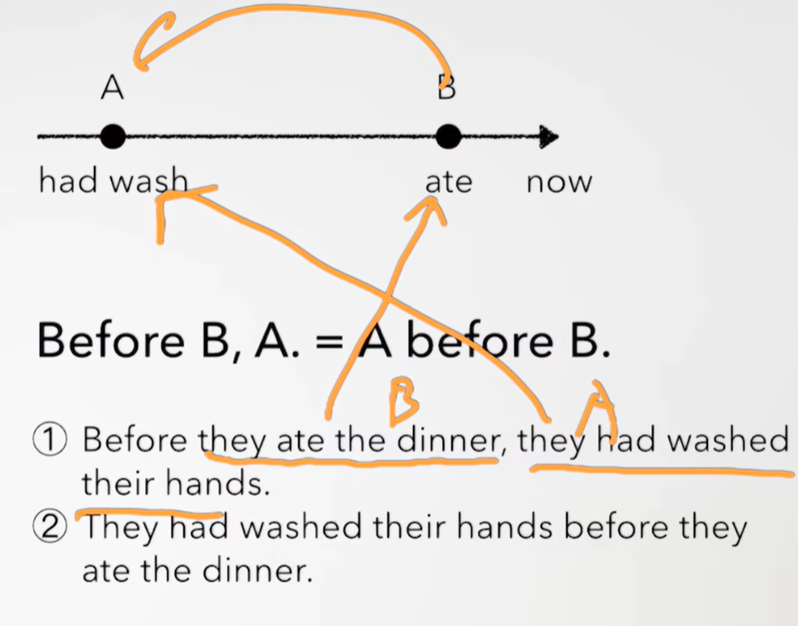
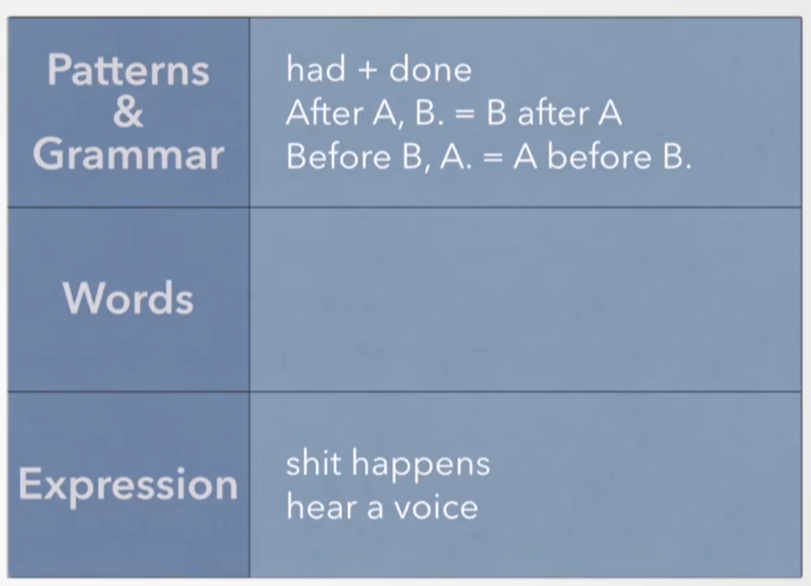
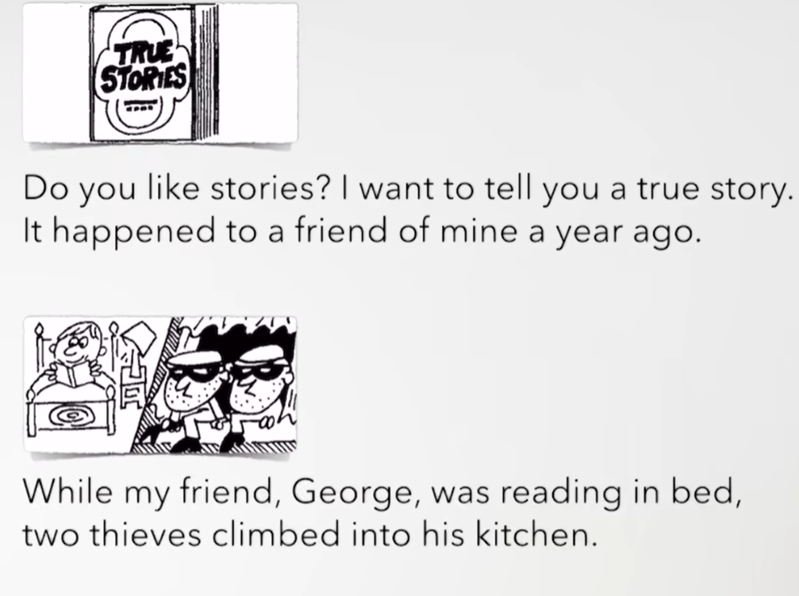
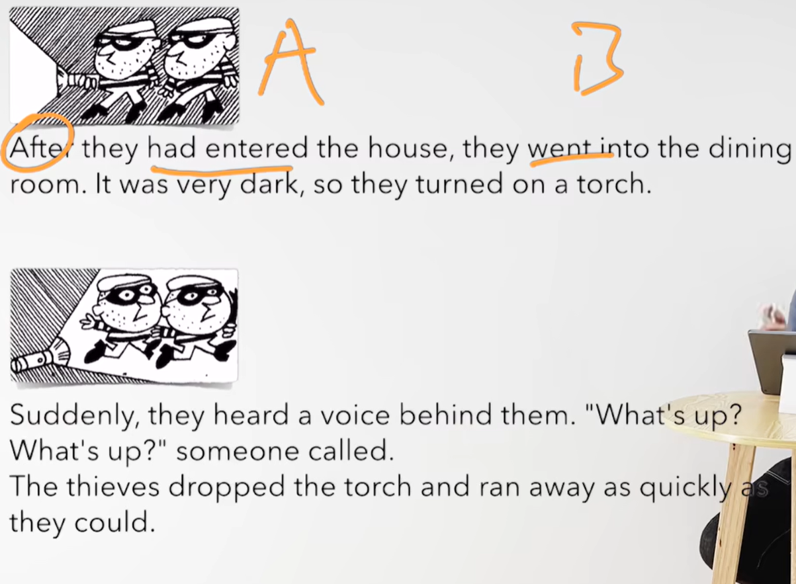
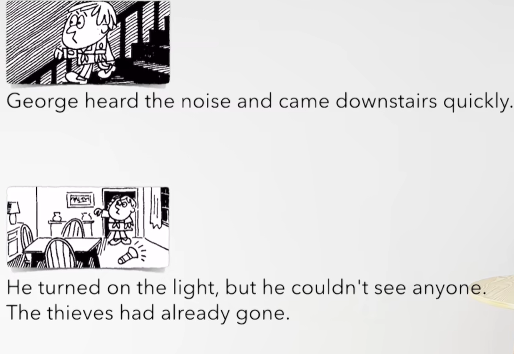
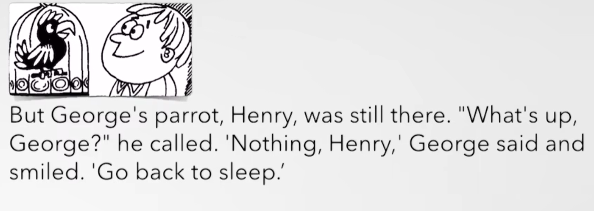
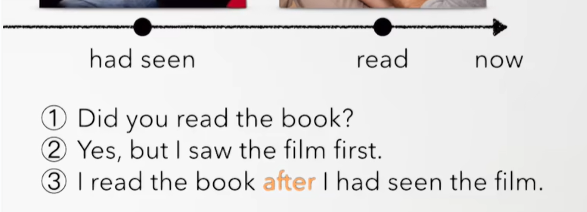

# 63、lesson119-120-过去完成时&after&before

# lesson119


## 1、Question

#### 	1、如何使用过去完成时？

​			我们回顾一下现在完成时  have/has +done 

​			变为过去完成时  had + done

​			除了学习句子的结构，时态，我们还需要理解它结构的含义

##### 			过去完成时：强调过去某一动作发生在另一动作或状态之前

​			----------------had done-------------did ----------------- now->

​			因为发生某个动作是在did前 --- 所以我们把过去完成时可以理解为 过去的过去


​			肯定句： had + done

​			否定句： had + not + done

​			疑问句： Had（提句首） + 主语 + 其他

​			这个时态经常与 after before 连用


#### 	2、如何使用after before？

After A，B == B after A  ---- 在A结束后，发生了B

​			------------A---------------B-------------now-->



 




​	Before B ,A （在这个B之前，发生了A）== A before B （发生了A，是在B之前发生的）

​	

​	在吃晚饭前，他们洗好了手

​	他们洗好了手，在吃晚饭前


#### 	3、如何理解 shit happens？

​		 shit happens -- 不好的事情就是会发生


## 2、Word

#### 	1、story -- n 故事

​	1、tell a story -- 讲个故事

​	2、My father told us a story last night --- 我父亲昨天晚上给我们讲了一个故事 -- 一般过去时

​	3、My father tell us a story every night --- 我父亲每晚都给我们讲一个故事 --- 一般现在时

​	4、Their father is telling them a story now -- 他们的父亲正在给他们讲一个故事 -- 现在进行时


#### 	2、thief -- n 小偷 -- thieves复数

​	1、That thief was looking at the picture in the living room when someone Knocked at the door -- L117

​		当一些人敲门时，那个小偷正在客厅看照片

​	2、This thief is taller than that one --L108 -- 这个小偷比那个更高


#### 	3、enter -- v 进入

​	1、When the woman was entering the room，she dropped everything on the floor -- L117

​		当这个女人进入房间时，她把所有东西都掉到地板上了


​	2、She entered the room 2 hours ago -- 她俩小时前进入了这个房间 -- 一般过去式


#### 	4、dark -- adj 昏暗的

​	1、It's dark outside  Be careful -- 外面很黑，小心一点

​	2、This room is darker than that one -- 这个房间比那个更昏暗

​	3、This is the darkest night I’ve ever seen -- 这是我见过最黑的夜晚 -- L111

​	4、It's dark enough too see the stars in the sky -- L103 -- 天足够的黑，可以看到天上的星星


#### 	5、torch -- n 手电筒

​	1、Can you give me a torch，please？

​	2、We must buy a new torch tomorrow

​	3、I have had this torch for 10 years -- 我已经拥有这个手电筒十年了 -- 现在完成时 -- L89


#### 	6、voice -- n 声音

​	1、hear a voice -- 听到某个声音

​	2、Did you hear a voice？ -- 你听到某人说话吗？

​	3、Can you hear a voice？ -- 你能听到有人说话吗？


#### 	7、parrot -- n 鹦鹉

​	1、This parrot is too old to fly --  这只鹦鹉太老了，飞不起来了 -- L103 too。。。to

​	2、Everybody likes this parrot -- 每个人都喜欢这个鹦鹉

​	3、My son wants to buy a parrot -- 我儿子想买一只鹦鹉 --L105 -- want to do sth 想...样


## 3、Recap




## 4、Homework

```
1、单词造句 3
		story 
	1、我给你讲个一年前的故事
	
	2、这个故事发生在哪里？
	
	3、这个故事像真实发生的一样
	
	1、I'm going to tell you a story that happened a year ago
	2、Where does the story happen？
    3、This story is like it really happened
	
	
	
		thief
	1、I am reading a book in bed when the thief comes into my living room 
	---- 当小偷进入到客厅时，我正在床上看书 -- 现在进行时
	
	2、He had caught that thief before I started work
	在我工作开始之前，他已经抓住了那个小偷

	3、I have already caught that thief -- 我刚刚抓住了那个小偷

	
		enter
	1、My wife was cooking dinner when I was entered the dining room
	当我进入饭厅时，我妻子正在做晚餐
	
	
	2、When did he enter the company？ -- 他什么时候进入的公司
	
	3、I'm going to enter that big company next week
	
	4、I'm going to enter that building 
	
		dark
	1、This is the darkest sky that I've ever seen
		这是我见过最黑暗的天空
	
	2、The weather was too dark before the rain
		在下雨前，天气很昏暗
	
	3、It's dark enough to see stars in the sky
		天黑可以看到天空中的星星
		
		
		torch
	1、昨天屋里变的很昏暗，我当时打开了手电筒
		I turned on the torch when it became too dark in the room yesterday
	
		voice
	1、I heard a voice -- 我听到一个声音
	
		parrot
	1、That parrot is very  quiet -- 那只鹦鹉非常安静


2、初级红皮书查看过去完成时

3、核心知识点
	这节主要讲了 过去完成时这个时态，过去完成时我们使用这个时态的需求是，想要知道过去发生的事情的前后顺序，因为如果过去发生了2件事情是和顺序相关联的，那么就必须要知道先后顺序
	我们之前学过 现在完成时 -- have/has + done 同样在过去完成时的时态是将 have/has转为过去式
	过去完成时 --- had + done
	
	然后我们还学了before 和 after 的使用，了解了其变换规则及其使用含义
	Before B，A == A before B --- 发生B之前，发生了A
	after A，B == B after A ------发生A之后，发生了B
	
	还学习了2个短语 shit happens -- 理解为 总有不幸的事情发生，很难预判和避免
	hear a voice -- 听到某个声音/听到某人说话
	
	
	
	
	
```


## 5、Story




​	你喜欢故事吗？我想给你讲一个真实的故事

​	它一年前发生在我的一个朋友身上


​	当我的朋友George，正在床上读书时，

​	俩个小偷爬进看他的厨房




​	他们进入到房子后，然后他们进入了餐厅

​	当时非常昏暗，所以他们打开了手电筒


​	突然，他们听到一个声音在他们身后  怎么了  怎么了  有人在说话

​	这个小偷掉落了手电筒 而且 他们   尽可能快的逃跑了




​	George 听到声音 并且立刻起来下楼

​	他打开灯，但是没有看到任何人

​	小偷们已经走了




​	但是George的鹦鹉Henry 待在哪里 怎么了George 

​	他说 没什么Henry 

​	George笑着说 回去睡觉吧


## lesson 120


## 1、practices



​	B after A


