# 64、lesson121-122-定语从句


# lesson121


## 1、Word

#### 	1、customer -- 顾客

​	1、Customer Services -- 客服中心

​	2、The customer is always right --- 顾客总是正确的 --- always一般放在be动词的后面

​	3、This customer is rich enough to buy everything in the shop -- 这个顾客很富有，足够买下这个商店的所有东西 ---  - L103-adj + to do sth


#### 	2、forget - forgot - forgotten -- 忘记

​	1、Oh，No，I forgot to take my pills --- 噢 我忘记吃药了

​	2、I forgot to take an umbrella with me --- 我忘记拿一把伞了

​	3、I forgot to cook dinner for him --- 我忘记给他做晚饭了


#### 	3、manager -- n 经理

​	1、He is the hotel manager --- 他是酒店经理

​	2、The hotel manager cleaned every room yesterday --- 昨天酒店经理打扫了每个房间

​	3、The manager has lived in New York for 2 years -- 经理已经在纽约住了俩年了 -- L89 has been持续已经


#### 	4、serve -- v 服务

​	1、After he had served us some food，he went back home -- 他给我们提供服务食物后就回家了

​	2、I served him an hour ago -- 我一小时前给他服务

​	3、Did you serve him an hour ago？


#### 	5、counter -- n 柜台

​	1、The lady is standing behind the counter -- 这个女士正站在柜台的后面

​	2、After she had cleaned the counter，she closed the store -- 她把柜台打扫完后，她就关门了

​	3、This counter is higher than the old one -- 这个柜台比那个旧的更高


#### 	6、recognize -- v 识别，认出

​	1、I can recognize him -- 我能认得他

​	2、Can't you recognize him？ -- 难道你不认识他吗？ --- L67

​	3、You can recognize him ，can't you？ -- 你能认出他吧，对吧？ --- L103


## 2、Homework

```
1、单词造句 3
		customer
	1、The customer who is rich bought a new car -- 这个富有的顾客买了一辆新车
	2、She is a beautiful customer who is young -- 她是一个年轻漂亮的顾客
	3、I met a customer who was gave me flowers yesterday -- 我遇到了一个客户昨天送我花的客户


		forget
	1、I forgot to make some coffee for my wife -- 我忘记为我的妻子煮咖啡
	2、He forgot that he has got a great future -- 他忘记了他拥有一个美好的未来
	3、They forgot to take these pencils to school -- 他们忘了带这些铅笔去学校
    
    	manager
    1、What a pity that the manager is ready to leave this company -- 真实太遗憾了，那个经理准备离开这家公司
    2、I recognize the manager who once got number one in the math game --我认出了在数学比赛获得第一名的那位经理
    3、The boss told the manager to work hard to finish work plan -- 老板告诉经理要努力工作完成工作计划
    
    	serve
    1、That is nice service which has many different experience every day
    	那是一个每天都有许多不同体验的优质服务
    
   	2、I served the girl who was my children‘s friend -- 我为那个女孩提供了服务，他是我孩子们的朋友
   	3、Their work was selling their services -- 他们的工作是销售他们的服务
   	
   	
   	
   		counter
   	1、I have a counter but it is in my neighbor's house -- 我有一个房子，但是它在我邻居的房子里
   	2、This is the counter that I just bought -- 这是我刚买的柜台
   	
   	3、Is this the counter that you just bought？
   	
   		recognize
   	1、I recognize her now -- 我现在认出她了
   	2、She doesn't recognize that man -- 她不认识那个人
   	3、He recognized that he had made a mistake -- 他意识到他之前犯了一个错误
   	
   	

```


## 3、Grammer


## 4、Question

#### 	1、如何使用定语从句？

​	定语&位置

​	例如：甜的苹果 -- Sweet apple （苹果有很多，这个甜的苹果起到的作用就是 确定了哪个苹果，这就是定语）

​				桌子上的面包 -- The bread on the table （可能有很多面包，而我们需要确定要桌子上的，位置确定，这也是定语）

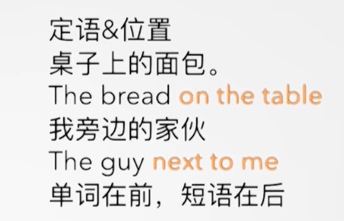

##### 		定语从句：一个句子做定语（adj.）

​			相当于帮助我们去确定你要的是哪个面包，哪个苹果，相当于形容词的作用

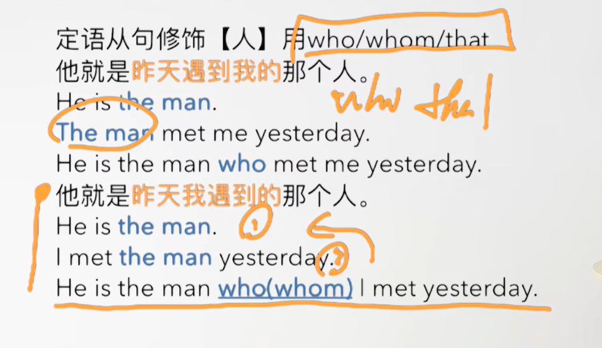


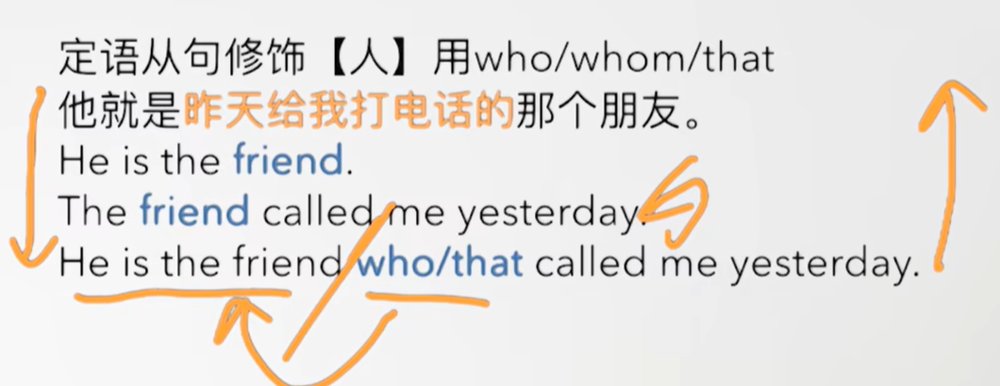


 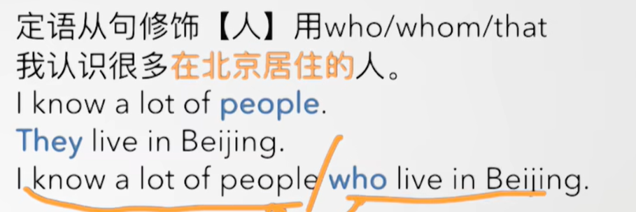


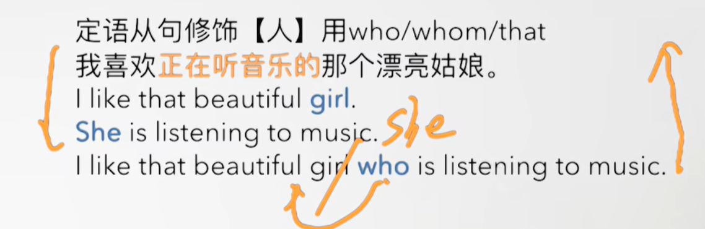


##### 		定语从句-- 修饰物 使用which/that

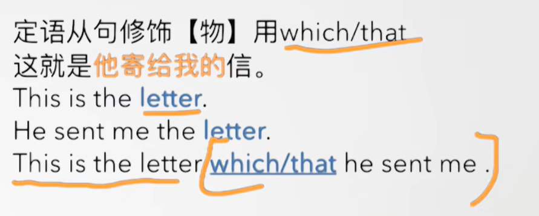

​	替代宾语的时候，Who/which/that 可以被省略

​	如：This is the letter he send it

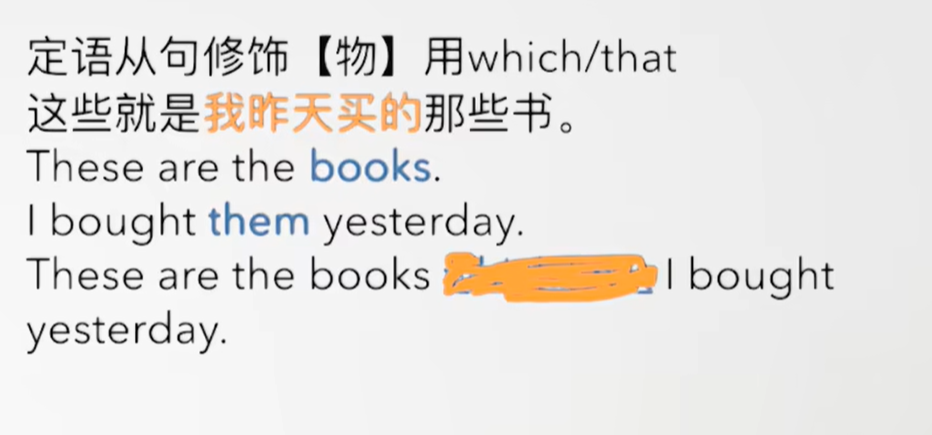


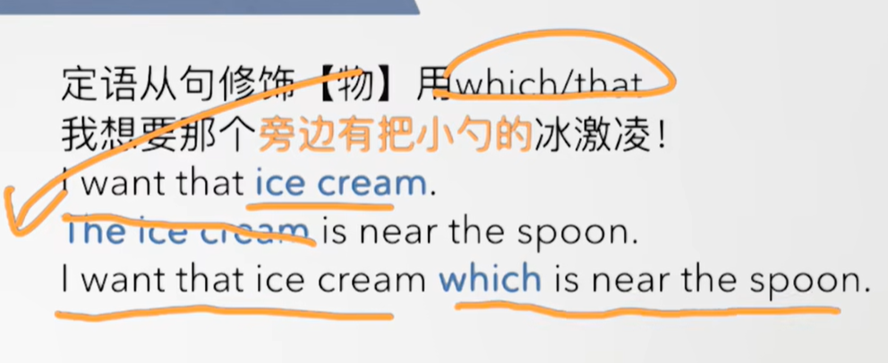


 


#### 	2、如何区分 who/whom/which?


#### 	3、定语从句中的易错点

 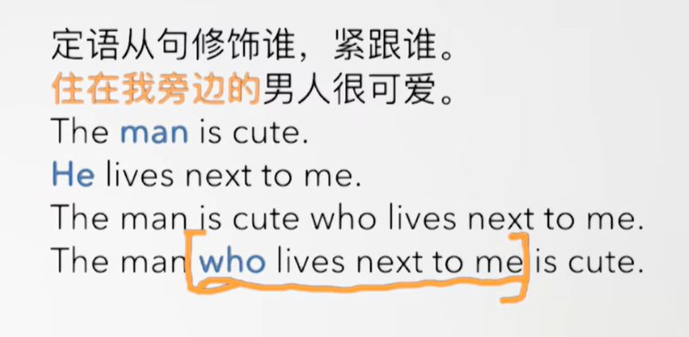


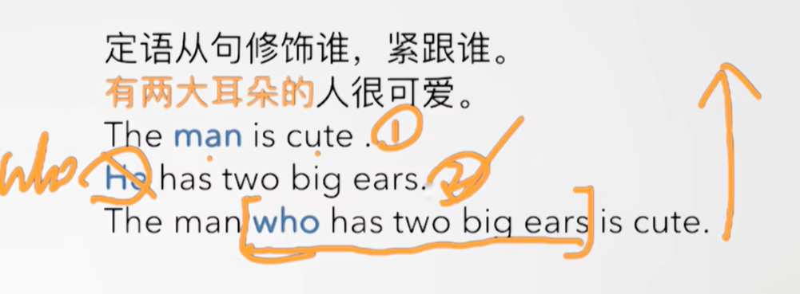

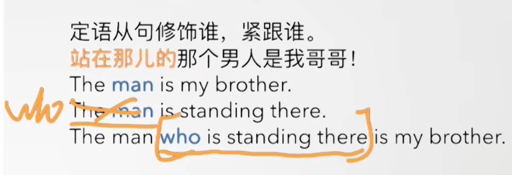


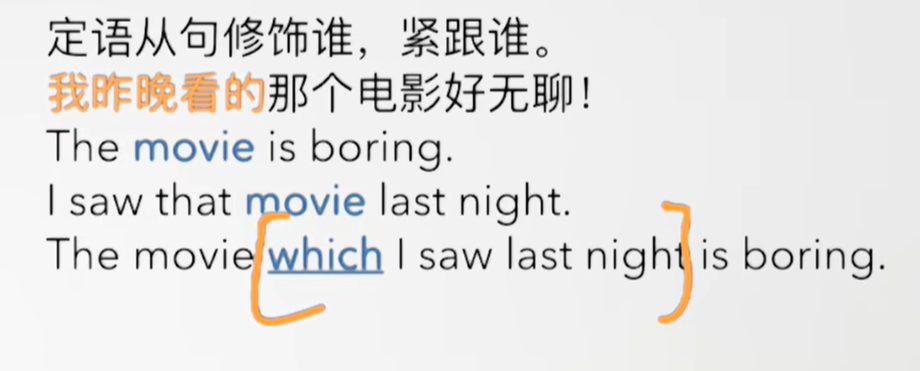

​	如果替代的是宾语那么，可以省略


## 5、Story

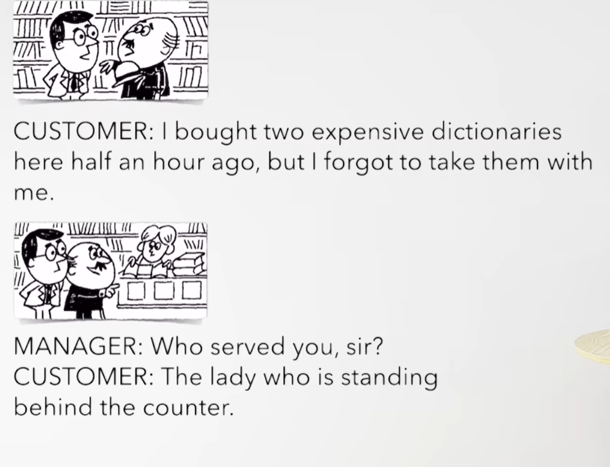

​	我半个小时前买了俩本贵的字典，但是我忘记随身携带了

​	谁服务的你，先生？


​	现在站在柜台后面的女士 服务的我


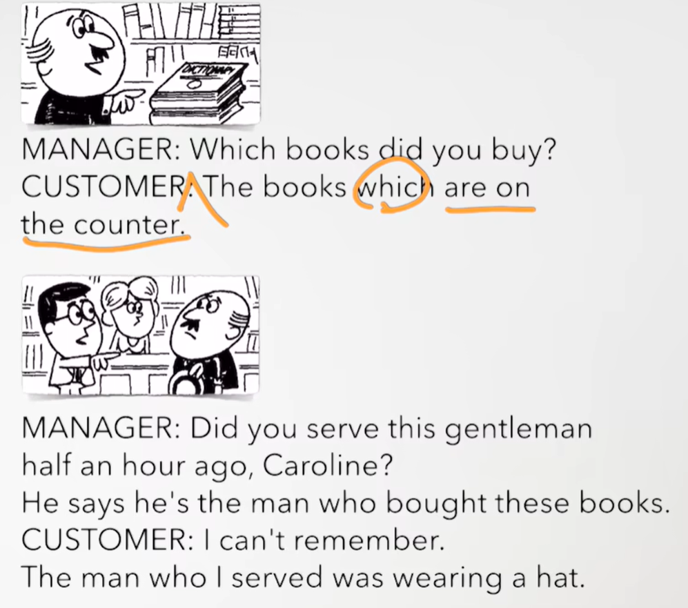

​	你买的那本书？

​	在柜台上面的那些书


​	半小时前是你服务的这位男士吗？Caroline

​	他说 他就是购买这些书的人


​	我记不起来了

​	我服务的男士当时正戴着一个帽子


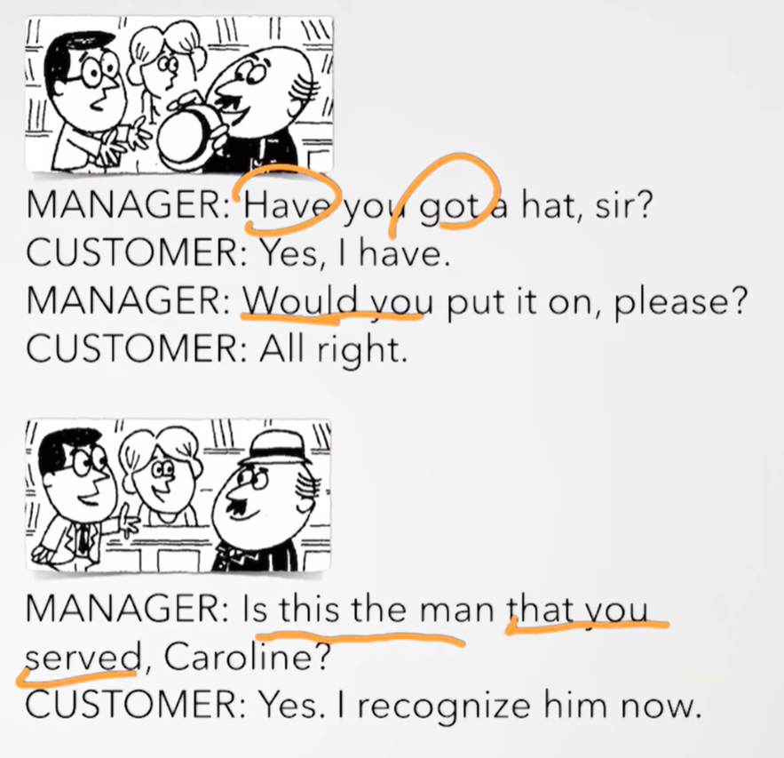

​	你有一顶帽子吗？先生

​	是的，我有

​	你愿意戴上它吗？

​	可以


​	这是你服务的男士吗Caroline？

​	是的，我现在认出他了


# lesson122


## 1、Practices


#### 	1、mechanic ---机械工

​	1、Isn't he the mechanic？ ---- 他不是机械修理师吗？

​	2、Didn't he repair your car？ ----他没有修理你的车吗？

​	3、Yes，he's the mechanic who repaired my car -- 是的，他是修理我的车的机械工


#### 	2、thieves -- 小偷

​	1、Aren't they the thieves？ -- 他们是小偷吗？

​	2、Didn't the police catch them？ -- 警察没有抓到他们吗？

​	3、Yes，they‘re the thieves whom the police caught -- 是的 他们是警察抓住的小偷


#### 	3、car -- 汽车

​	1、Isn't that the car？

​	2、Didn't you sell it last year？ --- 你去年没有卖它吗？

​	3、Yes， that’s the car which I sold last year --- 是的，那个车是我去年卖掉的


