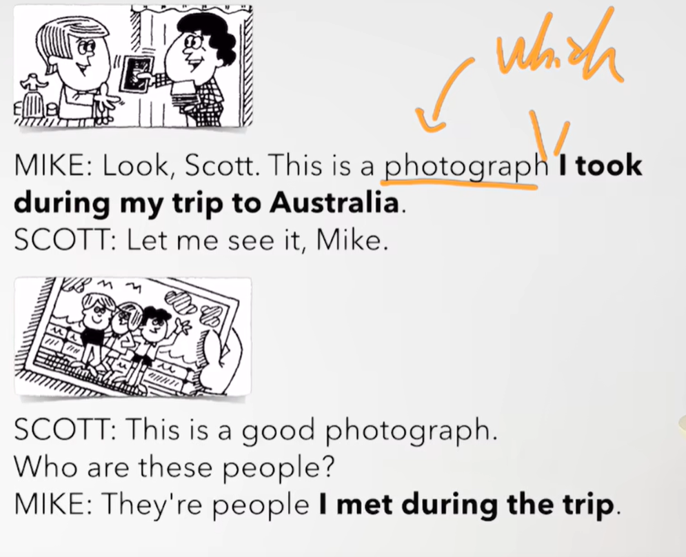
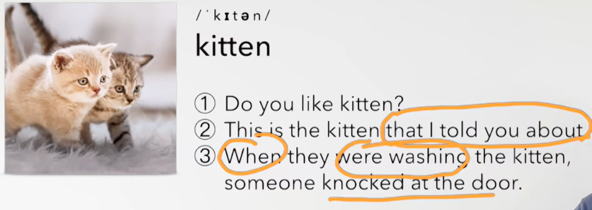

# 65、lesson123-124-定语从句替代宾语省略who&which&that

# lesson123

## 1、Question

#### 	1、如何使用英文感叹句？

​		感叹句  What + a/an + adj + n 

​		What a beautiful ship -- 多漂亮的船啊

 

## 2、Story

​	瞧，scott，这是一张我去澳洲旅游的照片

​	咱们看一下它，Mike

​	这是张很棒的照片

​	这些人是谁？

​	他们是我在旅行期间遇到的人（省略了 who ）

​	那是我们之前旅行坐的船

​	多漂亮的船啊！ -- 感叹句  What + a/an + adj + n 

​	这是谁？

​	那就是我和你讲过的那个人，想起来没？

​	噢，想起来了，这个人在澳洲给你提供了一份工作

​	对的

​	这是谁？

​	猜一猜

​	不会是你吧？

​	正确，就是我

​	我在旅行期间留了胡子

​	但是 我当我回家的时候 我已经刮掉它了

​	你为什么把它刮掉呢？

​	我妻子不喜欢它

## 3、Word

#### 	1、during -- 在...期间、 trip -- n 旅行

​	1、I met him during my trip to New York -- 在我去纽约的旅行期间我遇到了他

​	2、We didn't speak during the meal -- 在吃饭期间我们没有说话

#### 	2、travel -- v 旅行

​	1、I would like to travel there --  我想要 去那里旅游  --L 107

​	2、I travelled with my girlfriend last summer -- 去年夏天我和我的女朋友旅行过

#### 	3、offer -- v 提供、job -- 工作、offer --n 录取、录用

​	1、offer sb a job -- 提供给某人一个工作

 	2、She offer me a job last year -- 她去年提供给我一份工作

#### 	4、guess  /ges/-- 猜猜

​	1、I guess I'm too old for that sort nonsense anymore -- 对于那种毫无意义的事情，我猜我太老了

#### 	5、grow -- grew -- grown v --  生长 、beard -- 胡子 

​	1、I grew a beard during my  trip -- 在我旅行期间我留了一个胡子

​	2、I grow some vegetables every summer -- 每年夏天我都会种一些蔬菜

#  lesson124

​	是的，这就是我和你说过的考试

