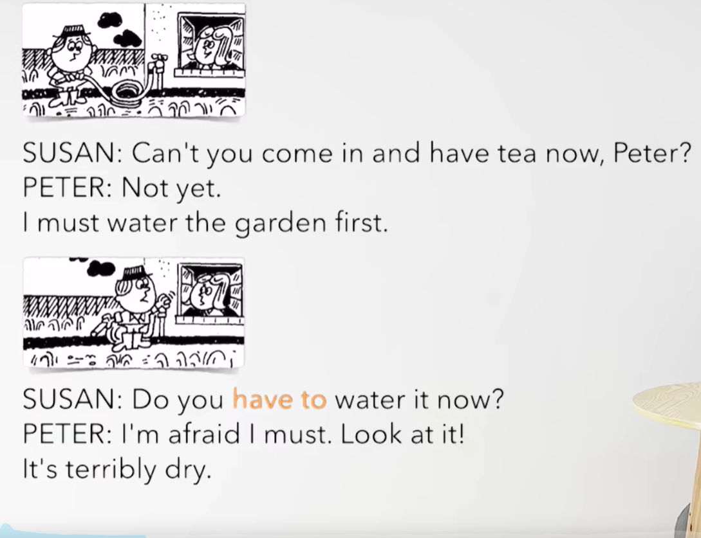
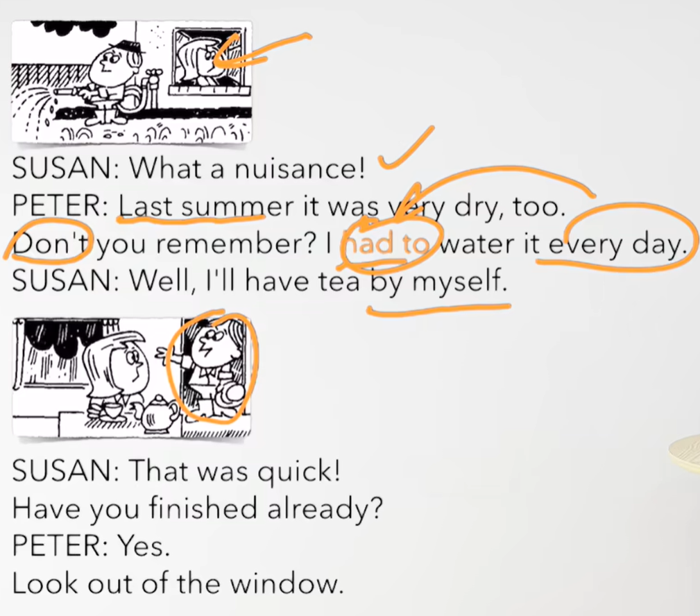
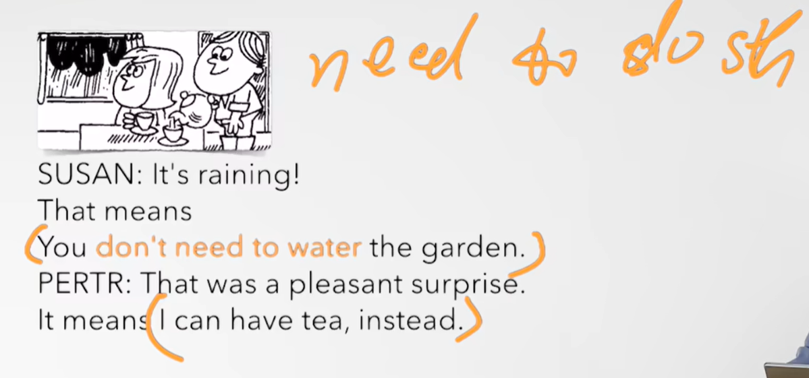
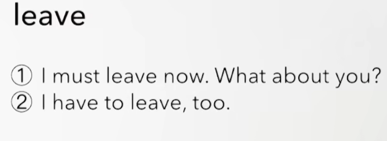
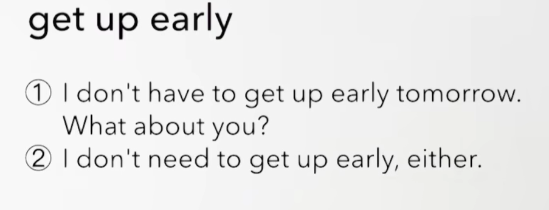
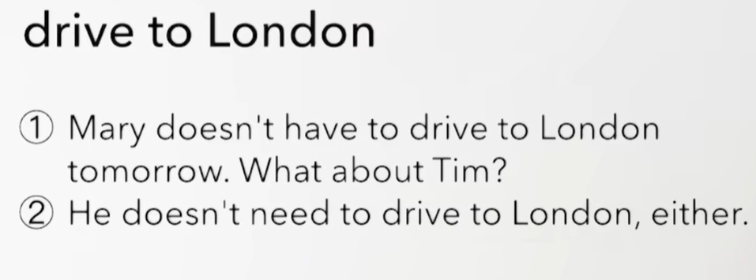

# 66、lesson125-126-have to


# lesson125


## 1、Question

#### 	1、如何使用 have to？

​		have to -- 一般现在时

​		含义：必须/不得不

​		我们可以理解为 have to 已经变成了一个新的单词 haveto 代表必须的意思

​	

##### 		一般现在时

​		I have to leave now -- 我现在必须得离开了/我现在不得不离开了 --- 一般现在时

​		I don't have to leave now -- 我现在不必离开

​		Do you have to leave now？ -- 你现在必须要走吗？

​		Why do you have to leave now？ -- 你现在为什么必须要走呢？

##### 		三单

​		She has to leave now 

​		She doesn't have to leave now

​		Does she have to leave now？


##### 		一般将来时

​		I have lost my key，so I **will have to** stay at home this afternoon -- 我把钥匙丢了，所以今天下午我就不得不待在家里

​		否定句：I won't  **have to** stay at home this afternoon

​		一般疑问句：Will you have to stay at home this afternoon

​		特殊疑问句：When will you have to stay at home？ -- 你将什么时候不得不待在家里


##### 	一般过去时

​		I had to work for my family when I was 16 -- 当我16岁时我不得不为我的家庭工作

​		I didn't have to work for my family -- 我不必为我的家庭去工作

​		Did you have to work for your family？ -- 你必须为你的家庭去工作吗？


#### 	2、have to 与 must 异同？

​		must -- 必须，have to -- 不得不

​		must是 说话人主观的看法 -- 如 I must go now（主观意愿），没有任何人或客观的情况，就是我想

​		have to 不得不 客观需要 -- 如章程或他人命令，例如被迫不得不这样去做

​				I have to go now -- （客观情况） 你表达的是其实不想走，但基于客观原因不得不走 


​		This is a terrible party，we really must go home -- 这是一个糟糕的聚会，我们真的必须要回家了（我自己想走）

​		This is a lovely place，but I have to go home because of my daughter -- 这是一个好地方，但是我不得不回家了，因为我的女儿（客观原因要走 ）


#### 	3、如何表达 某人很讨厌？

​	1、What a nuisance！ -- 真烦人

​	2、She is a nuisance -- 她是个讨厌鬼


## 2、Word


#### 	1、water -- v 浇水，n 水

​	1、My father waters the garden everyday -- 我父亲每天都浇花园

​	2、My mom watered the flowers last night -- 我的妈妈昨晚浇过花了

​	3、The man **who is watering the garden** is my brother -- 正在给花园浇花的那个人是我的兄弟


#### 	2、terribly adv --  非常地（糟糕的非常）、 dry -- adj 干旱

​	1、I watered the garden yesterday，but it's terribly dry right now -- 我昨天给花园浇过水，但是现在非常地干

​	2、Why is it terribly dry this summer？ -- 为什么今年夏天很干燥


#### 	3、nuisance -- 令人讨厌的、蚊子

​	1、What a nuisance！ -- 真烦人

​	2、She is a nuisance -- 她是个讨厌鬼


#### 	4、mean-meant-meant -- v 含义，意味

​	1、It means we can't help him -- 这意味着我们没有办法帮助他

​	2、Does it mean we can't help him？ -- 这意味着我们帮不了他吗？

​	3、What does it mean？ -- 它是什么意思呢？

​	4、What do you mean？ -- 你什么意思呢？

​	

#### 	5、surprise -- n 惊讶，惊喜

​	1、What do you want？

​	2、Surprise me -- 令我感到惊讶

​	3、That was a pleasant surprise -- 那是一个愉快的惊喜


## 3、Homework

```
1、单词造句 3

2、初级红皮书查看语法 have to

3、核心知识点
	这节主要讲解了 have to 的使用，我们可以把have to 理解为一个新的单词，它就是 不得不/必须的含义。
	在have to 和 must 的区别，have to 表示客观原因导致的 不得不怎么样，而must表示的是主观的 必须要怎么样。
	
	在单词学习中，water也可以是动词的形式出现，代表 浇水的意思
	nuisance是蚊子的意思，但多数表示讨厌的含义，如：She is a nuisance -- 她是一个讨厌的人
	mean 是含义/意味 的意思
	
	
```


## 4、Story



​	皮特，你现在不能进来喝茶吗？

​	还不能

​	我必须先浇一下花园


​	你必须要现在浇水吗？

​	我恐怕我必须得浇，看看它！

​	它非常干燥




​	真讨厌啊！

​	去年夏天它们也是非常干

​	难道你不记得了？ 我必须每天浇水

​	好吧， 我将自己喝茶 了


​	真快，你已经完成了吗？

​	是的。

​	你瞧窗户外面




​	正在下雨了

​	那意味着你不需要给花园浇水了

​	那真是一个愉快的惊喜

​	意味着我可以喝茶了


# lesson126


## 1、Practices + Word

#### 	1、immediately -- 立即的，马上的

​	1、We must leave immediately -- 我们必须立即离开

​	2、Do you have to leave immediately？ -- 你不得不立即离开吗？

​	3、After they ate the dinner，they left the house immediately -- 在他们吃完晚饭之后，他们迅速离开了这个房子 -- L119





 





