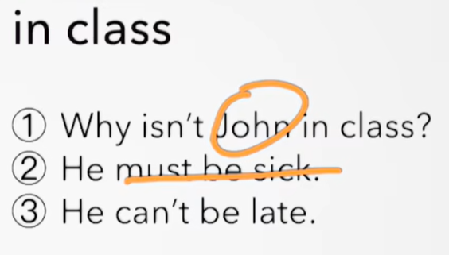
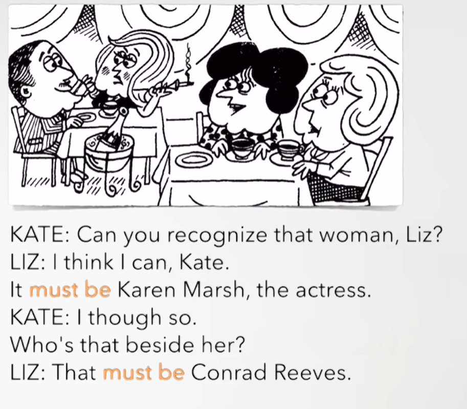
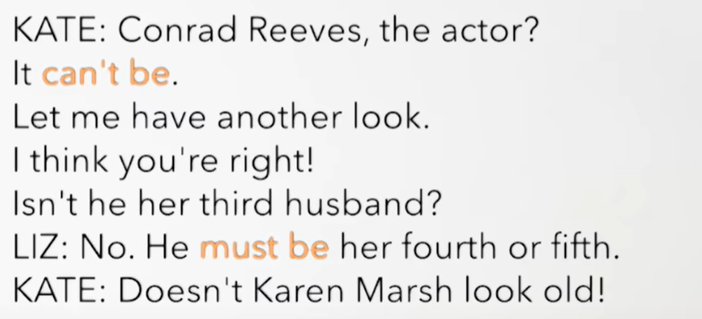
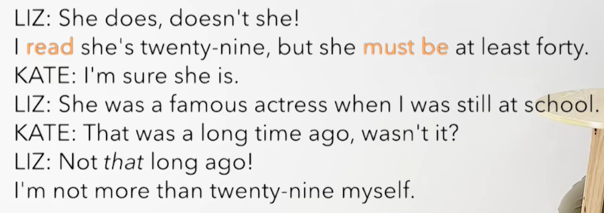
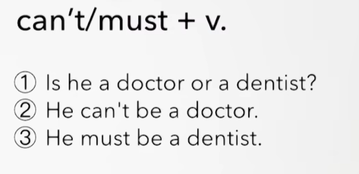

# 67、lesson127-128-must be&can't be


# lesson127


## 1、Question

#### 	1、如何使用must&can't表推测？

##### 		1、must表推测 -- 确信度高/对现在的肯定推测：一定是 

​		must be adj/n

​		must be doing 

​		如：You must be Leo -- 你一定是Leo

​				He must be your father -- 他一定是你的父亲

​		现在must be是一个肯定的推测，不完全确定，如果是完全确定是，那么must be 就替换为 be动词了


##### 		2、**can't 表推测 -- 确信度高/对现在的否定推测：一定不是**

​		can't be adj /n

​		can't be doing

​		如：You can't be Leo -- 你一定不是Leo

​				He can't your father -- 他一定不是你的父亲




 

## 2、Word

#### 	1、famous -- adj 出名的、 actress -- n 女演员

​	1、She is a famous actress -- 她是一个有名的女演员

​	2、The famous actress **who you saw last night** is my sister -- 你昨天晚上看到的女明星是我的妹妹

​	3、When the famous actress was having a bath，someone knocked at the door -- 当这个明星正在洗澡的时候，有人敲门


#### 	2、actor -- n 男演员

​	1、The actor **who you met yesterday** is my brother -- 你昨天遇见的那个男演员是我的兄弟

​	2、This is the best actor I‘ve ever seen -- 这是我见过最好的男演员 -- L111

​	3、The actor had to get up very early this morning -- 今天早晨这个男演员不得不非常早的起床 -- L125


#### 	3、read -- v 读、读到了

​	1、Can't you read the sign？It says No parking -- 你能读懂这个标志吗？它说的是禁止停车

​	2、**I read** the actress was here last night -- 我读到了 这个女演员昨晚是在这里的  -- L99（宾语从句）


## 3、Homework

```
1、单词造句 3

	famous
	1、That must be a famous building -- 那一定是一座著名的建筑
	2、She was a famous actor -- 她曾是一位著名的演员
	3、We must go to the best famous place -- 我们必须去最有名的地方
	
	actor
	1、He must be a friendly actor -- 他一定是一位友好的演员
	2、This actor has to stop the show because It's raining -- 这位演员不得不停止演出，因为下雨了
	3、The actor was working during the afternoon -- 这个演员在下午期间工作

	read
	1、I read that he wrote that book -- 我之前读到过他写的那本书
	2、He read that the company sent an email -- 他读到公司发送了一封邮件
	3、We have already read a magazine -- 我们已经读过一本杂志
	


2、初级红皮书查找语法 must be& can't

3、核心知识点
	这节主要讲了就是 must be&can't be的用法
	1、must be 代表肯定预测--不完全确定 如 you must be a teacher -- 你一定是一名老师
		含义是一定是，must另一个含义是必须，所以我们在遇到must的时候就需要注意这俩种含义想要表达的究竟是哪一种。
	2、can't be 代表是否定预测--一定不是 如 You can't be cat -- 你一定不是猫
		含义是一定不是，与must be 的使用是一样的，同样也需要注意 can’t的另外含义 不能，遇到句子分析究竟是那种含义
	同样他们俩种 肯定预测&否定预测 后面都是可以根 adj形容词或者n名词
	
	这节还复习了 have to 不得不 的使用，也复习了定语从句，宾语从句，在这个复习的过程中我们要注意什么时候 从句的引导关键词可以省略 如 who，我们是如果这个代表的是 宾语 那么就可以直接省略，如果代表的是主语那么就不能省略了。
	
	
```


## 4、Story



你能认出那个女人吗？Liz

我认为我能

她一定是KM，那个女演员

我刚才也是这样认为的 -- think的过去时 thought

她的旁边那个是谁？

那一定是CR




​	CR 是男演员吗？

​	它一定不是

​	让我再看一下 have another look

​	我认为你是对的

​	难道他不是她的第三任老公吗？

​	不是，他一定是她的第四任或第五任老公了

​	难道KM看起来不老吗？




​	她确实是这样的，难道她不是吗

​	我读过她的 二十九岁，但是她一定是至少四十岁了

​	我很确定 她是

​	当我以前在学校的时候，她是一个有名的女演员

​	那是很久以前的事情了，对吧？

​	没有那么长时间之前

​	我自己还没有超过二十九岁呢


# lesson128


## 1、Practices

 

​		这里有个错误，不是+v，而是adj/n


