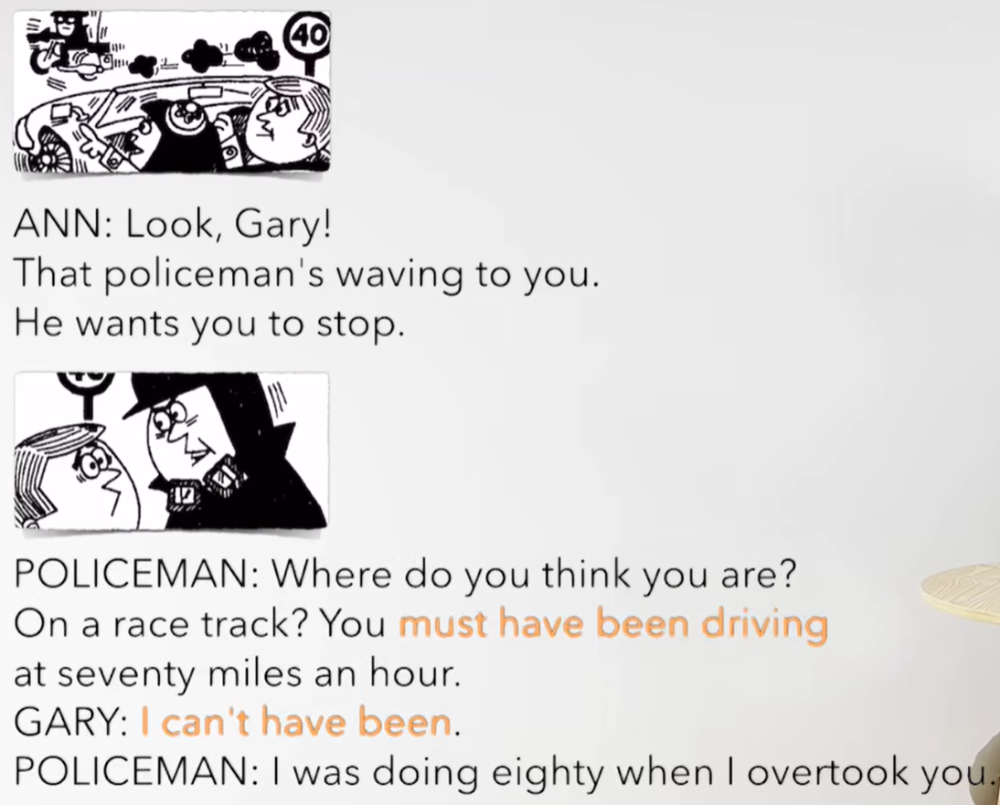
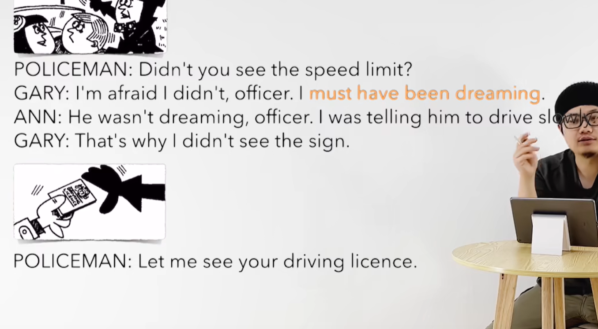
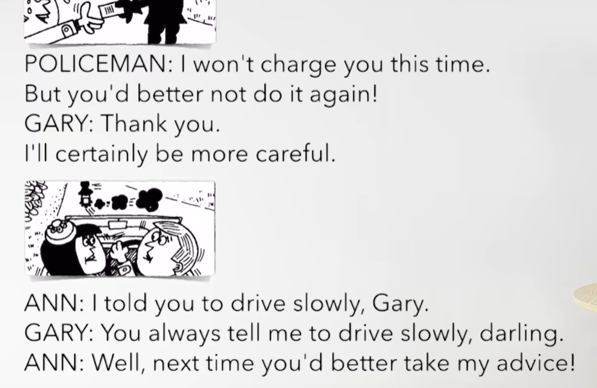
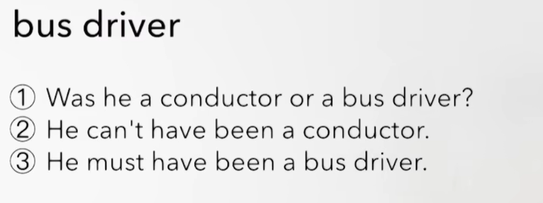

# 68、lesson129-130-must&can't


# lesson129


## 1、Question

#### 	1、must&can't对过去推测？

​		确信度高、对过去的肯定推测： 当时一定是

​		must have been  adj / n

​		must have done  --- done是动词的过去分词 

​		must have been doing  -- 当时一定在做某事


​		I must have been crazy -- 我当时一定是疯了

​		They must have been having a party -- 他们当时一定是正在举办一个聚会

​		

##### 		2、can't

​		确信度高、对过去的否定推测：当时一定不是

​		can't have been adj 、n

​		can't have done

​		can't have been doing 


​		She can't have been ill -- 她当时一定不是病了

​		They can't have been having dinner -- 他们当时一定不是正在吃晚餐


## 2、Word

#### 	1、wave --v 招手，挥手

​	1、wave to sb --  对某人招手

​	2、Look，they are waving to you -- 瞧，他们正在对你招手

​	3、The policeman waved to you --- 这个警察刚才和你招手了


#### 	2、track n -- 轨道、 race -- 比赛

 	1、on the race track -- 赛道

​	2、My brother is driving a car on the race track -- 我的兄弟正在赛道上开着一辆车

​	3、They must be cleaning the race track now -- 他们一定是正在清理赛道

​	4、THe race track **which they cleaned yesterday** is full of bottles now -- 他们昨天打扫过的赛道现在满是瓶子


#### 	3、mile -- 英里

​	1、The railway station is 4 miles away -- 火车站大概是4英里的地方

​	2、She is driving at seventy miles an hour --  她正在开车每小时70英里

​	3、He must be driving at fifty miles an hour -- 他一定是以每小时五十英里在开车


#### 	4、overtake -- overtook - overtaken -- 超过 超越

​	1、The white car overtook the red one a minute ago -- 这辆白车一分钟前超越了这辆红车


#### 	5、speed limit -- 速度 限制 - 限速

​	1、He can't have seen the speed limit -- 他当时一定没有看这个限速

​	2、She saw the speed limit -- 她看到了限速


#### 	6、dream -- v 做梦、n梦想

​	1、She waved to you， but you didn't see her You must have been dreaming -- 她对你招手了，但是你没有看到她，你当时一定是做梦了

​	2、I dreamed about you last night -- 我昨天晚上梦到你了

​	3、She dreamed about some bad things last night -- 她昨天晚上梦到了一些不好的事情


#### 	7、sign -- n 标志

​	1、The sign **which they put up yesterday** was not there this morning -- 他们昨天把这个标志立起来的，今天早晨这个标志不在那了

​	2、She must be cleaning the sign right now -- 她现在一定是正在清理标志

​	3、When he was cleaning the sign on the street yesterday，I waved to him -- 当他昨天正在清理牌子的时候，我向他挥手 -- L117


#### 	8、driving license -- 驾照

​	1、I had to give police my driving license yesterday -- 我昨天不得不把我的驾照给警察

​	2、Did you have to give police your driving license yesterday？


#### 	9、charge -- v 罚款

 	1、The police will charge you this time -- 警察这次将对你罚款


## 3、Homework

```
1、单词造句

2、初级红皮书语法 查看 must和can't 过去推测，一定是、一定不是

3、核心知识点
	这节还是讲解了 must 和 can't的使用
	must have been adj/n -- 当时一定是
	can't have been adj/n -- 当时一定不是
	
	
```


## 4、Story



​	瞧Gary！

​	那个警察正在对你招手

​	他想让你停下

​	

​	你认为你现在在哪里？

​	在赛道上吗？你当时一定是开车在七十英里每小时

​	我一定没有吧

​	当我超过你的时候，我正在以八十英里每小时




​	你之前没有看到限速吗？

​	我恐怕，我没看到 警官，我当时一定是做梦了

​	他当时没有做白日梦，警官，我当时正和他说开的慢点

​	那就是为什么我没看到指示牌了


​	让我看一下你的驾照



​	我这次将不对你罚款

​	但是 你最好不要再次这样了

​	谢谢，我一定会更加小心的


​	我之前对你说开的慢点Gary

​	你总是告诉我要慢点开，心爱的

​	好吧，下次你最好还是听从我的建议


# L130


## 1、Practices




​	


