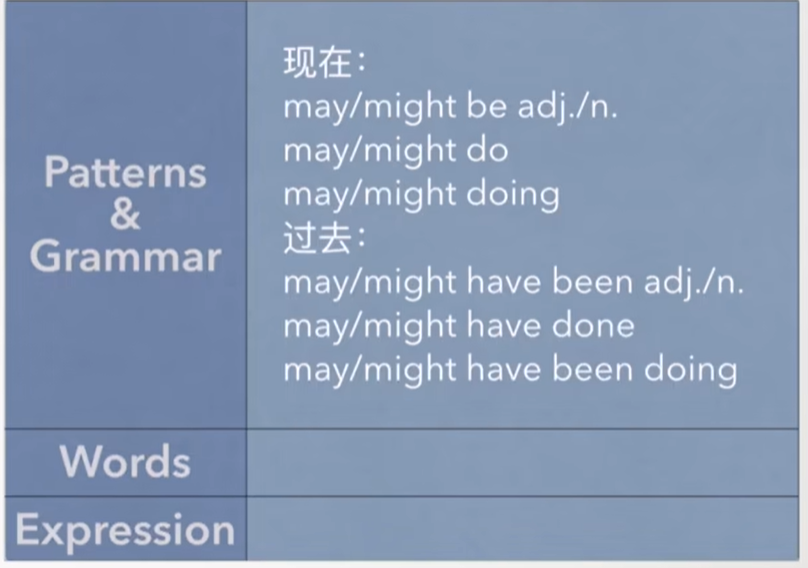
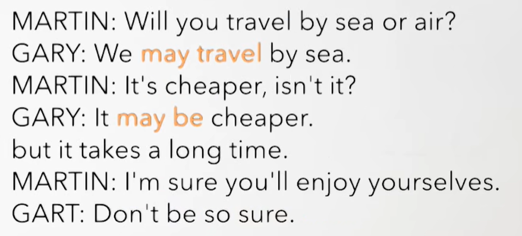
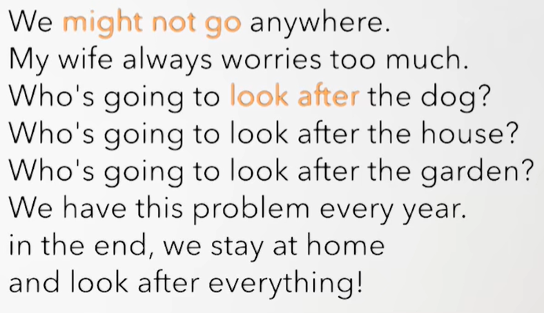
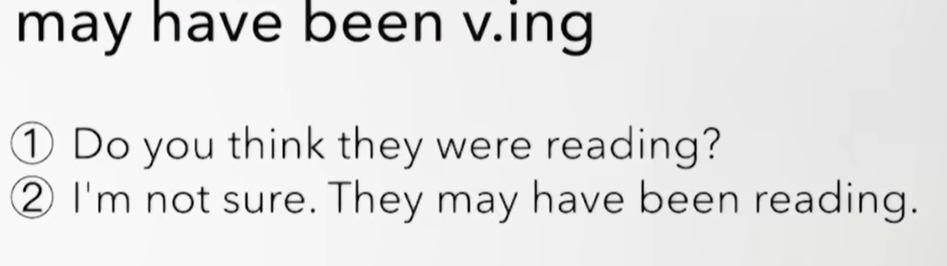
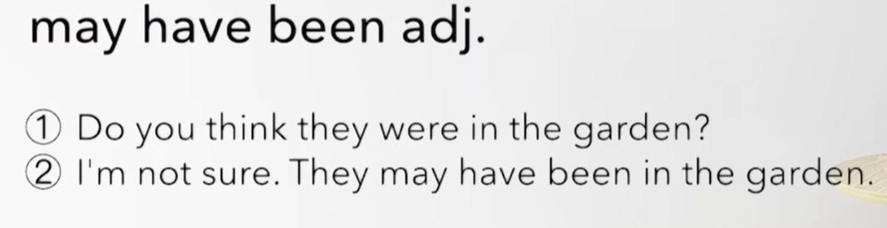
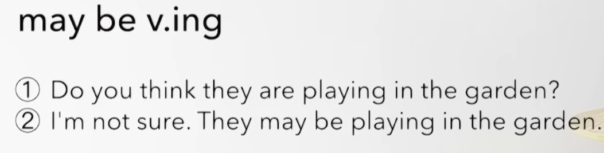

# 69、lesson131-132-may/might推测


# lesson131


## 1、Question

#### 	1、may&might表推测？ 

##### 	1、确信度低/对现在的肯定推测：可能是

​	may/might be adj、n

​	may/might do

​	may/might be doing 

​	否定： may/might + not

​	例句：1、Where is he from？

​				2、She may be from China

​				3、What is he doing？

​				4、He may be eating -- 他可能正在吃


##### 	2、确信度低/对过去的肯定推测：当时可能是

​	may/might have been adj/n

​	may/might have done

​	may/might haven been doing 

​	例句：1、What was his job？I don't know

​				2、He may have been a doctor -- 他当时可能是一个医生


​				3、What was he doing？

​				4、He may have been repairing his car -- 他当时可能正在修理他的车


## 2、Word

#### 	1、Egypt -- n 埃及

​	1、They went to egypt last week -- 他们上周去过埃及

​	2、The man **who you met in Egypt** bought himself a new car -- 你在埃及见到的那个男人，他给自己买了一辆新车-- L121

​		句中的who可以被省略，因为who在从句中是属于宾语


#### 	2、abroad -- 国外

​	1、go abroad -- 出国

​	2、He has lived aboard for 15 years -- 他在国外生活了15年

​	3、They went abroad last winter -- 他们去年冬天出国了


#### 	3、worry -- v 担心

​	1、worry about sb/sth -- 担心某人/担心某事

​	2、He worries about his job every day -- 他每天都会担心他的工作

​	3、Your mom worried about you last night -- 你的妈妈昨晚很担心你


#### Recap




## 3、Homework

```
1、单词造句

2、初级红皮书查看 may

3、核心知识点
	这节主要讲了 还是推测，只不过是确信度低的推测，使用may/might + have been -- 当时可能是
	


```


## 4、Story


​	今年你打算去哪度假呢？

​	我们可能会出国

​	我不确定

​	我的妻子想要去埃及

​	我也想去那

​	我们还不能 下定决心




​	你们打算坐船还是飞机旅行？

​	我们可能坐船吧

​	更便宜，对吧？

​	可能是更便宜，但是花费更长的时间

​	我很确定 你将玩的很开心

​	你可别太确定

​	



​	我们可能哪也去不了

​	我妻子总之过多的担心

​	谁将照看狗，谁将照看房子，谁将照看花园？

​	我们每年都会有这个问题

​	最后，我们待在家里

​	然后照看一切

 


# lesson132

## 

## 1、Practices










  


