# 6、lesson10-11-特殊疑问词Whose

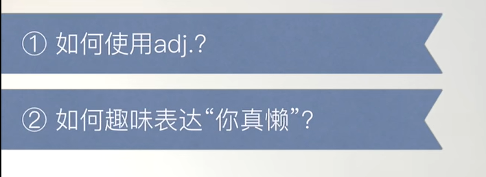

​		形容词的使用  ---- adj 形容词 + n 名词

## 1、单词

#### 1、fat -- 胖

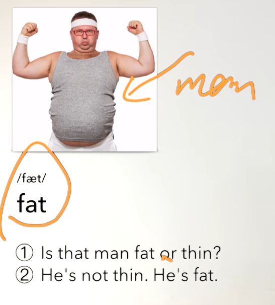

#### 	2、thin -- 廋

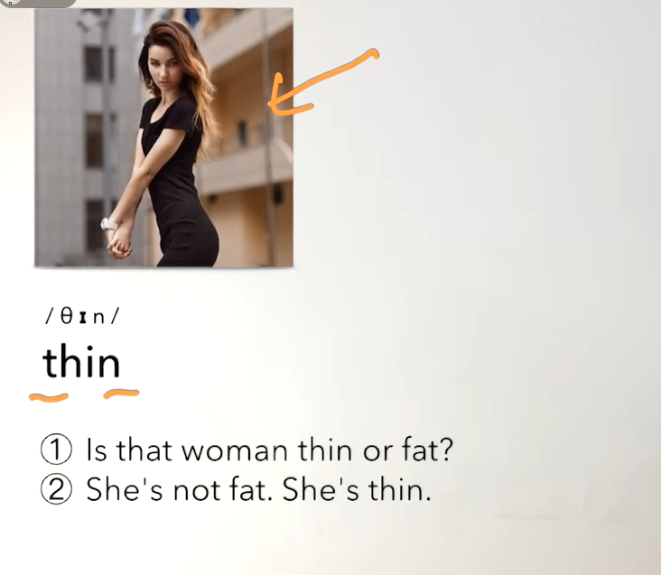

#### 	3、tall -- 高

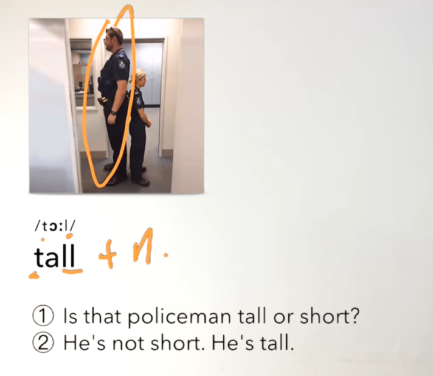

#### 	4、short -- 短的，矮的

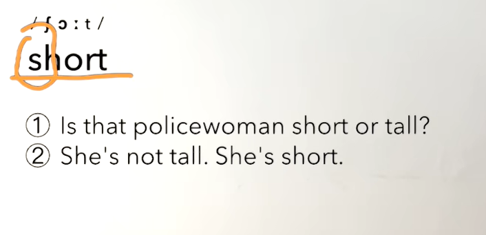

#### 	5、dirty -- 脏

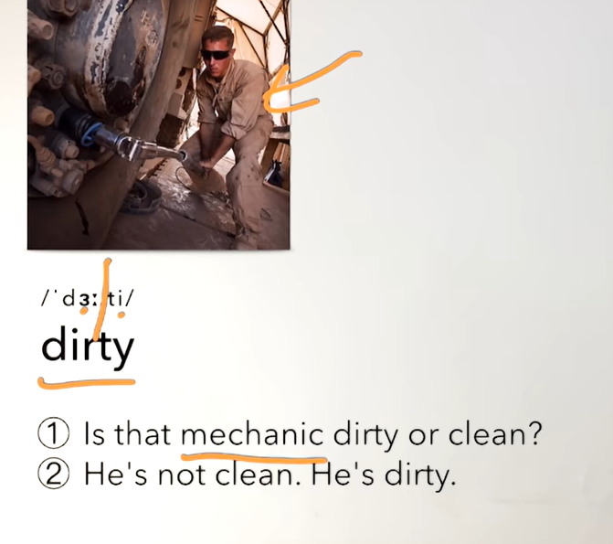

#### 	6、clean -- 干净

​				nurse 护士

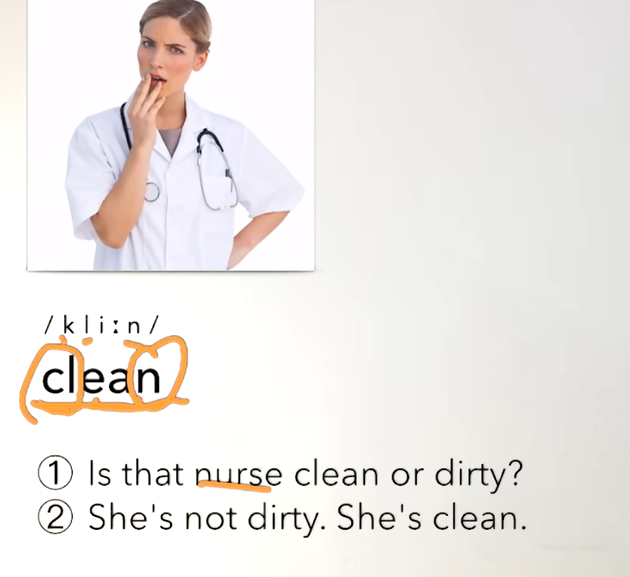

#### 	7、hot -- 热

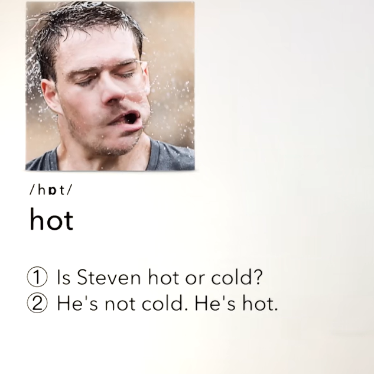

#### 	8、cold -- 冷的

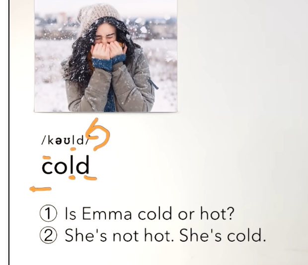

#### 	9、old -- 老的

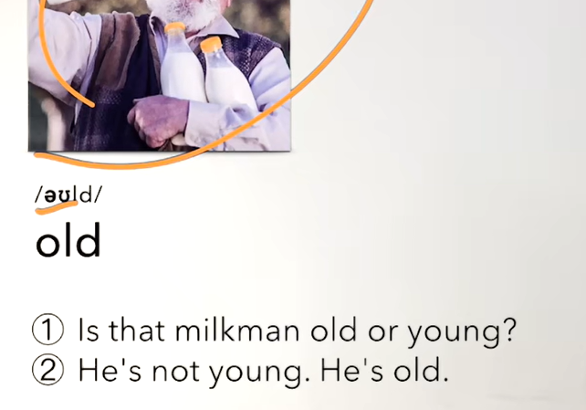

#### 	10、young --年轻的

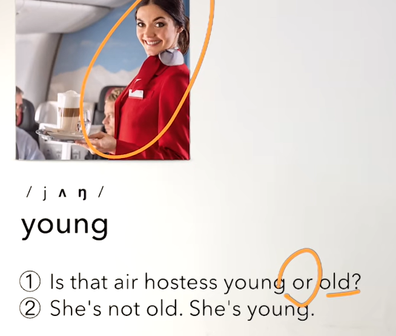

#### 	11、busy -- 忙

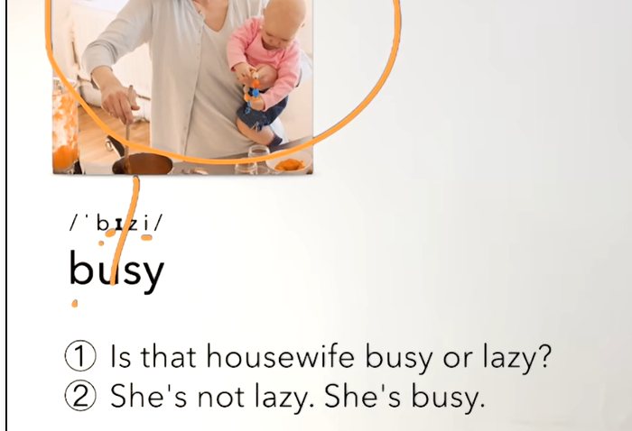

#### 	12、lazy -- 懒散的

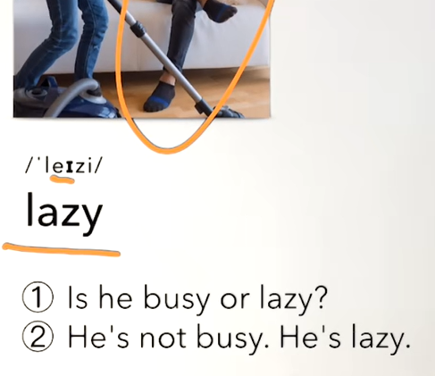

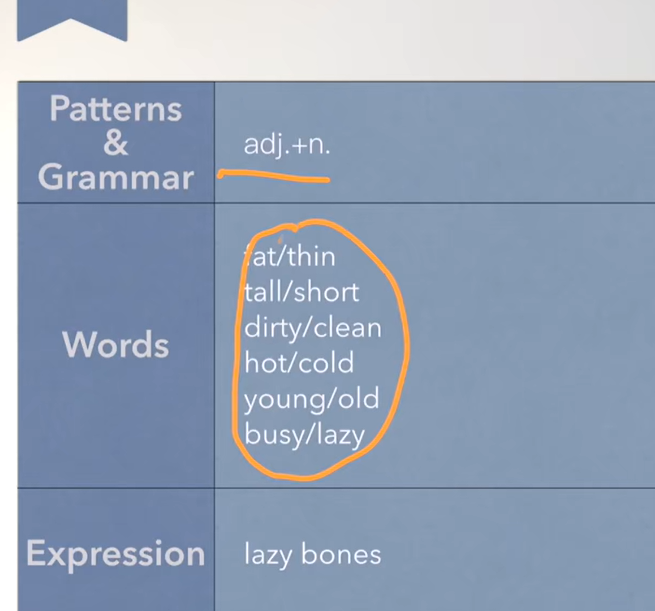

##  2、单词

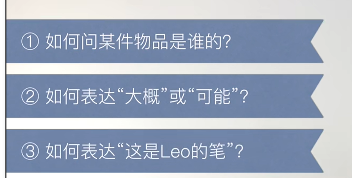

#### 	1、blue -- 蓝色

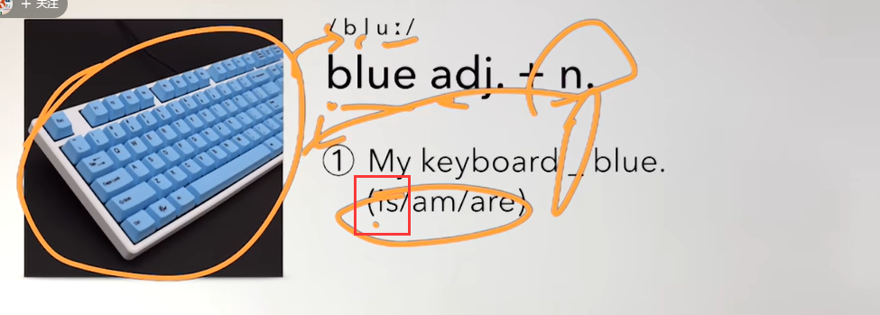

#### 	2、perhaps -- 大概

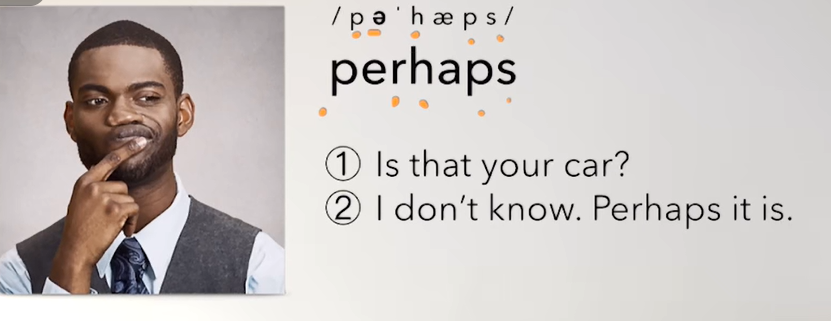

#### 	3、white -- 白色

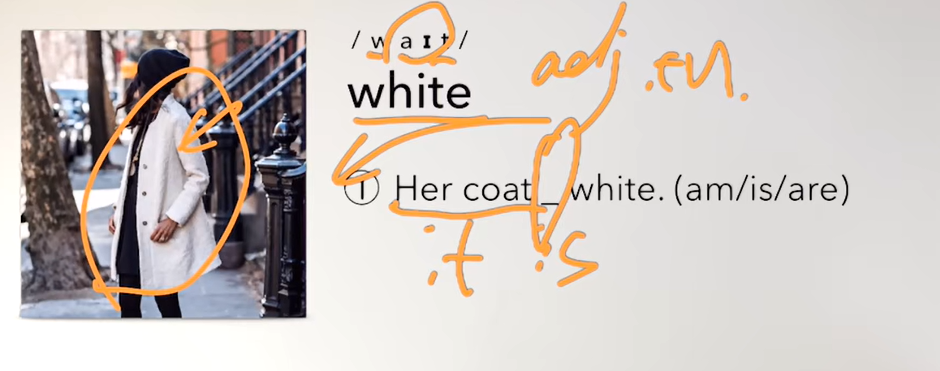

#### 	4、catch -- 抓

​		v. -- 动词

## 3、练习特殊疑问句：whose -- 这是

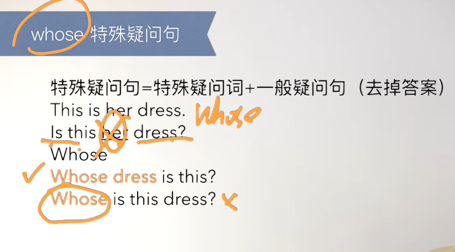

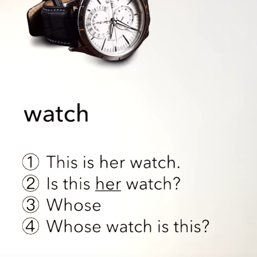

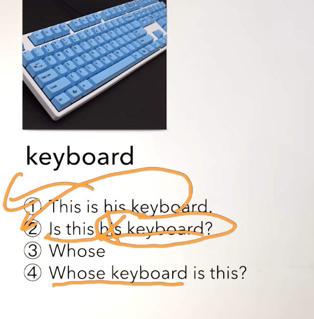

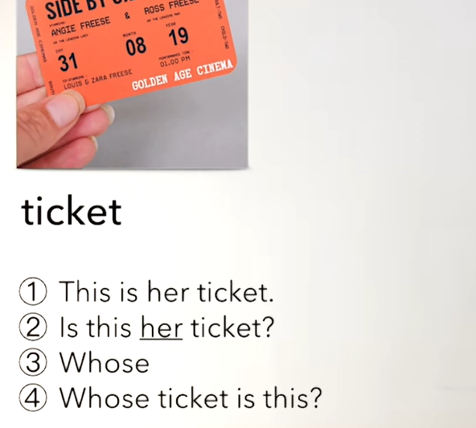

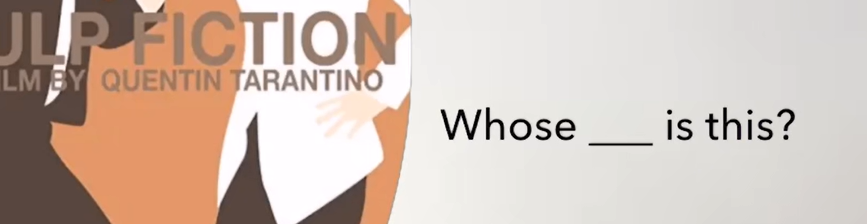

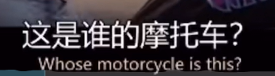

​		这是谁的衬衫？

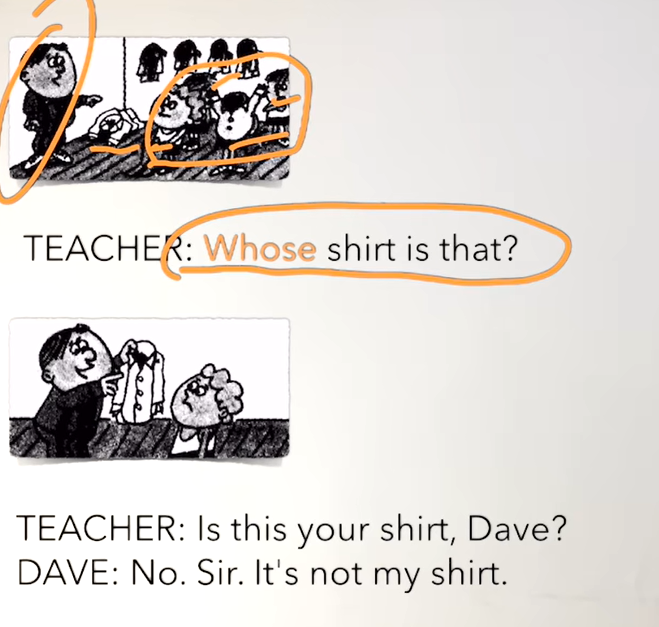

​			tim's 是代表  tim的

​			这件衬衫是tim的吗？

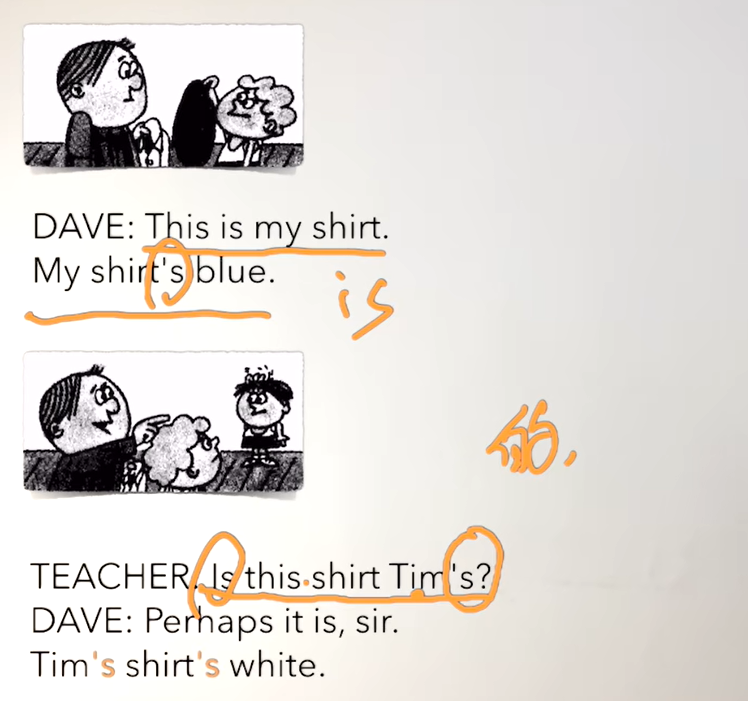

#### 	名词 + 's 代表谁的 的

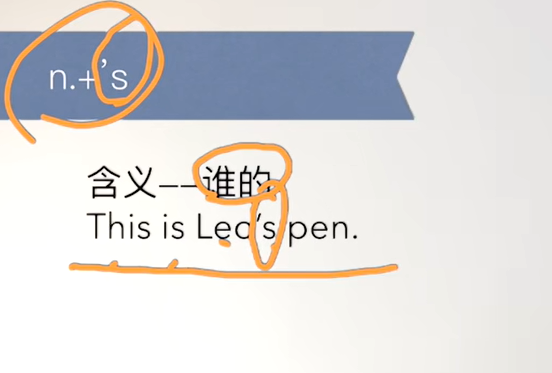

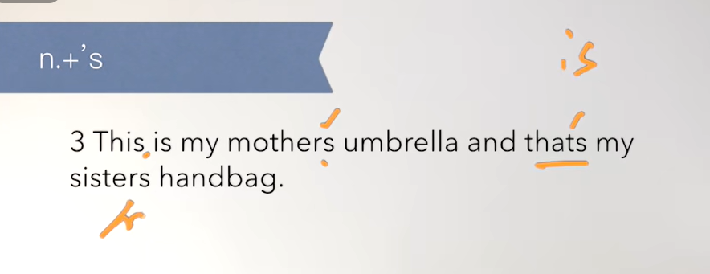

