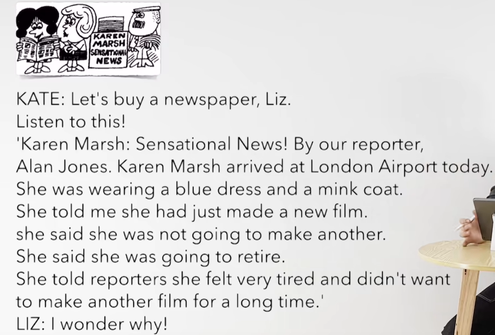

# 70、lesson133-134-直接引语&间接引语时态变化


## 1、Question

#### 	1、直接引语&间接引语时态变化？

​			参考L99-101讲过直接引语和间接引语

​			主句： 一般过去时

​			直接引语：一般现在时 am/is/are/do/does

​			间接引语：一般过去时 was/were/did

​	例句：I feel tired

​				What did she say？

​				She said that she felt tired -- 她说她感觉累了 -- 这个 that she felt tired是间接引语，而且是过去说的话 时态是过去

​			直接引语如果是一般现在时，间接引语要变为一般过去时，并且主句是 一般过去时


​			主句：一般过去时

​			直接引语：现在进行时 am/is/are + doing

​			间接引语：过去进行时 was/were + doing 

​	例句：I am writing for the taxi

​				What did she told you？

​				She told me **that she was writing for the taxi** -- 她之前告诉我 她之前正在等待出租车

​			主句是一般过去时，要把直接引语的 现在进行时变为间接引语 的过去进行时


​			主句：一般过去时

​			直接引语：现在完成时 have done / 一般过去时 was/were/did

​			间接引语：过去完成时 had + done

​	例句：I have finished my homework

​				What did she say？

​				She said that she had finished her Homework -- 她说 她已经完成了她的作业


​			主句：一般过去时

​			直接引语：一般将来时 am/is/are + going to do

​			间接引语：过去将来时 was/were going to do

​	例句：I'm going to take a bath

​				What did she say？

​				She said that she was going to take a bath -- 她说 她之前打算去洗澡


## 2、Word

#### 	1、reporter -- n 记者

​	1、She is the best reporter I've ever seen -- 她是我见过最好的记者 -- L111

​	2、The reporter **who was on TV last night** went abroad this morning -- 昨晚电视上的记者今天早晨出国了

​	3、After the reporter got out of the building，it began to rain -- 记者出了这个建筑之后 就开始下雨了 --L119


#### 	2、sensational -- adj 骇人听闻的，轰动的

​	1、This is the most sensational news I've ever heard -- 这是我听过最轰动的消息了 -- L111

​	2、This may be the most sensational news I've ever heard -- 这可能是我听过最轰动的消息了 -- L131


#### 	3、mink coat -- 皮衣

​	1、This is the mink coat which I bought last winter -- 这是我去年冬天买的皮衣 -- L121&123

​	2、This mink coat is longer than that one -- 这个皮衣比那个更长 -- L108

​	3、She must have been wearing that mink coat last night -- 她昨晚一定是穿着那件皮衣 -- L129


## 3、Homework

```
1、单词造句

2、核心知识点
	这节主要讲解了 主语是一般过去时，直接引语的某种时态 对应的 间接引语的时态变化
	其实就是 大部分是变为 间接引语的 过去时态，因为这个引用 都是过去发生的事情了，只不过是分为 一般过去时，过去进行时，过去完成时 这些个状态的变化需要注意。
	
	
	
```


## 4、Story

 

​	你刚刚有拍一部新电影吗 M女士？

​	是的，我有

​	你打算去拍另一部吗？

​	不，我不打算，我准备退休了

​	我感觉非常的累

​	我不想拍其他的电影很久了


 

咱们买一份报纸吧Liz

听听这个！

KM： 轰动的新闻！由我们的记者AJ报道，KM今天到达了伦敦机场

她当时穿着一个蓝色的裙子和一件皮衣

她告诉我 她刚刚拍了一部新电影

她说 她不打算拍另外的电影了

她说 她打算退休

她告诉记者 她感觉非常的累而且她不想拍另一部电影很长时间了

我很好奇为什么！


## 5、Practices


