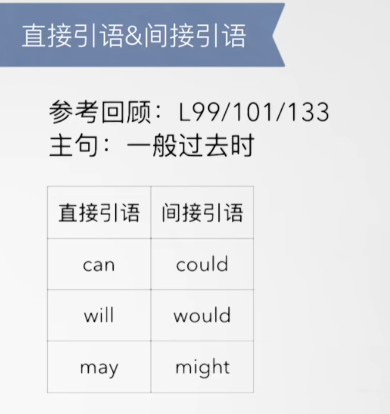
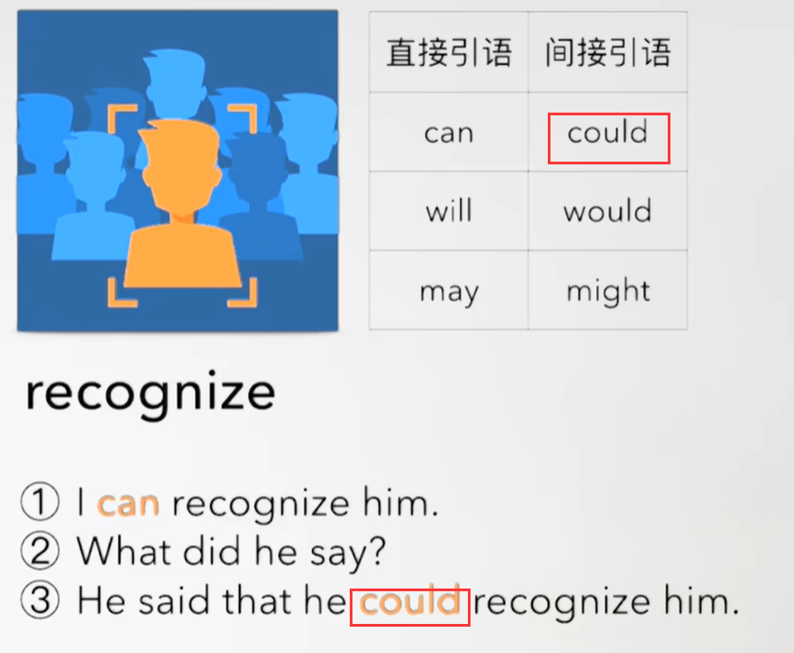
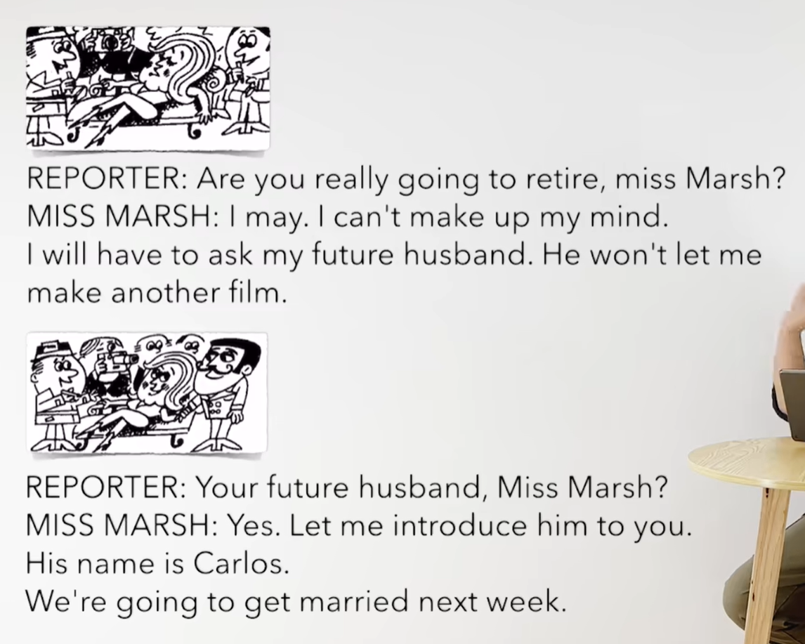
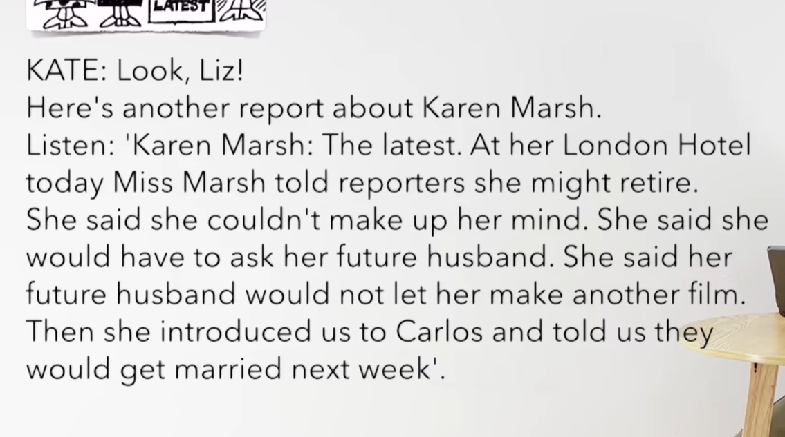
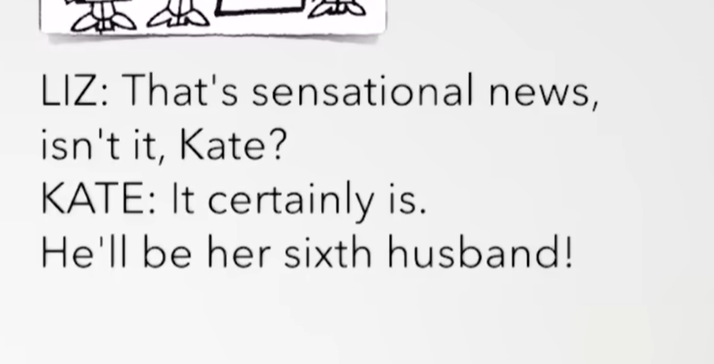
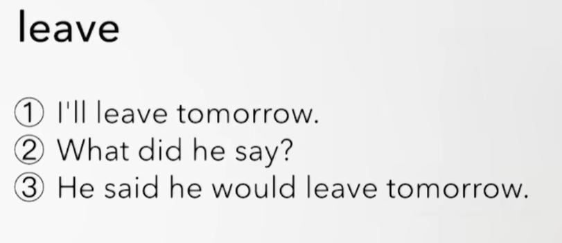
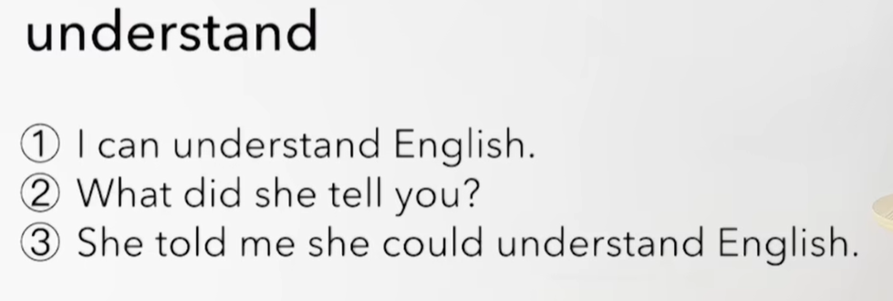
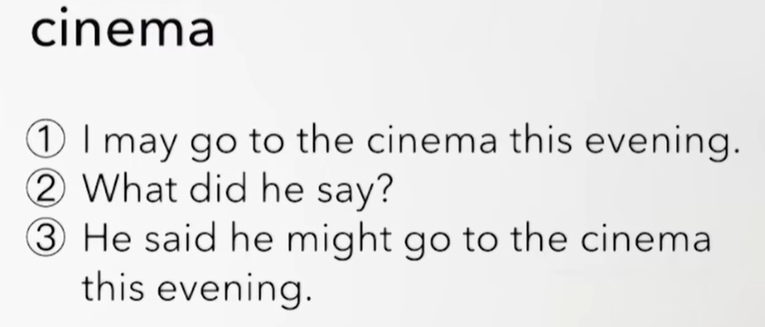

# 71、lesson135-136-直接间接引语情态动词转换

## 1、Question

#### 	1、直接引语变间接引语：情态动词

​	间接引语其实就是个宾语从句

 

## 2、Word

#### 	1、future -- adj 未来

​	1、future husband、wife -- 未来的老公、老婆

​	2、This is my future husband -- 这是我未来的老公

​	3、While my future wife was having a bath，someone knocked on the door -- 当我未来的妻子正在洗澡时，有人来敲门 -- L117

​	4、My future husband is taller than your future wife -- 我未来的丈夫比你未来的妻子高 -- L107

#### 	2、get married -- v 结婚

​	1、They are going to get married next week -- 他们打算下周去结婚

​	 2、They got married last summer

​	3、The **man who you met last night** got married a month ago --  你昨天晚上见到的那个男人 在一个月前结婚了

#### 	3、hotel -- 酒店

​	1、This is the hotel which I told you about -- 这是一个我之前和你说过的酒店 -- L121

​	2、This must be a very nice hotel -- 这一定是个非常棒的酒店 -- L127

​	3、She can't have been living in that hotel -- 她当时一定不是正住在那个酒店中 -- L129

​	4、The may be sleeping in that hotel -- 他们可能正在那个酒店休息 -- L131

#### 	4、latest -- adj 最新的

​	1、newest/latest model -- 最新的模型

​	2、This is the latest model -- 这是最新的模型

​	3、The model which you saw yesterday is the latest one -- 你昨天看到的模型是最新的

#### 	5、introduce -- v 介绍

​	1、I would like to introduce my boss -- 我愿意去介绍一下我的老板 -- L107

​	2、I had to introduce it to my boss yesterday -- 我昨天不得不给我的老板介绍一下它 -- L125

​	3、Did you have to introduce it to your boss yesterday？ -- 你昨天不得不介绍它给你的老板吗？

## 3、Story

​	你真的要退休吗M女士？

​	我可能，我还不能下定决心

​	我将不得不问问我未来丈夫，他不打算让我拍电影了

​	你的未来丈夫M女士？

​	是的，让我介绍他给你

​	他的名字是C

​	我们打算下周去结婚

​	瞧Liz

​	这是另一个关于KM的报道

​	听 Km 最新消息，在他的伦敦酒店

​	今天 M女士告诉记者 她可能退休

​	她说 她没有办法下定决心

​	她说她将不得不问问她未来的丈夫，她说她未来的丈夫不想让他拍电影了

​	然后 她介绍给我们给Carlos 还告诉我们 他们下周要结婚了

​	那是一个轰动的新闻啊，不是吗kate？

​	当然是了

​	他将是她的第六任丈夫

## 4、practices

​	

