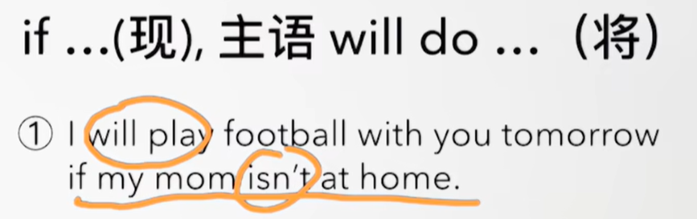
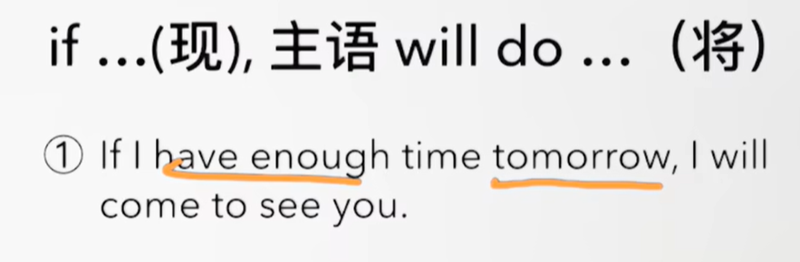
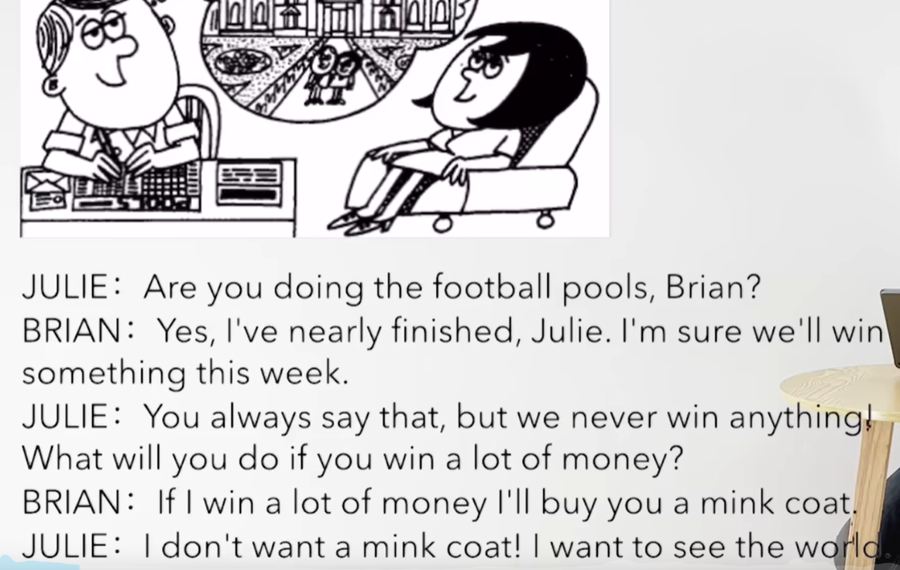
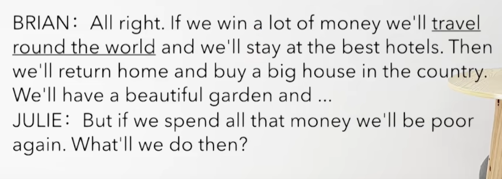
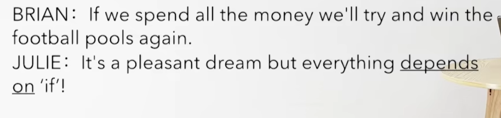

# 72、lesson137-138-If条件从句


## 1、Question

#### 	1、如何表达 如果？

##### 	条件从句

​	If -- 如果

​	if ....（现） 主语 will do ... （将）

​	if you cook dinner，I will wash the dishes -- 如果你做完饭，我将去洗碗 -- 条件从句/条件状语从句

​	也可以交换位置 I will wash the dishes if you cook dinner


​	主将从现-- 主句使用一般将来时，从句用一般现在时






## 2、Word

#### 	1、football -- n 足球

​	1、This is the football **which I found on the floor last night** -- 这是我昨天晚上在地板上找到的足球

​	2、When he was playing football yesterday afternoon，his mom called him -- 当他昨天下午正在踢足球的时候，他的妈妈给他打了电话

​	3、What were they doing？Who knows？They must have been playing football -- 他们当时在做什么？谁知道呢？ 他们当时一定是在踢足球


#### 	2、pool -- n 池

​	1、swimming pool -- 泳池

​	2、This is the biggest swimming pool I've ever seen -- 这是我见过最大的泳池 -- L111

​	3、They may be swimming in that pool -- 他们可能正在那个池子里游泳

​	4、They must be swimming in that pool


#### 	3、win--won--won -- 赢

​	1、I won the game -- 我赢了这个比赛

​	2、Did you win the game？

​	3、How did you win the game？

​	4、Who won the game？

​	5、After they had won the game，they went to a bar -- 他们赢了比赛之后，他们去了酒吧


#### 	4、world -- 世界

​	1、travel round the world -- 环游世界

​	2、in the world

​	3、You're the best father in the world -- 你是这个世界上最好的父亲

​	4、When I was very young，I always wanted to travel round the world -- 当我还很小的时候，我总是想去环游世界


#### 	5、poor -- adj 穷

​	1、rich poor

​	2、The poor guy **who you met last year** is very rich now -- 去年你见到的那个穷人 现在非常富有


#### 	6、depend -- v 依靠，依赖

​	1、depend on -- 依赖某人/某物

​	2、If I need help，I can always depend on Leo -- 如果我需要帮忙，我总是可以依赖Leo的

​	3、It depends on you -- 这事靠你了/这事取决于你

​	


## 3、Homework

```
1、单词造句

2、初级红皮书查看语法 if 条件从句

3、核心知识点
	这节主要讲了 条件从句，由If引导，if可以是在句子的首部，也可以在句子的后部
	if ....（现） 主语 will do ... （将） -- 从句使用的是一般现在时，即使从句中有代表过去或将来也是使用的 一般现在时，而主语 则使用的是 将来时 -- 主将 从现

	if you cook dinner，I will wash the dishes -- 如果你做完饭，我将去洗碗 -- 条件从句/条件状语从句

	也可以交换位置 I will wash the dishes if you cook dinner

```


## 4、Story

#### 	1、如何表达 依赖某人/某物？

​			depend on sth/sb




​	你正在赌球吗B？

​	是的，我快要结束了Julie。我很确定，我们将赢一些东西这周

​	你经常那样说，但是我们从来什么都没有赢过

​	如果你赢很多的钱，你会去做什么？

​	

​	如果我赢很多钱，我将给你买一件皮衣

​	我不想要皮大衣，我想看看这个世界




​	好吧，如果我们赢了很多的钱，我们将环游世界而且我们会待在最好的酒店

​	然后我们返回到家而且买一个大房子在乡下

​	我们将会有一个非常美丽的花园 然后....


​	但是如果我们花掉那些所有的钱，我们将会再次变穷

​	我们到时候怎么办怎么办呢？

   



​	如果我们花掉了所有的钱，我们会尝试再赢一次赌球

​	那是一个愉快的梦，但是一切都依赖 如果


## 	5、Practices

 


