# 73、lesson139-140-宾语从句


## 1、Question

#### 	1、一般疑问句做宾语从句？

​		宾语从句 -- 其实就是用一句话 做动词的承受者，这句话就是宾语，那么也就是宾语从句

​		回顾：L99，L101，L133，L135

​		定义： 一个句子做宾语

​		陈述句（肯&否） 做宾语从句

​		例如：I think （that） **he can win the game**。

​					I believe **that you are not Leo** --  一个否定句在做宾语从句

​			宾语从句的引导词如that是可以被省略的，从句中作为宾语的都是可以省略引导词的


##### 		一般疑问句做宾语从句

​		1、Is she a nurse？

​		2、变为称述语序： She is a nurse -- 不是称述句，只不过是显得和称述句是一样的

​		3、添加连接词 if： I want to know if she is a nurse -- 我想知道 是否(if) 她是一个护士

​		主句 + if + 宾从（一般疑问句）

​		

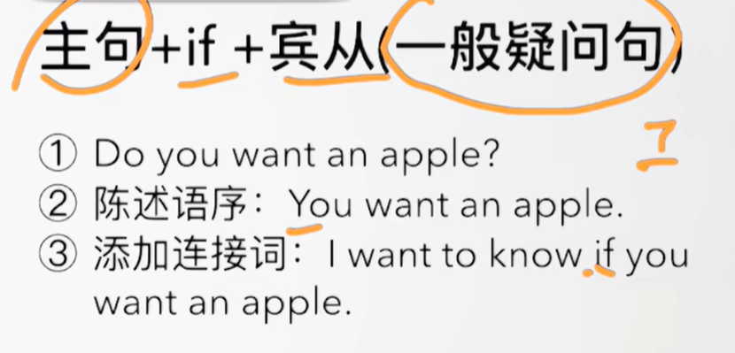

​	例句：Is he going to study English？

​				He is going to study English

​				I want know if he is going to study English 


#### 	2、特殊疑问句做宾语从句？

​	1、Who is she？

​	2、陈述语序：Who she is

​	3、I want to know who she is

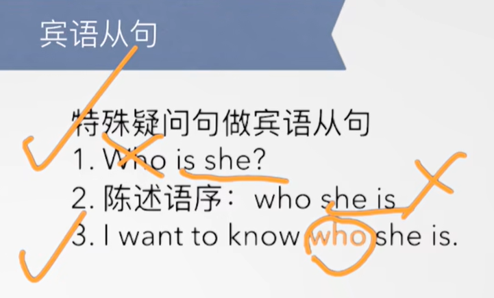

​		例如：1、What are you talking about？

​					2、陈述语序：what you are talking about

 					3、I want know what you are talking about -- 我想知道你在说什么

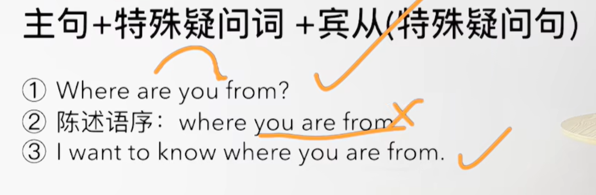

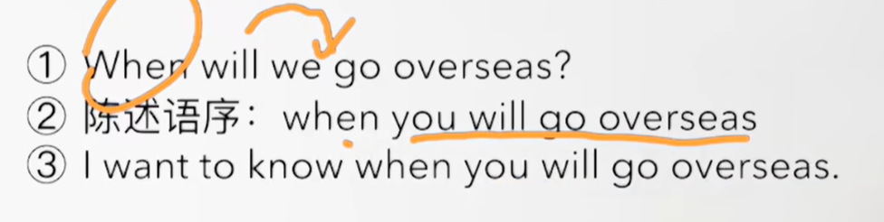


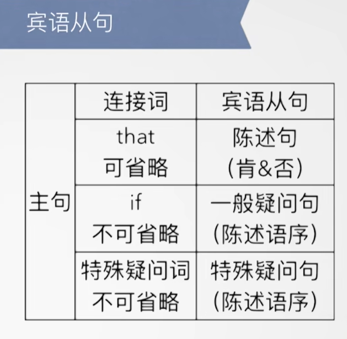

 

## 2、Word

#### 	1、extra -- 额外的

​	1、I need some extra money/time -- 我需要一些额外的 钱/时间

​	2、After my mom had given me some extra money，I took a taxi to school	-- 我的妈妈给了我一些额外的钱之后，我打了一个车去学校


#### 	2、overseas -- 国外

​	1、go overseas -- 出国，去海外

​	2、They went overseas five days ago -- 他们五天前出国了


#### 	3、engineering -- 工程、company -- 公司

​	1、My father has worked for an engineering company for 30 years -- 我的父亲在一家工程公司工作了30年


#### 	4、line -- 线 线路

​	1、repair the telephone line -- 维修电话线路

​	2、After he had repaired the telephone line，he went home -- 在他修完电话线之后，他回家了

​	3、The man **who has just repaired the telephone line** is having a bath -- 刚刚修理完电话线路的男人正在洗澡 -- 注意 who不能省略，因为从句做了主语


## 3、Homework

```
1、单词造句 3

2、初级红皮书 宾语从句

3、核心知识点
	这节主要讲了宾语从句 -- 有称述句的宾语从句，一般疑问句的宾语从句，特殊疑问句的宾语从句
	称述句的宾语从句： 就是一个句子充当宾语，中间加个引导词that 也可以省略that，组合成的句子
	
	一般疑问句宾语从句： 其实就是把一般疑问句转换为 陈述语序，然后加上 引导词 if -- if代表是否的含义
	
	特殊疑问句宾语从句：忽略特殊疑问词 - 还是放句首做引导词，后面的是一般疑问句，将一般疑问句转换为 陈述语序 -- 然后就可以了，引导词就是特殊疑问词
	
	
	
	
	
	
	
```


## 4、Story

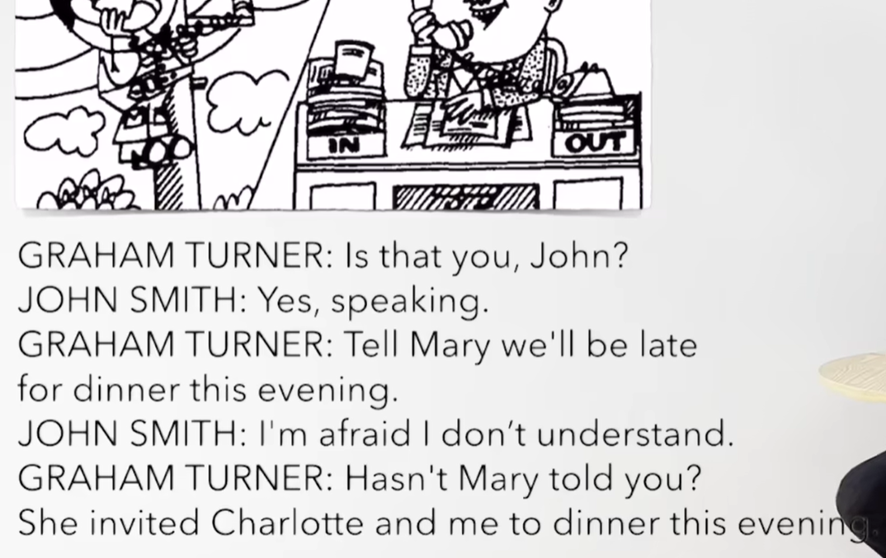

​	那是你吗John？

​	是的，正在说

​	告诉M我们今晚吃晚餐会迟到

​	我恐怕我不明白

​	难道M没有告诉你吗？

​	她邀请C和我今晚去吃饭餐


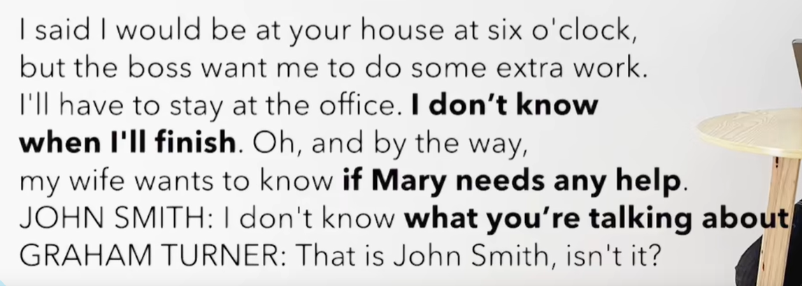

​	我之前说我将六点钟到你家

​	但是老板想让我做工作以外的工作

​	我将不得不待在办公室，我不知道我将什么时候完成，噢，顺便说一句，

​	我的妻子想知道 是否 M需要一些帮助

​	我不知道你在说什么

​	那是Js 对吧？


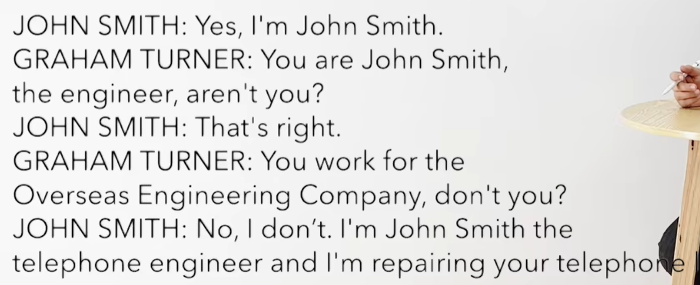

​	是的，我是JS

​	你是工程师JS，对吧？

​	是的

​	你为海外工程公司工作对吧？

​	不，不是，我是电话工程师JS，而且我现在正在修理你的电话线路


 

## 5、Practices

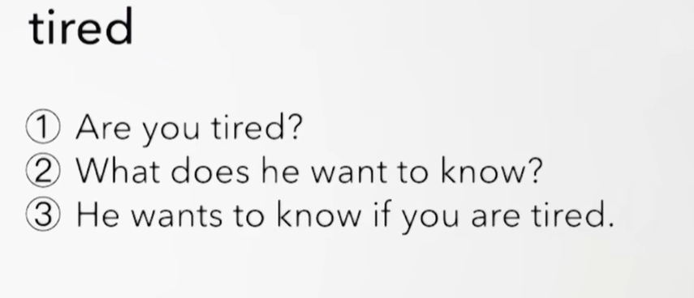


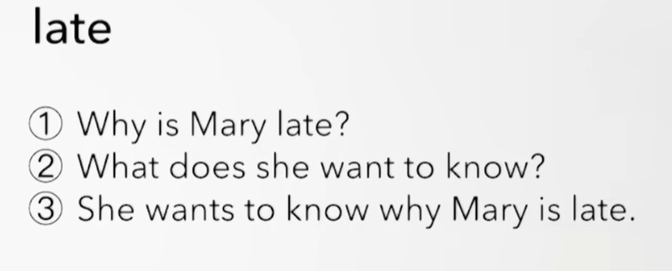


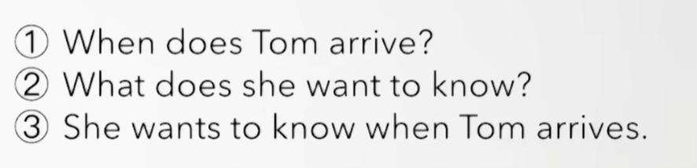


