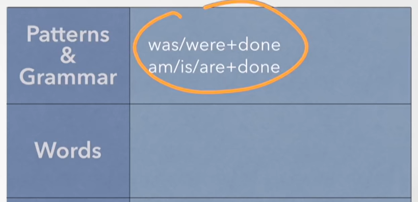
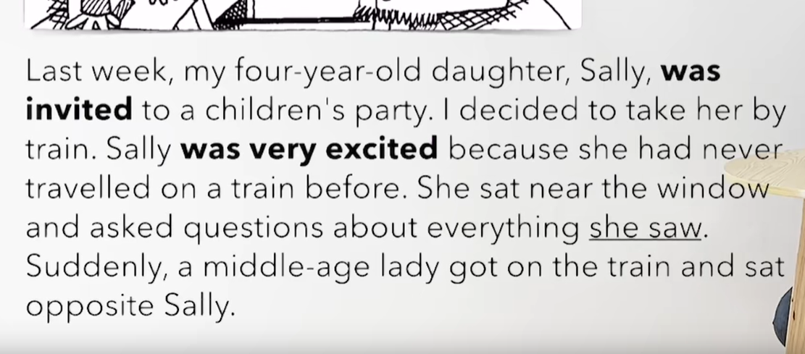
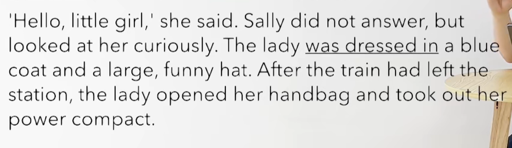
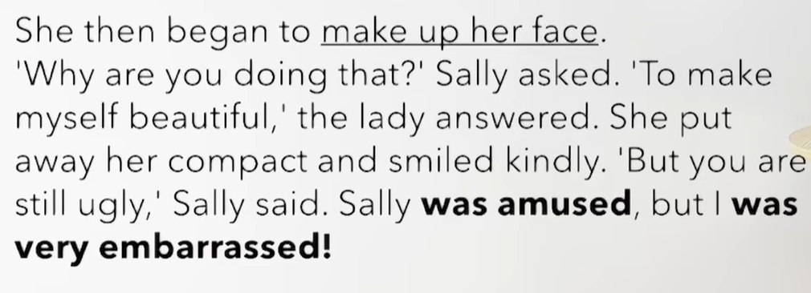
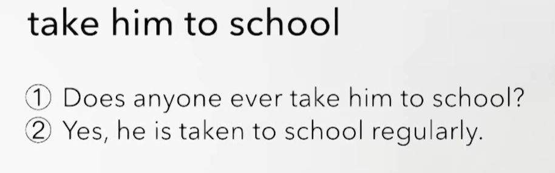

# 74、lesson141-142-被动语态


## 1、Word

#### 	1、excited -- adj  兴奋

​	1、They were very excited when they knew that their father would take them to school next week -- 当他们知道他们的父亲下周要带他们去学校的时候，他们非常兴奋

​	2、They must have been very excited when they heard the news

 -- 当他们听到这个新闻时，他们一定非常兴奋


#### 	2、get on -- v 上车

​	1、She got on the bus 5 minutes ago -- 她五分钟前上了这个巴士

​	2、She wants to know when you got on the bus -- 她想知道你什么时候上的车 -- L139 -- 特殊疑问句的宾语从句

​	3、If I can't get on the bus，I will take a taxi -- 如果我不能上这辆巴士，我会打一辆出租车


#### 	3、middle-aged -- 中年

​	1、She is a middle-aged woman 

​	2、The middle-aged woman who got on the bus five minutes ago is my mom -- 这个五分钟前上车的中年女人是我的妈妈

​	3、When the middle-aged woman was cooking in the kitchen，her husband was watching TV -- 当中年妇女正在厨房做饭的时候，她的丈夫正在看电视


#### 	4、opposite -- prep 相反的

​	1、The middle-aged woman sat opposite the little girl -- 这个中年女子坐在这个小姑娘的对面

​	2、The school is opposite the park -- 这个学校在公园的对面


#### 	5、curiously -- adv 好奇地

​	1、She looked at the picture curiously -- 她好奇地看着这张照片


#### 	6、funny -- adj 有趣的，滑稽的

​	1、He is funny

​	2、He is the funny guy who I told you about -- 他是我之前和你说过的滑稽的家伙

​	3、This is the funniest guy I’ve ever seen -- 这是我见过最滑稽的家伙

​	4、The funny guy wants to know if you will be free tonight -- 这个滑稽的家伙想知道你今晚是否有空


#### 	7、powder n 粉 compact --  小型的、盒

​	1、I lost my powder compact last night -- 我昨晚把粉盒弄丢了

​	2、After I had lost my powder compact，my boyfriend bought me a new one -- 我丢了我的粉盒之后，我的男朋友给我买了一个新的


#### 	8、ugly -- 丑

​	1、The ugly man **who is buying a new car** sold his old car this morning -- 正在买新车的这个丑男人 今天早晨卖掉了他的就车

​	2、He is the ugliest man I’ve ever seen -- 这是我见过最丑的人


#### 	9、amused -- adj 有趣的

​	1、She was amused -- 她当时很有趣 


#### 	10、smile -- v微笑 、kindly -- adv 很善良地，很温暖地

​	1、She smiles everyday -- 她每天都微笑

​	2、The woman who is smiling knows my brother -- 这个正在笑的女人认识我的哥哥

​	3、She smiled kindly -- 她笑的很亲切


#### 	11、embarrassed -- adj 尴尬的

​	1、When I met my ex-girlfriend with her new boyfriend yesterday on the street,I was embarrassed -- 当我昨天在马路上遇到前女友和她的新男友的时候，我感觉很尴尬

​	2、The man who was embarrassed is my ex-boyfriend -- 这个很尴尬的男人是我的前男友

​	3、When my girlfriend told me that the man who was embarrassed on the street was my girlfriend's ex-boyfriend，I was very embarrassed -- 当我女友告诉我昨天在马路上那个尴尬的男人是我女友的前男友的时候，我非常的尴尬


## 2、Homework

```
1、单词造句 3

2、核心知识点
	这节主要就是单词造句，及复习之前的语法
```


## 3、Grammer

#### 	1、一般现在时的被动？

​	被动： 例如-- 我 被 打了。 我 应 邀出席， 我 受到 老师的表扬，在中文中有很多的字都可以代表被动

​	被动有时态吗？ -- 有时态

​	结构： be 表时态 + done表被动

​	一般现在时被动： am/is/are + done 

​								My hair is cut every month -- 我的头发每个月都会被剪

​								The room is cleaned by someone everyday -- 这个房间每天被某人打扫


#### 	2、一般过去时的被动？

​	一般过去时被动：was/were + done

​		例句：	My hair was cut last month -- 上个月我的头发被剪掉了

​						Wusong killed the tiger -- The tiger was killed by Wusong -- 老虎被武松杀死了

​						第一个killed 是一般过去时，第二个killed是过去分词，我们需要明白这个结构

​	

​		Someone stole my wallet yesterday -- 昨天有人偷了我的钱包

​		My wallet was stolen yesterday -- 我的钱包昨晚被偷了


​		Someone booked the room yesterday -- 某人昨天预定了这个房间

​		The room was booked yesterday -- 这个房间昨天被预定了


#### 	Recap




## 4、Story



​	上周，我四岁的女儿S被邀请去一个孩子们的聚会

​	我决定带着他坐火车去

​	S非常兴奋，因为她之前从来没有坐火车旅行过。

​	她坐在窗户旁边而且 她对她看到的一切提出问题

​	突然，一个中年的女士上了火车 坐在S的对面




​	她说：你好 小女孩，S没有回答，但是她好奇的看着。

​	这个女士穿着一件绿色的大外套和滑稽的帽子。

​	火车离开车站后，这个女士打开了她的手提包然后拿出了她的粉盒




​	她然后开始 化妆

​	你为什么正在做这件事？ S询问，让我自己变的更漂亮啊，这个女士回答道

​	她把她的化妆盒拿开 然后 和蔼的微笑

​	但是你依旧是丑啊，S说

​	Sally当时特别有趣，但是我感到非常尴尬


## 5、Practices




 


​	


​	


​	


