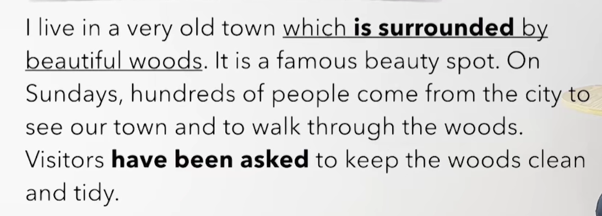
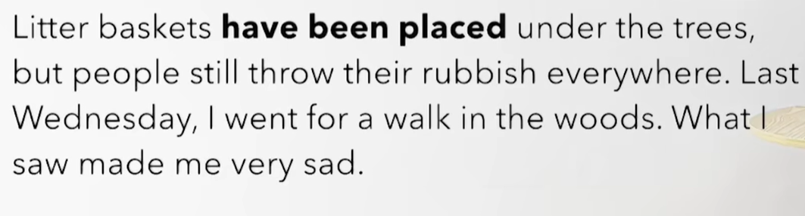
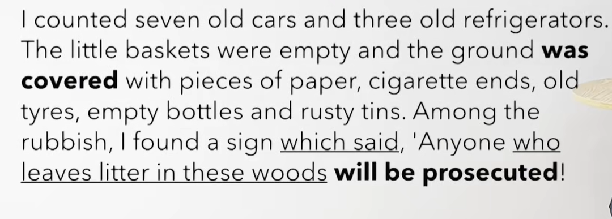
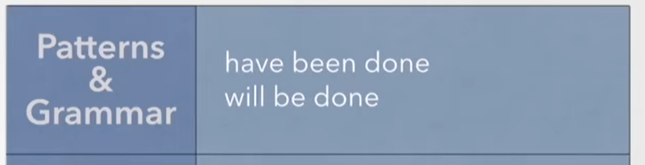
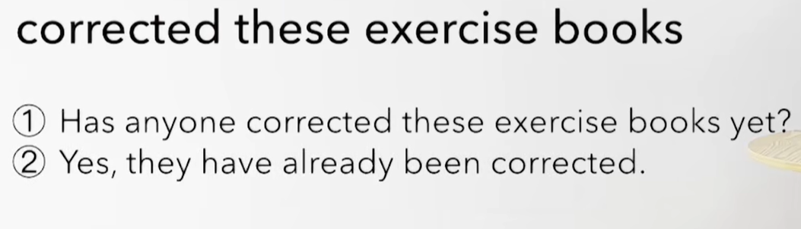
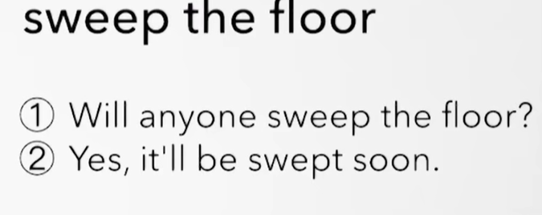
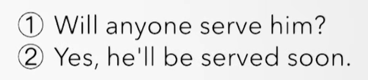

# 75、lesson143-144-现在完成&一般将来的被动


## 1、Word

#### 	1、surround v -- 包围、wood -- 木头

​	1、A be surround by B -- A被B包围了

​	2、My house was surrounded by beautiful woods，but they were cut down last month -- 我的房子被美丽的树林包围着，但他们上个月被砍掉了

​	3、He was surrounded by people who he didn't know at all -- 他被一些不认识的人包围了


#### 	2、beauty spot -- 风景区

​	1、This is a beauty spot -- 这是一个风景区

​	2、The beauty spot which we went to yesterday was closed this morning -- 我们昨天去的风景区今天早晨关闭了

​	3、After they had left the beauty spot，they went to dinner -- 他们离开这个风景区之后，他们去吃晚饭了


#### 	3、through -- prep 穿过

​	1、walk through the woods/park --  步行穿过深林，公园

​	2、After they had walked  through the park ，they went shopping -- 他们穿过公园后 他们去购物了


#### 	4、visitor -- n 来访者

​	1、The visitors who got on the train last night arrived in Beijing -- 昨天上火车的来访者今天到达了北京

​	2、They met the visitors at the station 5 days ago -- 他们五天前在车站见到了来访者


#### 	5、tidy adj -- 干净，整洁的、untidy -- 不整洁的

​	1、keep the room tidy -- 保持房间干净

​	2、She keeps her room very tidy -- 她保持她的房间非常的干净


#### 	6、litter -- n 垃圾

​	1、littler basket -- 垃圾箱

​	2、The litter basket which I bought yesterday was broken already --  昨天我买的垃圾箱已经坏了

​	3、They are washing the litter basket -- 他们正在清理垃圾箱

​	4、The litter basket is cleaned regularly -- 这个垃圾箱有规律的被清理


#### 	7、place --v 把..放到.. -- n 放置

​	1、Litter basket was placed on the street last night -- 昨天晚上垃圾箱被放到了街上

​	2、The visitor placed the coffee cup on their table -- 来访者把咖啡杯放到了他们的桌子上


#### 	8、throw - threw - thrown v -- 抛

​	1、That visitor has just thrown his coffee cup on the street -- 那个来访者刚刚扔了他的咖啡在街上

​	2、The man who threw his money on the street was very excited -- 把钱扔到街上的那个男人当时非常的激动


#### 	9、rubbish -- n 垃圾

​	1、They had to clean the woods，because they threw the rubbish everywhere -- 他们当时不得不打扫这个树林，因为他们仍的四处都是垃圾

​	2、After they had thrown the rubbish everywhere，they run away -- 他们四处扔了垃圾之后，他们跑掉了

​	3、The police wants to know if you threw the rubbish everywhere --这个警察想要知道 你是否四处仍垃圾


#### 	10、count -- v 数

​	1、I counted seven cars -- 我数到了七辆车

​	

#### 	11、cover -- v 覆盖

​	1、A be covered with B -- A被B所覆盖

​	2、It snowed last night，and the street was covered with snow this morning -- 昨晚下雪了，而且今天早晨这个街道被雪覆盖了

​	3、The woods are covered with rubbish now -- 这个森林现在被垃圾所覆盖


#### 	12、tyre -- n 轮胎

​	1、These tyres were bought by my father -- 这些轮胎之前是被我父亲买的

​	2、This is the tyre that I told you about -- 这是我和你说过的轮胎

​	3、This is the most expensive tyre I've ever bought -- 这是我买过最贵的轮胎


#### 	13、rusty -- adj 生锈的

​	1、There are rusty tins everywhere in the woods -- 在这个森林里四处都是生锈的罐子

​	2、She wants to know if you have a rusty tin -- 她想知道你是否 有一个生锈的罐子

​	3、The rusty tin was thrown away last night --这个生锈的罐子昨天晚上被扔掉了


#### 	14、among -- prep 在...之间

​	1、I found the sign among the rubbish -- 我在垃圾之间找到了这个标志

​	2、I found my father among hundreds of people -- 我在数百人之间找到了我的父亲


#### 	15、prosecute -- v 起诉、控告


## 2、Homework

```
1、单词造句

2、核心知识点
	 
```


## 3、Grammer

#### 	1、现在完成时的被动？

​		现在完成时被动： have been  + done 

​			100 trees have been planted by student -- 一百颗树已经被学生种下了

​			Someone has painted the door -- 有人把门刷了漆

​		变被动：The door has been painted -- 这个门被刷了漆


​			Somebody has stolen my key -- 有人偷了我的钥匙

​			My key has been stolen -- 我的钥匙被偷了


​			Nobody has invited me to dinner -- 没有人邀请我去吃晚饭

​			I haven't been invited -- 我没有被邀请


#### 	2、一般将来时的被动？

​	一般将来时被动： will be + done

​		It will be cleaned -- 它将被打扫干净

​	

​		The basket hasn't been emptied yet -- 这个篮子还没有清空

​		It will be emptied tomorrow -- 它们明天将会被清空


## 4、Story



​	我住在一个非常古老的小镇，这个小镇被美丽的森林包围着。它是一个有名的风景区。

​	在周日，数以百计的人来自城市 去看我们的小镇 然后穿过树林

​	来访者被要求 保持这个树林的干净整洁


​	

​	垃圾箱已经被放置到了树下

​	但是人们依旧把他们的垃圾扔的四处都是

​	上周三，我去树林里走了走，我看到这些东西我感到很悲伤




我数到了七辆旧车和三个旧冰箱

这个垃圾箱是空的 然后地面覆盖了纸的碎片，烟头，旧轮胎，空瓶子还有生锈的罐子在这些垃圾的中间。

我找到一个标志上面说 任何人 在这片树林人垃圾 将被起诉


## 5、Recap




## 6、Practices









