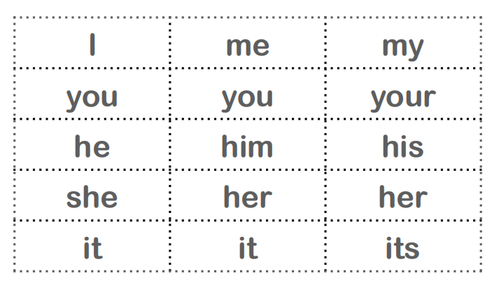
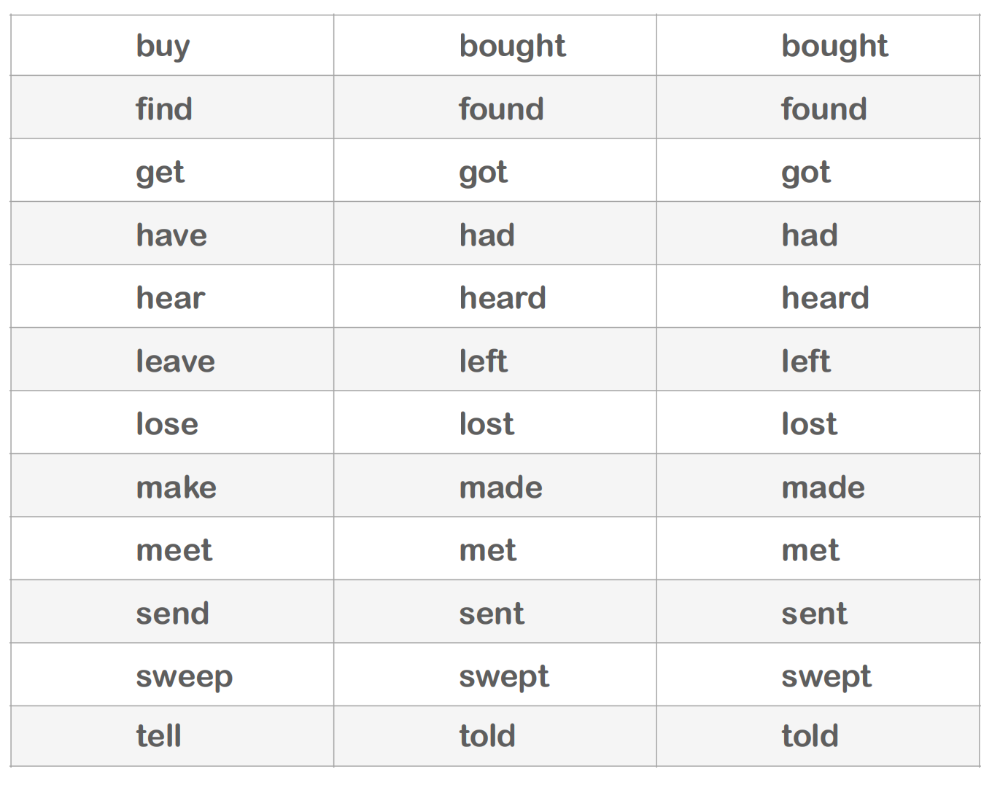
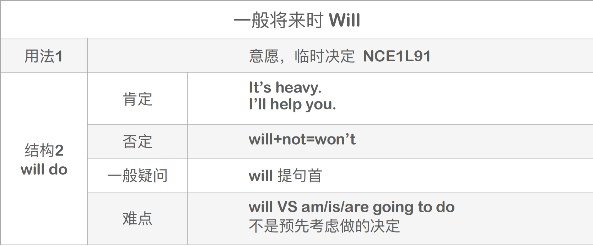
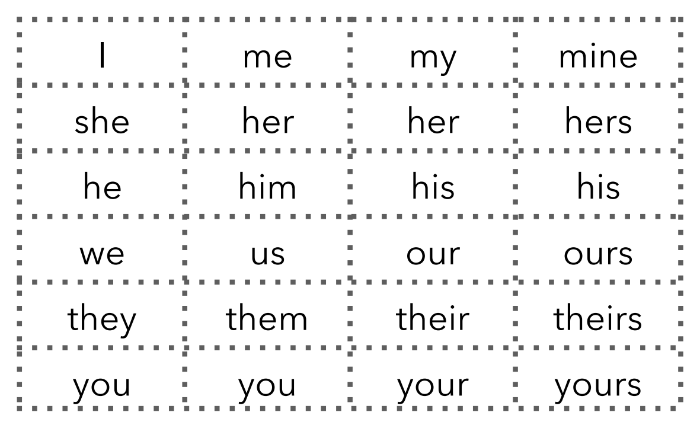
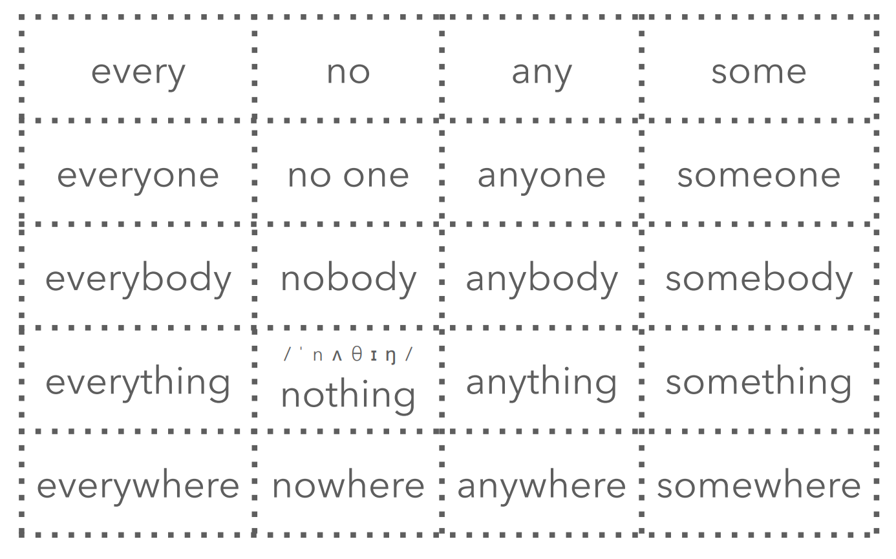
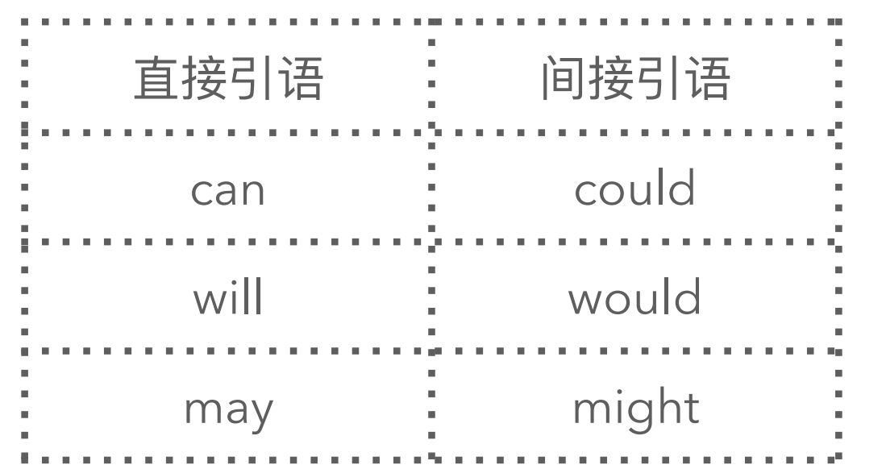

# 76、新概念一册课程总结


​	课程总结--主要总结每节课的重点记录回顾


## L1-2 -- ⼀般疑问句

This is my handbag.

Is this my handbag?

Is this your handbag?


## L3-4 -- 一般疑问句-否定-肯定

This is not my umbrella. 

is+not	


## L5-6 -- 冠词a和an的使用

a an 

⼀个 

位置：a/an + n.

Leo is a teacher


## L7-8 -- 特殊疑问句

特殊疑问句 =

特殊疑问词 + ⼀般疑问句

(去掉答案)


特殊疑问句-where 

She is from Italy.

Is she from Italy? 

Where is she from?


## L9-10 -- How 特殊疑问句

How 特殊疑问句 

特殊疑问句 =

特殊疑问词 + ⼀般疑问句

(去掉答案)


She is ok.

Is she ok?

How 

How is she?


## L11-12 -- Whose 引导的特殊疑问句&n+‘s

Whose 引导的特殊疑问句

含义：谁的

特殊疑问句 = 

特殊疑问词 + ⼀般疑问句

(去掉答案)


This is her dress.

Is this her dress?

Whose 

Whose dress is this? 

Whose is this dress?


n.+’s 

含义——谁的

This is Leo’s pen.


## L13-14 -- What colour 特殊疑问句

Her new dress is green.

Is her new dress green?

What colour is her new dress?


## L15-16 -- n. 单数/复数

1.直接加s friend—friends

2.以字⺟ s, o, x, ch, sh 结尾的单词加-es.


be动词 单数 is 复数 are

My shirt is red.    My shirts are red.

Is your shirt red?    Are your shirts red?

What colour is your shirt?    What colour are your shirts?


## L17-18 -- n.复数特殊情况

#### 名词复数：以 f/fe 结尾的

​	把 f/fe 变成 v 再加-es 读/vz/

​	housewife-housewives

​	knife-knives

​	thief-thieves


#### 名词复数：元⾳字⺟+y结尾的 

​	直接+s

​	day - days

​	boy - boys

​	monkey - monkeys


#### 名词复数：辅⾳字⺟+y结尾的

​	变 y 为 i 再加-es 读/z]/

​	country - countries

​	family - families

​	city - cities 

​	party - parties baby - babies


## L19-20 -- 一般&特殊疑问句复习

These are my children.

Are these your children? 

Whose children are these?


What’s the matter? 

What’s wrong?


## L21-22 -- 人称表&给某人某物

#### 人称代词

​	主格：如I you he等 -- 主格 做主语

​	宾格：me him等 -- 宾格 做宾语


#### 物主代词

​	my是属于 物主代词 -- 相当于某物的主人 -- 我的

​	形容词物主代词：my，your，their，our，his，her，its

​			这类词性属于形容词 -- 后面还是要接n的，如 my school


​	名词物主代词：mine，ours，yours，his，hers，its，theirs

​			这类词性属于 名词 -- 也相当于 形容词性物主代词 + 名词，可以做主语、表语和宾语

​			如：Those flowers are ours，not theirs -- 这些花是我们的，不是他们的

​			This isn't my shirt，mine is over there -- 这不是我的衬衫，我的在那边




#### 	give sb. sth. 

​		give me a pen.


## L23-24 -- Where 特殊疑问句

Where 特殊疑问句 

含义：哪⾥? 

特殊疑问句 =

特殊疑问词 + ⼀般疑问句

(去掉答案)


My book is on the shelf.

Is my book on the shelf?

Where is my book?


宾格

you - you    we - us   they - them

give 宾格_ some food. Please!


## L25-26 -- there be 某地有某人/某物

#### 肯定句: There be+a/an+某物+地点

There is a table in the middle of the room. 

There is an electric cooker in the kitchen. 


#### 否定句: There be+not+a/an+某物 + 地点 

There isn’t an electric cooker in this room. 


#### ⼀般疑问句: be 提句⾸

Is there an electric cooker in this room?


## L27-28 -- How many 特殊疑问句&some&any

#### 1、How many 特殊疑问句  -- 含义：多少

​	How many 

​	1 There are three cats in the picture.

​	2 Are there three cats in the picture?

​	3 How many cats are there in the picture?

#### 2、some&any区别

​	some VS any 

​	同：“⼀些”

​	异: some 肯定句 VS any 否定 / 疑问句


## L29-30 -- 练习-屋内场景

1 T :Is Mrs. Jones in the living room? 

​	S: No, she isn't. 

2 T :Is Mrs. Jones in the bedroom? 

​	S: Yes, she is. 

3 T :Is Amy in the bedroom, too? 

​	S: Yes, she is.


4 T :Is the bedroom tidy? 

​	S: No, it isn't. It's very untidy. 

5 T :Are these clothes in the wardrobe? 

​	S: No, they aren't. 

6 T :Is the floor clean? 

​	S: No, it isn't. It's dirty.


## L31-32 -- 现在进行时be doing

时&态  动作发⽣的时间   动作的状态

现在进⾏时 

含义：⼀个动作现在正在进⾏

#### 1、**现在进⾏时：肯定句**

结构：主+am/is/are+doing  (v.ing 现在分词) 

am/is/are+doing 

​	1 v.+ing: eating/opening/reading 

​	2 She is reading a book. 


am/is/are+doing 

​	1 去e+ing(e不发⾳)

​	2 come-coming/make-making/

​	dance-dancing 

​	3 They are dancing. 


am/is/are+doing 

​	1 双写 + ing

​	2 run-running/sit-sitting/swim

​	swimming 

​	3 They are running on the street.


#### 2、现在进⾏时：否定句

结构: 主+am/is/are+not+doing 

​	She is not reading books. 

​	She is not making the bed. 

​	They are not swimming


#### 3、现在进行时：⼀般疑问句 

结构: am/is/are(提句⾸)+主+doing? 

​	1 Is she opening the door? 

​	2 Yes, she is. 


​	1 Are they sitting on the floor? 

​	2 Yes, they are.

 

​	1 Is she turning off the phone? 

​	2 Yes, she is.


#### 4、现在进行时：特殊疑问句 

结构: What+am/is/are+主+doing? 

​	1 What are they doing? 

​	2 Are they dancing?

​	3 Yes, they are dancing. 


​	1 What are they doing?

​	2 Are they reading a book?

​	3 Yes, they are reading a book.


who 特殊疑问句 

​	Tim is climbing the tree. 

​	对主语提问，直接⽤特殊疑问词替代主语 

​	Who is climbing the tree?


## L33-34 -- 练习-现在进行时

**What+be+主语+doing?** 

1 What are the cooks doing?

2 Are they washing dishes?

3 No, they aren't washing dishes. 

4 They're cooking. 


**What+be+主语+doing?** 

1 What are the children doing? 

2 Are they crying?

3 No, they aren't crying.

4 They're sleeping.


## L35-36 -- be doing + 介词

​	*介词*是词类的一种，属于虚词，主要由作为实词的动词引申而成，是具有引介作用的词，它通过把其宾语引介给谓语，借以表达谓语动词所涉及的时间、处所、方式、目的及对象等各种语法关系。依其用法，可以分为时间*介词*、处所*介词*、对象*介词*、工具*介词*、原因*介词* 等


​	The baby is sleeping between his parents.


​	What is his wife doing?

​	She is walking into a shop. 

​	What are the children doing?

​	The children are running out of school.


​	What are they doing?

​	They are walking along the river. 

​	What are they doing?

​	They are swimming across the river.


## L37-38 -- 一般将来时be going to&for sb

**时&态  动作发⽣的时间 动作的状态**

⼀般将来时    含义：计划打算


#### 1、⼀般将来时：肯定句

结构:主+am/is/are+going to do(v.原型) 

​	gonna do [⼝语] 

​	am/is/are+going to do 

​	He is going to shave. 


​	He is going to jump off the building. 


#### 2、⼀般将来时：否定句

结构:主+am/is/are+not+going to do

**(v.原型)** 

​	I am not going to wash the dishes. 

​	I am not going to cook.

​	I am not going to make the bed.


#### 3、⼀般将来时：⼀般疑问句

结构：Am/Is/Are(提句⾸)+主+going to 

do (v.原型) 

​	Is she going to swim?

​	Yes, she is going to swim. 

​	Are they going to eat?

​	Yes, they are going to eat.


#### 4、⼀般将来时：特殊疑问句

结构：What am/is/are+主+going to do? 

​	What is she going to do?

​	Is she going to eat?

​	No, she is going to clean her teeth. 

​	What is she going to do?

​	Is she going to dance?

​	No, she is going to clean the living room.


### for sb -- 给你、为你

​	1 This apple is for you. 

​	2 Is this apple for me? 

​	3 Who is this apple for?


​	1 This is for my mother. 

​	2 Is this for your mother? 

​	3 Who is this for?


## L39-40 -- do with sth& give sth. to sb

#### 1、do with sth -- 处理/处置 某物

What is he going to do with that refrigerator?  -- 你打算如何处理那个冰箱？

​	He is going to clean it.


What are you going to do with that old  car? 

​	I’m going to give Leo the car.


#### 2、give sb. sth. = give sth. to sb. -- 给某人某物

​	1 give me the book. 

​	2 give the book to me. 

​	3 give it to me.


#### 3、show sb. sth.=show sth. to sb. -- 向某人展示某物

​	show me your passport.

​	show me your ticket.

​	What are you going to do with your passport?

​	I am going to show it to Leo.


#### 4、send sb. sth.=send sth. to sb. -- 送某人某物

​	send me a postcard.

​	send me a letter.

​	send sb. sth.=send sth. to sb. 

​	What are you going to do with the postcard?

​	I am going to send it to Leo.


#### 5、take sb. sth.=take sth. to sb. -- 带给某人某物

​	take me some clothes.

​	take me some coffee.

​	take sb. sth.=take sth. to sb.

​	What are you going to do with the coffee?

​	I am going to take it to Leo.


## L41-42 -- 可数&不可数名词

#### 1、可数名词 cn. 

​	1 There is a **pen** on the table.

​	2 There are some **pens** on the table.


#### 2、不可数名词 un. 

​	1 There is a piece of **cheese** on the table. 

​	2 There is some **cheese** on the table


#### 3、如何判断可数与否? 

​	1 液体milk/ ⽓体air

​	2 组成过⼩:sand/grass/hair 

​	3 总称:food/fruit/money 

​	4 同⼀个单词，含义不同

​	5 字典


## L43-44 -- 情态动词Can

### can 能

#### 1、肯定句：主+can+do (动词原形) 

​	Birds can fly in the sky. 

​	Dogs can swim in the water. 

​	Cats can climb the wall.


#### 2、否定句：主+can+not+do (动词原形) 

​	cannot=can not=can’t 

​	Cats can’t read a book. 

​	Elephants can’t jump. 

​	Pigs can’t look at the sky.


#### 3、⼀般疑问句：Can(提句⾸)+主+do(动词原形)?

​	Can you help me? 

​	Yes, I can. 

​	Can the dog swim? 

​	Yes, it can. 

​	Can kiwi fly? 

​	No, it can’t.


#### 4、特殊疑问句：What+can+主+do (动词原形)?

​	What can the bird do? 
​	It can dance. 
​	What can the cat do? 
​	It can climb a tree. 
​	What can the grasshopper do? 
​	It can jump.


## L45-46 -- 短语

1.wait a minute 等一下

2.why can't 为什么不

3.easy=a pice of cake 小菜一碟，简单

4.make biscuits 做饼干 


## L47-48 -- 一般现在时

**⼀般现在时** 

含义： 客观事实 / 存在状态 L51-54 习惯动作 L55-58


#### 1、⼀般现在时：肯定句

​	I want this job. 

​	I love Beijing. 

​	I like tea.

​	I do like tea.


#### 2、⼀般现在时：否定句

do+not=don’t 

I do not want this job. 

I don’t like tea. 

I don’t love you.


#### 3、⼀般现在时：⼀般疑问句

do 提句⾸ 

Do you want this job? 

Yes, I do.

No, I don’t.


#### 4、⼀般现在时：特殊疑问句

特殊疑问句 = 特殊疑问词 + ⼀般疑问句

(去掉答案) 

I want this job.

Do you want this job?

What do you want?


## L49-50 -- 一般现在时&第三人称单数

**⼀般现在时：肯定句**

I want this job.

I love Beijing.

I like tea.

He wants this job, too.


**does 表强调**

He does want this job. 

He loves Beijing, too. She likes tea, 

too.

They want some money


#### 1、v.s 第三⼈称单数

1 v.+s

2 likes; wants

3 He likes coffee. 


1 s x ch sh o 结尾的v.加es

2 watches; goes; washes; does 

3 He washes dishes every day


1 辅⾳字⺟+y结尾,变y为i+es 

2 cry-cries; fry-fries

3 The baby cries every night. 


1 元⾳字⺟+y结尾,直接加s

2 buy-buys; say-says/sez/

3 He buys a new phone every year.


#### 2、⼀般现在时：否定句 

He wants this job.

He doesn’t want this job. 

does+not 

1 She likes tea.

2 She doesn’t like tea.


#### 3、⼀般现在时：⼀般疑问句

He wants this job. 

Does he want this job? 

does提句⾸+v. 

1 She washes the dishes every day.

2 Does she wash the dishes every day?


## L51-54 -- 月份&天气&国家名称

#### 1、月份

​	January February 

​	March April

​	May  June 

​	July August 

​	September October 

​	November December 


#### 2、天气

 climate 

spring summer autumn winter

windy rain warm snow


#### 3、国家

the U.S. Brazil Holland England France Germany 

Italy Norway Russia  Spain Sweden


## L55-56 -- 练习四句型转换


## L57-58 -- 时间表达

**What time is it?** 

1 It is six o’clock. 

2 Is it six o’clock? 

3 What time is it? 

4 What’s the time?


**What time is it?** 

1 倒序 (to; half; a quarter) 

2 分 to 时

3 a quarter to 12 

4 10 to 12

**What time is it?** 

1 顺序(past; half; a quarter)

2 分past时

3 half past 12

4 a quarter past 12 

5 12 past 12

6 12:50


**do/does VS be+v.ing** 

1 What does he usually do every day?

2 He usually shaves at 7 o'clock every 

day. 

3 What is he doing today?

4 He is shaving at 8 o'clock today.


## L59-60 -- 询问尺码

I want a large size.

Do you want a large size? 

What size do you want?


**shop assistant** 

I know that shop assistant. 

Do you know that shop assistant? 

That shop assistant works hard every day.


## L61-62 -- 生病吃药

What are you doing?

I’m taking some medicine. 

I have a stomach ache. -- 我胃疼


**aspirin**

take an aspirin

I have a headache, and I’m gonna take an aspirin.


## L63-64 -- 情态动词must

​	must 必须

**must 肯定句**

主+must+do

I have a very bad headache. 

I must call the doctor.


**must 否定句**

主+must+not+do mustn’t

You mustn’t go. 

注意:表[禁⽌]，⽽⾮[不必]，轻易别⽤ 

Don’t go.


**must ⼀般疑问句**

Must+主+do...? 

Must I do the housework today?


**must 特殊疑问句**

What+must+主+do? 

What must she do?

She must clean her bedroom


## L65-66 -- 时间的表达2

**when 特殊疑问句** 

1 When must you come home?

2 I must come home at one o'clock.


1 When must she go to the library?

2 She must go to the library at a quarter past one.


1 When must you and Tom see the dentist? 

2 We must see the dentist at a quarter to four.


1 When must Sam and Penny see the boss? 

2 They must see the boss at half past one.


## L67-68 -- 一般过去时

⼀般过去时 

含义： 过去的状态 L67-70 过去发⽣的动作


#### 1、⼀般过去时：肯定句

am/is — was

are — were

He is a teacher. 

He was a teacher.


#### 2、⼀般过去时：否定句

​	are/is/are + not 

​	was/were + not 

​	wasn’t weren’t 


​	They were not at school. 

​	She was not thirsty. 

​	This wasn’t us.


#### 3、⼀般过去时：⼀般疑问句

​	am/is/are 提句⾸ 

​	was/were 提句⾸

 

​	She was hungry. 

​	Was she hungry?

 

​	He was at work. 

​	Was he at work?


#### 4、⼀般过去时：特殊疑问句

特殊疑问句=特殊疑问词+⼀般疑问句 

特殊疑问词+⼀般疑问句 

​	He was at work in the morning. 

​	Was he at work in the morning? 

​	When was he at work?


#### 5、否定疑问句-难道

​	Isn’t he Leo?

​	Isn’t there any tea in the kitchen? 

​	Can’t you see me?

​	Isn’t he sleeping?


​	Aren’t you going to help him? 

​	Don’t you like tea?

​	Doesn’t he look ill?


## L69-70 -- there be过去时的使用

**there be**

​	There is/are + sth. + sw. 

​	There was/were + sth. + sw

​	

​	Where is the pen?

​	There was a pen on the table. 

​	It’s not here.


​	When was I at the dairy?

​	You were at the dairy on Saturday


## L71-72 -- 一般过去时 v变换v.ed

**⼀般过去时：肯定句**

Do you love me? 

I love you.

I loved you.


**⼀般过去时：否定句**

do/does — did

did+not = didn’t

I talked to him yesterday.

I did not talk to him yesterday.


v. — v.ed 过去式 (规则 VS 不规则)  +ed 

1 He looked nice yesterday.

2 I talked to him yesterday.

3 We enjoyed ourselves yesterday.


结尾e不发⾳+d 

1 live — lived

2 I live in Beijing now.

3 I lived in Auckland last year.


辅⾳字⺟+y结尾，变y为ied 

1 empty — emptied

2 She emptied the basket yesterday.


元⾳字⺟+y结尾，+ed 

1 play — played

2 We played with our parents yesterday.


双写+ed

1 stop — stopped


#### ⼀般过去时：⼀般疑问句

do/does 提句⾸ v.变原形 

did 提句⾸ v.变原形 

1 I loved you.

2 Did you love me?


#### ⼀般过去时：特殊疑问句

What + did + 主 + do? 

1 What did he do yesterday afternoon? 

2 He called me.


## L73-74 -- 练习

​	副词adv主要的一个用途就是 说这个动作的 如：公交车**突然**停止，这个突然就是副词用于修饰停止这个动作

​		1、Suddenly，the car stopped near the bus stop -- 突然这个车停到了公交车站的旁边


​	went 是go的过去式

​	She went to London last weekend


## L75-76 -- ago

N years ago

N months ago

N days ago

N hours ago

N minutes ago

N seconds ago

I met your mom 30 years ago. 

I went to Beijing 3 days ago.


## L77-78 -- 练习


## L79-80 -- much&many区别&have got

**have got** --拥有

**肯定句:** 

I have a car.

I have got a car. 

I’ve got…


**肯定句：三单** 

He has a car.

He has got a car. He’s got…


**主+have/has got+其他**

**have got** 

**否定句:** 

I don’t have a car. 

I haven’t got a car. 


**have got** 

**否定句：三单** 

He doesn’t have a car. 

He hasn’t got a car. 

主+haven’t/hasn’t got+其他.


**疑问句：**

Do you have a car? 

Have you got a car?


**疑问句：三单** 

Does he have a car? 

Has he got a car? 

Have/Has+主+got+其他?


**a lot of** 

**既可修饰cn. 也可修饰un. 肯定句/否/疑问**

I have got a lot of money.

We have got a lot of potatoes. 


**much + un. (否/疑)** -- 不可数

There isn’t much tea on the table. 

Is there much tea on the table? 

Did you buy much food?

We haven’t got much money. 

How much money do you want? 


**many + cn.** -- 可数

There aren’t many dishes in the kitchen. 

Are there many dishes in the kitchen? 

Did you buy many books?

We don’t know many people.

How many photos did you take?


## L81-82 -- have用法

吃喝玩乐--都可以使用have

#### 1、have 吃喝玩乐

1 have breakfast -- 吃早餐

2 have lunch

3 have dinner 

4 have a meal --用餐


1 have some milk 

2 have tea

3 have coffee

4 have a drink


1 have fun

2 have a good time 

3 have a haircut

4 have a swim


1 have a bath -- 洗澡

2 have a party -- 举办聚会

3 have a holiday 

4 have a lesson 

5 have a cigarette -- 抽一支烟


#### 2、时态+情态动词复习

be + v.ing

be + going to v. 

do/does  was/were/did 


can   must

```
1 What are they going to do?
2 They are going to have breakfast.

1 What are they doing? 
2 They are having lunch.

1 What must they do? 
2 They must have tea.

1 What did they do? 
2 They had dinner.

1 What must they do?
2 They must have a meal

have a party 
1 What did they do?
2 They had a party.
3 And they have a party every Friday.

have a good time 
1 What are they going to do?
2 They are going to have a good time.

```


## L83-84 -- 现在完成时have done


**肯定句：主+ have done (过去分词) + 其他**

I have had lunch. / I’ve had lunch.

He has had lunch. / He’s had lunch.


have 原型

has 三单

having 现在分词 

had 过去式 

had 过去分词


#### 1、肯定句：

**主+have done(过去分词)+其他**

过去分词: 规则变化 ed / 不规则变化 

I have had lunch.

I am having lunch.


#### 2、⼀般疑问句：

**Have/Has+主语+done(过去分词)+其他?**

Have you had lunch? 

Yes, I have.

No, I haven’t


**含义**

**⽤法⼀：⾔之过去，意在当下 (潜台词)**

Do you want to have some food?

No, thanks. I have just had some food. 

I have just had some food. I’m full now.


## L85-86 -- have been/gone to

​	其实have been中的been其实就是be的过去分词，结构也是have done 现在完成时

Sally went to Paris last week. 

She arrived in Beijing yesterday. 

She has been to Paris. 去过


Sally went to Paris last week. 

She is in Paris now. 

She has gone to Paris. 去了 

go — went — gone


## L87-88 -- 复习现在完成时

**cleaned your shoes** 

1 Have you cleaned your shoes yet? 

2 I haven't cleaned my shoes yet.

3 I'm still cleaning them.


**washed the dishes** 

1 Have you washed the dishes yet? 

2 I haven't washed the dishes yet. 

3 I'm still washing them.


#### 过去时&过去分词表




## L89-90 -- 现在完成时have done第二用法

⽤法⼆：⼀个动作done或者状态been 

​	从过去持续或重复到现在


for+⼀段时间 for three years

I have lived in Beijing for 10 years/since 2012


since+时间点 since 1984

I have lived in Beijing for 10 years/since 2012. 

I have been here for 2 hours.


我学过英语。 

我学英语⼗年了。 

I studied English before.

I have studied English for ten years


我曾住在这⾥。 

我从1989年就住在这⾥。

I lived here.

I have lived here since 1989.


## L91-94 -- 一般将来时Will




```
rain 
1 It rained yesterday.
2 Yes, and it'll rain again tomorrow.

make an appointment 
1 He made an appointment yesterday. 
2 Yes, and he'll make an appointment 
again tomorrow.
New York 
Will Alice and Mary stay in New York next 
month? 
No, they won't stay in New York next month.
They will stay in Moscow.


```


## L95-96 -- had better最好

含义： 最好 (去做某事，否则会有麻烦/困难/危险)

**You had better take an umbrella.** 

**主语+had better+动词原形+其他**

You’d better (注意:不表过去)

**sleep** 

You’d better sleep.


**He had better not eat any food.** 

**主语+had better+not+动词原形+其他**

**do that** 

You’d better not do that


## L97-98 -- 名词性物主代词使用mine



There is a book on the desk. 

It’s her book/his book. (hers/his) 

It’s my book. (mine)

```
keys 
1 Are these your keys? 
2 Yes, they're mine.
3 They belong to me.

letter 
1 Is this John's letter?
2 Yes, it's his. It belongs to him.

hammers 
1 Are these hammers Frank's and Harry's? 
2 Yes, they're theirs. They belong to them.

car 
1 Is this our car?
2 Yes, it's ours. It belongs to us.


```


## L99-100 -- 宾语从句

定义：⼀个句⼦充当宾语  这个句⼦叫宾语从句

主语 + v. + (that) + 句⼦


I hope that you’ve got some money. L79

I believe that this house is for sale. L89

I think that they’ll move in the day after tomorrow. L91


主语 + v. + (that) + 句⼦

v. : think/believe/hope/say/understand/know

I think that you are right.

He believes that they will help him.

I hope that the food is safe here.

She says that she will help you.

We understand that we mustn’t talk in the library.


## L101-102 -- 直接引语&间接引语&反义疑问句

#### 1、直接引语变间接引语

The doctor says, “I will come at once.” 

The doctor says that he will come at once.

1. 引号去掉 
2. 转换⼈称 
3. 添加引导词 that

```
He says “I can do it .”
He says that he can do it .

“I have just arrived in Scotland.” says Leo. 
Leo says that he has just arrived in Scotland.
```

结论：间接引语属于宾语从句


#### 2、反义疑问句

He doesn't say very much, does he? 

前肯后否，前否后肯

前后⼈称时态应保持⼀致

```
Leo is in Tokyo, isn’t he?
Leo goes to school on foot, doesn’t he? 
Sam saw me last night, didn’t he?
Cat can’t swim, can it?
You have finished your work, haven’t you? 
Leo hasn’t had his lunch, has he?

可⽤ right? 替代

```


## L103-104 -- 如何使用too&enough

too -- 太    enough -- 足够

**adj. + enough**    This is big enough.

**too + adj. **    This is too big.


too + adj. 

too adj.+(for sb)+ to do --对某人来说 太...而不能

It’s too big for me to wear. -- 它太大了我穿不了


adj. + enough 

adj.+enough+(for sb)+ to do  -- 对某人来说足够...而可以

It’s big enough for me to wear. -- 它足够的大我可以穿


```
answer all the questions 
1 Could he answer all the questions?
2 Yes, he could.
3 They were easy enough for him to answer.

1 Could he answer all the questions?
2 No, he couldn't.
3 They were too difficult for him to answer


```


## L105-106 -- want&tell

**want to do sth. = wanna do sth.** -- 想要做某事

I want to buy a new car.

Do you want to buy a new car? 

Why do you want to buy a new car?


**tell sb. to do sth.** -- 告诉某人做某事

Please tell him to bring me some coffee. -- 请告诉他给我拿点咖啡来。

```
be careful 
1 Why is the woman telling the girl to 
be careful? 
2 Because she doesn't want her to lose it.

```


## L107-108 -- 形容词比较级

adj. ⽐较级&最⾼级 

**构成：1**

单⾳节形容词+er/est

small → smaller → smallest 

new → newer → newest 

old → older → oldest


**构成：2**

单词以e结尾+r/st

large → larger → largest 

nice → nicer → nicest


**构成：3**

辅⾳字⺟+y结尾的，把y变为i, 加er, est 

pretty → prettier → prettiest

easy → easier → easiest

heavy → heavier → heaviest


**构成：4**

辅+元+辅，双写末尾辅⾳字⺟，加er, est 

big → bigger → biggest

hot → hotter → hottest

fat → fatter → fattest


#### adj. ⽐较级⽤法 

**主语+be+adj.er+than+⽐较对象**

That man is older than this woman.


#### adj. 最⾼级⽤法 

主语+be+the+adj.est+n.+范围

My father is the coolest guy in the world.


主语+be+the+adj.est+n.+I’ve ever met/seen 

This is the craziest thing I’ve ever done. 

This is the cutest baby I’ve ever seen.

Mother Teresa is the kindest woman I’ve ever known.


## L109-110 -- 区分little&few&不规则比较级使用

little --后面跟不可数名词 -- 如果带a是肯定，不带是否定含义

few --后面加可数名词 -- 如果是带a是肯定，不带是否定含义


a little + un. 肯定含义 

little + un. 否定含义

a few + cn. 肯定含义 

few +cn. 否定含义

```
a little + un. (肯) 
little + un.(否) 
1 There is a little milk in the fridge. 
You can drink that. 
2 There is little milk in the fridge. 
We need to buy some.

a few + cn. (肯) 
few +cn. (否) 
1 There are a few apples in the fridge. 
2 There are few apples in the fridge. 
It’s nearly empty.

```


不规则⽐较级&最⾼级 

many/much — more — most 

little — less — least

few — fewer — fewest

good — better — best 

bad — worse —worst


## L111-112 -- more&most&as..as

多⾳节形容词，前加more, most表更多


more beautiful

the most beautiful 

She is more beautiful than her mom.

She is the most beautiful woman in her family.


**less least + adj.** 

多⾳节形容词，前加less, least表较少 

beautiful

less beautiful

the least beautiful 

expensive

less expensive

the least expensive


**as...as** 

expensive → as expensive as beautiful → as beautiful as

The blue car is as clean as the red car. 

....和... 相同

He is as stupid as a donkey. 

She is as beautiful as an angel.


**not as...as** 

否定: not as adj. as ...不如...

The blue car is not as clean as the red car. 

The woman is not as tall as the man.


## L113-114 -- not&no&none&so&neither

**not any/a.an=no+n.**

I didn’t see any cars in the street. 

I saw no cars in the street.


**no + n.= none**

There aren’t any students. 

There are no students. There are none.


He’s got no house. 

He’s got none.


**so --肯定   neither -- 否定** 

**肯定: so+助动词/情态动词/be+主语** 

**否定: neither+助动词/情态动词/be+主语** 

**时态⼀致，⼈称⼀致** 

I have a happy family. So do I.

I don’t want to work. Neither do I.


**party** 

1 I was at the party last night. 

2 So was I. 

**tired** 

1 I wasn't tired this morning. 

2 Neither was I


## L115-116 -- 不定代词



**tell** 

1 Did anybody tell you? 

2 No, nobody told me.


**meet** 

1 Did anyone meet you at the station? 

2 No, no one met me


## L117-118 -- 过去进行时was/were + doing

**过去进⾏时**:  was/were + doing

I was doing my homework at 8 o’clock last night. 

We were swimming in the river, at 4 o’clock, yesterday afternoon.

Were you swimming...?

What were you doing?


**时间状语从句** -- 定义：句⼦作时间状语

He was cooking a meal at 10 o’clock. 

He was cooking a meal when he was listening to music.


When+was doing/did  -- 同时发生使用when

While+was doing -- 同一时间段使用while

```
When+was doing/did 
While+was doing
1 Someone knocked at the door, when I was having lunch. 
2 She was washing the dishes, when the telephone rang. 
3 She was cooking the dinner, when I knocked at the door.

1 She was cooking the dinner, while I was watching TV. 
2 She was cooking the dinner, while I was eating. 
3 I was playing games, when my father was sleeping last night


```


## L119-120 -- 过去完成时had done

强调过去某⼀动作发⽣在另⼀动

作或状态之前。(过去的过去)

had + done

had + not + done 

Had(提句⾸)+主语+其他

经常与after before 连⽤


After A, B. = B after A

1 看完电视之后，我就去看书了。

2 After I had seen the film, I read the book. 

3 I read the book after I had seen the film.


Before B, A. = A before B.

1 Before they ate the dinner, they had washed their hands. 

2 They had washed their hands before they ate the dinner.


## L121-122 -- 定语从句

​	一个句子做定语（adj）

定语从句修饰【⼈】⽤who/whom/that 

他就是昨天给我打电话的那个朋友。

He is the friend.

The friend called me yesterday.

He is the friend who/that called me yesterday.


定语从句修饰【物】⽤which/that 

我想要那个旁边有把⼩勺的冰激凌!

I want that ice cream.

The ice cream is near the spoon.

I want that ice cream which is near the spoon.


**在定语从句中，从句的引导词在从句中不做主语的时候是可以省略的**


## L123-124 -- 练习定语从句

Do you like kitten?

This is the kitten that I told you about. 

When they were washing the kitten, someone knocked at the door.


1 Isn't this the test?

2 Didn't you speak to me about it?

3 Yes, this is the test I spoke to you about


## L125-126 -- have to必须/不得不

**一般现在时**

I have to leave now.

I don’t have to leave now.

Do you have to leave now? 

Why do you have to leave now?


She has to leave now.

She doesn’t have to leave now. 

Does she have to leave now? 

Why does she have to leave now?


**⼀般将来时**

I have lost my key, so I will have to stay at 

home this afternoon.

I won’t have to stay at home this afternoon. 

Will you have to stay at home this afternoon. 

When will you have to stay at home?


**⼀般过去时**

I had to work for my family when I was 16. 

I didn’t have to work for my family.

Did you have to work for your family? 

Why did you have to work for your family?


**have to VS must**

**must 必须**

**说话⼈的主观看法**

**I must go now. (主观意愿)**

**have to 不得不** 

**客观需要 (如章程或他⼈命令)** 

**I have to go now. (客观情况)**


## L127-128 -- must另外用法表推测

确信度⾼/对现在的肯定推测：⼀定是

must be adj. n.

must be doing

You must be Leo.


can’t 表推测 

确信度⾼/对现在的否定推测：⼀定不是

can’t be adj. n.

can’t be doing

You can’t be Leo. 

He can’t be your father.


**can’t/must + v.** 

1 Is he a doctor or a dentist? 

2 He can't be a doctor.

3 He must be a dentist.


## L129-130 -- must&can't对过去推测


#### 1、确信度⾼/对过去的肯定推测：当时⼀定是

must have been adj./n.

must have done

must have been doing 

I must have been crazy.

He must have been tired.

They must have been having a party

#### 2、确信度⾼/对过去的肯定推测：当时⼀定不是

can’t have been adj./n.

can’t have done

can’t have been doing 

She can’t have been ill.

They can’t have been having dinner


## L131-132 -- may&might表推测

确信度低/对现在的肯定推测：可能是

may/might be adj./n.

may/might do

may/might be doing 

否定: may/might + not

```
1 Where is she from?
2 She may be from China.

1 What is he doing?
2 He may be eating.


```


确信度低/对过去的肯定推测：当时可能是

may/might have been adj./n.

may/might have done

may/might have been doing 

否定: may/might + not

```
1 What was his job? I don’t know. 
2 He may have been a doctor.

1 What was he doing?
2 He may have been repairing his car.


```


## L133-134 -- 直接引语变间接引语 时态的变化

直接引语&间接引语 

参考回顾：L99/101

主句：⼀般过去时

直接引语：⼀般现在时 am/is/are/do/does 

间接引语：⼀般过去时 was/were/did


I feel tired.

What did she say?

she said that she felt tired.


直接引语：现在进⾏时 am/is/are+doing 

间接引语：过去进⾏时 was/were+doing

I am waiting for the taxi.

What did she tell you?

She told me that she was waiting for the taxi.


直接引语：现在完成时 have+done / 

⼀般过去时 was/were/did 

间接引语：过去完成时 had+done

I have finished my homework.

What did she say?

She said that she had finished her homework.


直接引语：⼀般将来时 am/is/are+going to do 

间接引语：过去将来时 was/were going to do

I’m going to take a bath.

What did she say?

She said she was going to take a bath


## L135-136 -- 直接引语&间接引语的情态动词转换



**recognize** 

1 I can recognize him.

2 What did he say?

3 He said that he could recognize him


**supermarket** 

1 I will go to the supermarket.

2 What did she tell you?

3 She told me that she would go to the supermarket.


**arrive** 

1 They may arrive tomorrow.

2 What did he say?

3 He said that they might arrive tomorrow.


## L137-138 -- if条件从句

if ...(现), 主语 will do ...(将)

If you cook dinner, I will wash the dishes. 

I will wash the dishes if you cook dinner. 

主将从现

I will play football with you tomorrow if my mom isn’t at home. 

If I have enough time tomorrow, I will come to see you.


## L139-140 -- 宾语从句

定义：⼀个句⼦做宾语 

陈述句(肯&否)做宾语从句

I think (that) he can win the game. 

I believe (that) you are not Leo


#### 1、⼀般疑问句做宾语从句 

1 Is she a nurse?

2 陈述语序:she is a nurse

3 添加连接词: I want to know if she is a nurse.


**主句+if +宾从(⼀般疑问句)** 

1 Do you want an apple? 

2 陈述语序:You want an apple. 

3 添加连接词:I want to know if you want an apple.


1 Is he ill?

2 陈述语序: He is ill.

3 添加连接词: I want to know if he is ill.


#### 2、特殊疑问句做宾语从句

1 Who is she?

2 陈述语序: who she is 

3 I want to know who she is.


**主句+特殊疑问词+宾从(特殊疑问句)** 

1 What are you talking about? 

2 陈述语序:what you are talking about.

3 I want to know what you are talking about.


1 Where are you from? 

2 陈述语序:where you are from.

3 I want to know where you are from


## L141-142 -- 被动语态

**结构：be(表时态)+done(表被动)** 

**⼀般现在时被动: am/is/are + done** 

My hair is cut every month.


**clean the room** 

1 Someone cleans the room everyday.

2 The room is cleaned by someone everyday.


**结构:be(表时态)+done(表被动)** 

**⼀般过去时被动: was/were + done** 

My hair was cut last month.

**kill the tiger** 

1 Wusong killed the tiger.

2 The tiger was killed by Wusong.


## L143-144 -- 现在完成时&一般将来时的被动语态

#### 1、现在完成时被动: have been+done 

100 trees have been planted by students.

**paint the door** 

1 Someone has painted the door.  -- 有人把门刷了漆

2 The door has been painted.   -- 门被粉刷了


#### 2、⼀般将来时被动: will be + done 

It will be cleaned

**empty the basket** 

1 The basket hasn’t been emptied yet. 篮子还没有倒空

2 It will be emptied tomorrow. --明天将被清空


## 


## 

## 


## 

## 

## 

## End


