# 7、lesson-12

​		如何自己用单词造句？

## 1、单词

#### 	1、father -- 父亲

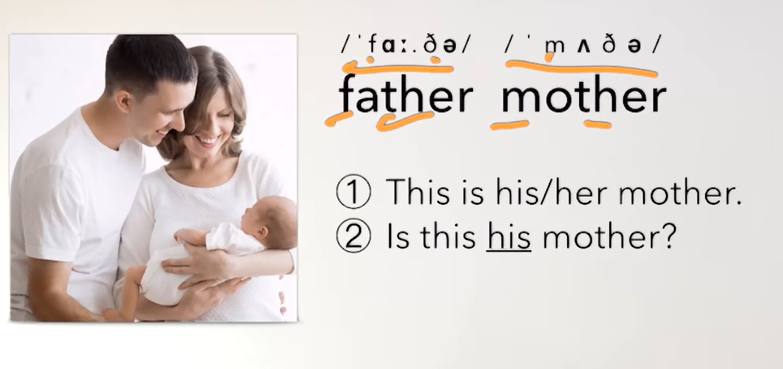

#### 	2、sister -- 姐妹

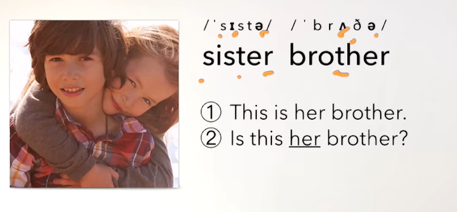

#### 	3、blouse -- 女士衬衫

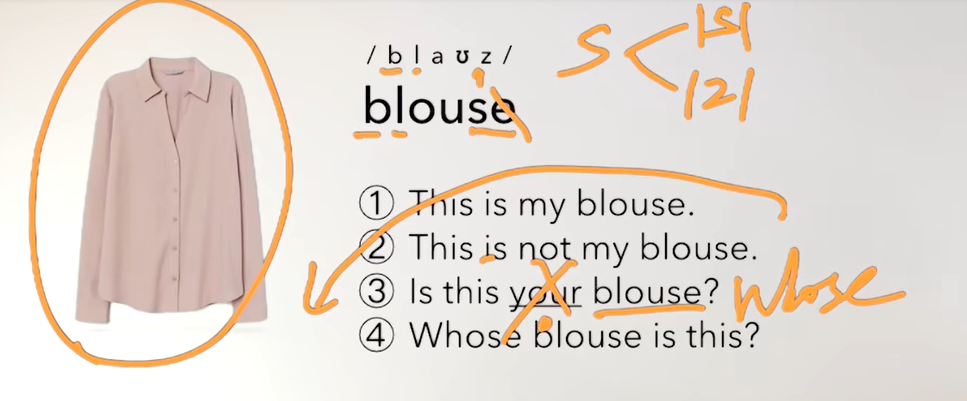

#### 	4、is that a blouse？ -- 你穿的什么衣服？

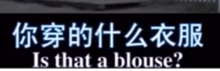

#### 	5、tie -- 领带

​		造句的思路

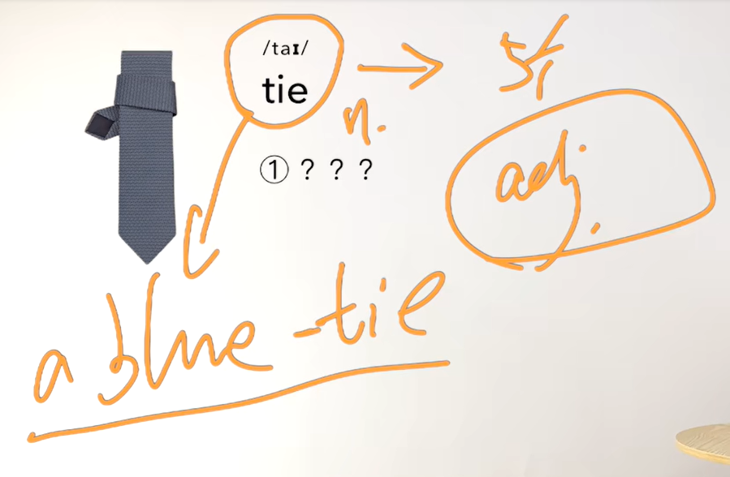

#### 	6、handbag -- 手提包

​	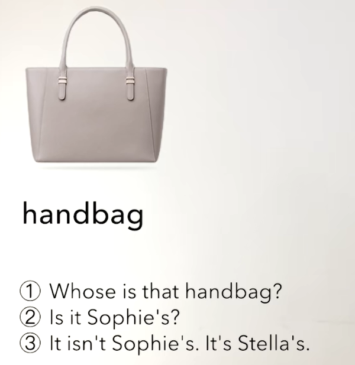

#### 	7、car -- 汽车

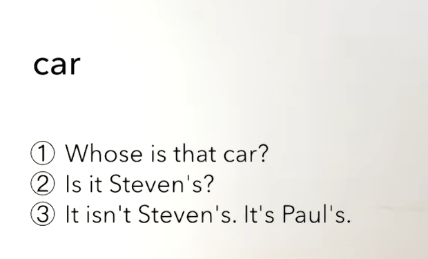

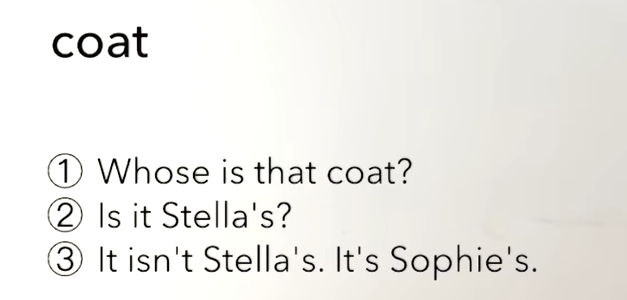

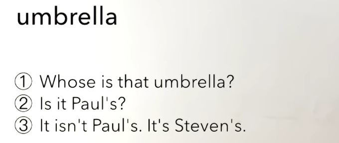

​	

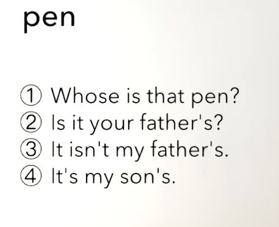

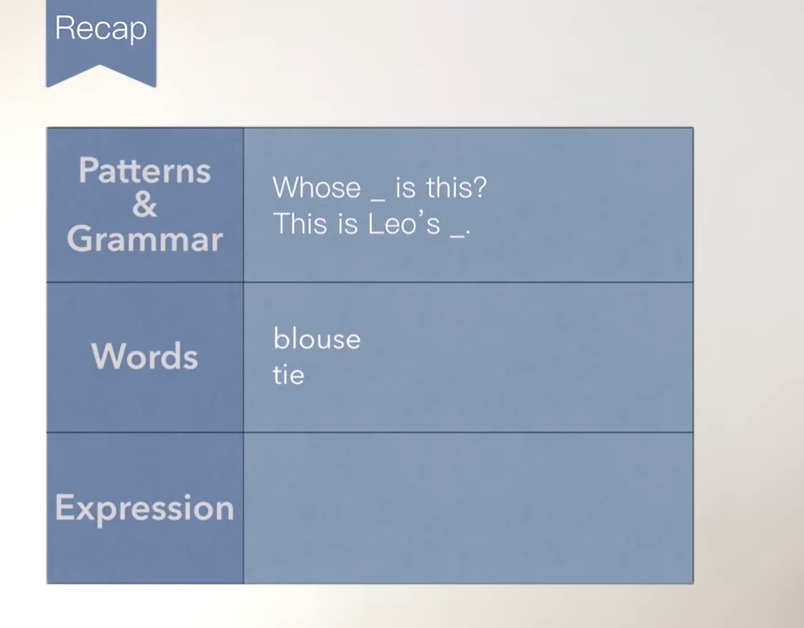

## 2、造句

​	

​		先是肯定句

​		一般疑问句

​		特殊疑问句（不同的特殊疑问词）

​	例如：

​		whose tie is this ？ 特殊疑问句

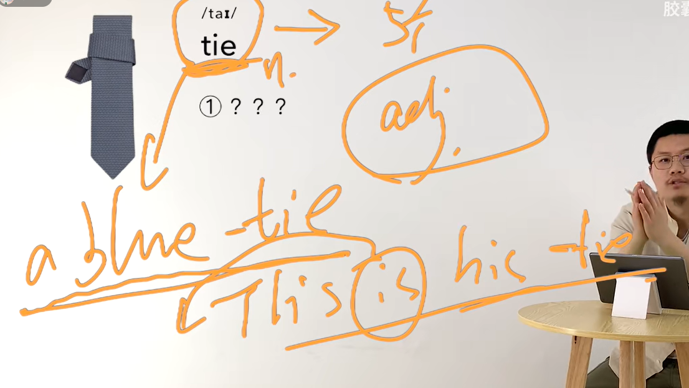

​		

