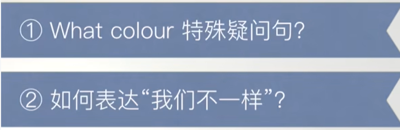

# 8、lesson13-14-特殊疑问词What color

​		


#### 	1、what color

​	what color 引导的特殊疑问句

​		Her new dress  is green -- 她的新裙子是绿色的

​		Is Her new dress green ？ 她的新裙子是绿色的吗？

​		What color is her new dress ？ 她的裙子是什么颜色的？ ---特殊疑问句


#### 	2、go/come upstairs

​			上楼


#### 	3、作业

​			1、使用hat造10句话

```
 
1、this is my hat 
2、Is this your hat 
3、whose hat is this？
4、where is this hat ？
5、He has a hat
6、Who has a hat？
7、I like my hat
8、Do you like this hat？
9、I want a hat
10、How much is this hat ？


```


​			2、给自己讲解一遍这节的核心知识点

```
	1、这节主要讲了特殊疑问句 what color 什么颜色，这个特殊疑问词
		如：what color is her dress？

	2、 come / go  upstairs 短语 上楼是可以使用come 也可以使用go
	
	3、 They are the same 和 It is different 其中不同少了个the，这个无需纠结是否需要加the，这个可以理解为常规用法。


```


## 复习第九课内容


特殊疑问句 VS 一般疑问句

#### 1、what 

​			特殊疑问句 = 特殊疑问词 + 一般疑问句（去掉答案）

​	例如： My name is Leo

​		一般疑问句 = Is your name Leo ？

​		特殊疑问句 = What is your name ？ --去掉了Leo这个答案

​	what是什么的意思，那么他的答案可能会有很多种，这种很多种的提问就是特殊的疑问句


##### 	如何判断这句话是特殊疑问句还是一般疑问句？

​		一般疑问句的回答 一般是 Yes NO

​		

​		例如： 明天去游泳吗？ 去，不去  ---- 一般疑问句

​					明天什么时候去游泳？  答案很多        -------特殊疑问句


​			He is French

​			Is he french ?

​			What nationality is he？ -- 他的国籍是什么？ -- 特殊疑问句   What nationality是特殊疑问词


#### 2、where 

​			特殊疑问词 -- 哪里


​			She is from Italy 

​			Is she from Italy？ -- 她来自意大利吗？    一般疑问句

​			where is she from ？ -- 她来自于哪里？  --- 特殊疑问句


