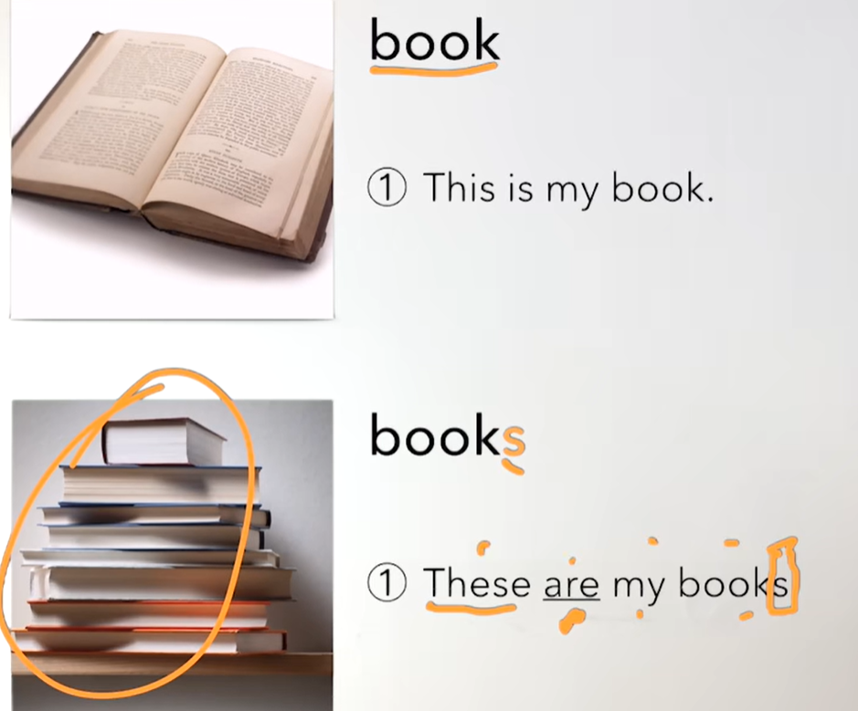
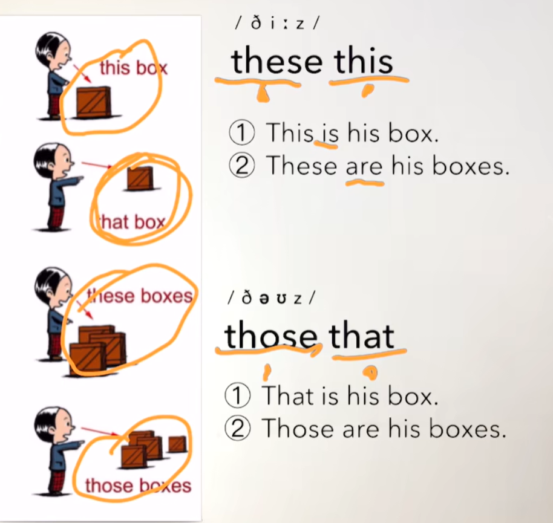
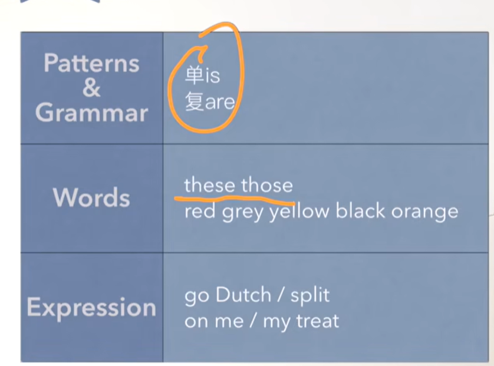

# 9、lesson15-16-名词复数的使用

 

## lesson15

### 	1、如何识别海关申报通道？

​				customs -- 海关

​				Goods to declare -- 需申报的货物

​				Nothing to declare -- 无申报通道


​		officer -- 办公室里的长官 延伸出 -- 长官的意思

​		 


### 	2、如何表达英文名词复数

​			friend 与 friends

#### 		规则：

​				1、直接+ s

​	

​	

​			2、以字母s,o,x,ch,sh结尾的单词加 es


​		易错点：

​				俩个老师/俩个老师们

​				two teachers   -- 我们很容易忘记加s


### 3、lesson15总结：

```
	
		这节课主要讲解了，名词的复数形式，然后有些名称是+s后缀
		x、o、s、ch、sh，th结尾的大多数单词，名称加es
		
		
```


## lesson16

### 	1、如何表达生活不是非黑即白？

​		Life isn't black and white -- 生活不是非黑即白

​	

### 	2、如何表达我请客或AA？

​			Let's go Dutch -- 我们AA吧

​			Let's split -- 我们分账

​			It's on me -- 算在我身上 --我请客

​			My tread -- 我请客

​			He is Dutch -- 他是 荷兰人

​	

### 	3、如何判断何时用is are？








### 	4、作业

​		绿皮书 16节内容

### 5、总结

```
	这节课主要讲了复数的be动词 使用会有变化 复数使用are，单数使用is
	短语-- AA制 Let's go Dutch，我请客 -- on me
	
	These -- 这些
	Those -- 那些


```


​		


