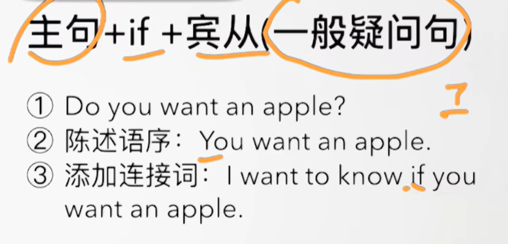
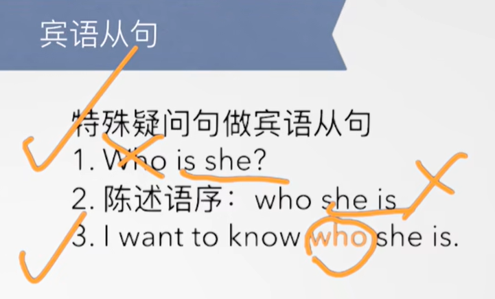
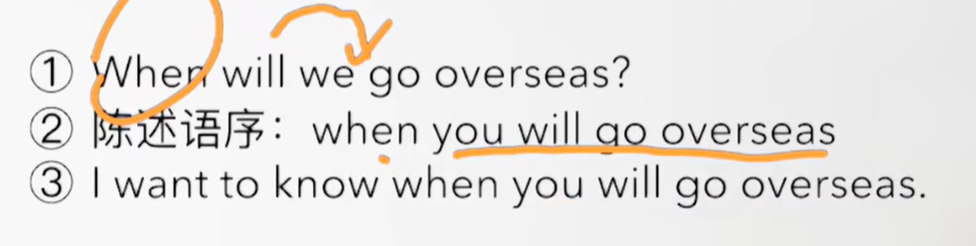
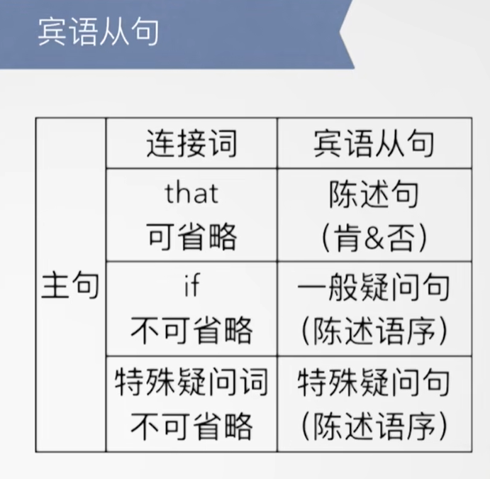

# 习惯用法+短语

## L-21

#### 	1、give sb sth -- 给某人某物

​		give me that book please -- 请把那本书给我

## L-62

#### 	1、take medicine --  吃药/服药

​		take any aspirins -- 吃一些阿司匹林

#### 	2、I have good news for you -- 我有好消息给你

#### 	3、What's the matter with you？ -- 你有毛病吗？

#### 	4、I'm gonna see a dentist -- 我要去看牙医

## L-63

#### 	1、must 用法

​			肯定句---主语 + must + do

​			I must call the doctor -- 我必须给医生打电话

#### 	2、have a flu -- 得了流感，患病使用have

​			I have a very bad headache -- 我头痛的很厉害

#### 	3、get up -- 起床

## L-64

#### 	1、play with sb -- 与某人玩

​		Don't play with him -- 不要和他一起玩

​		He is gonna play with his parents this weekend -- 这周末他要去和他的家长一起玩

#### 	2、talk to sb -- 和某人说话，talk with sb -- 与某人谈话

​		Don't talk to me now -- 现在不要和我说话

​		I'm gonna talk to him -- 我要和他谈谈

​	

#### 	3、lean out of window  探出窗外

​		Look,they are leaning  out of the windows -- 看他们正在探出窗外

#### 	4、so quickly -- 如此的快

​		You are driving so quickly -- 你现在开车如此的快

​		please slow down -- 请慢下来

#### 	5、make a noise -- 弄出声响

#### 	6、take any aspirins -- 吃一些阿司匹林

#### 	7、play with matches -- 玩火

## L-65

#### 	1、enjoy yourself -- 享受你自己-祝你玩的愉快

#### 	2、Can you hear me ？ -- 你能听到我吗？

​		Do you hear that ？ -- 你听到了吗

## L-67

#### 	1、be absent -- 表达缺席

​		1、be absent from -- 某人从某地缺席了

​		2、Tim is absent from school again -- Tim 又缺课了

#### 	2、country music -- 乡村音乐

​		

## L-69

#### 	1、next year -- 明年

#### 	2、a large crowd of people -- 一大群人

#### 	3、on the way home -- 在回家的路上

## L-70

#### 	1、hundreds of people -- 数以百计的人

## L-73

#### 1、go hand in hand -- 紧密相连 == closely connected

#### 2、suddenly -- adv突然
    1、Suddenly，the car stopped near the bus stop -- 突然这个车停到了公交车站的旁边

#### 3、walk slowly -- 走的很慢

## L-75

#### 1、buy sb sth. / buy sth for sb 给某人买某物

#### 2、a pair + n ---- 一双/一副
    a pair shoes 一双鞋

#### 3、ago -- 在...之前
    1、N years ago --- 多少年以前
    
    2、N months ago --- 多少月前

## L-77

#### 1、have an appointment -- 预约，有个预约

#### 2、Walk in -- 走进，无约而至，也可以代表无需预约

#### 3、Wait here till I come back -- 在这等直到我回来

## L-79

#### 1、have got ？ 有
#### 1、I have a car == I have got a car == 缩写 I've got

## L-83

#### 1、make a mess -- 制造混乱

## L-85

#### 1、go to cinema -- 去电影院

#### 2、see a film -- 看电影

#### 3、never ever -- 什么都不要做

## L-87

#### 1、Where is the reception？ -- 前台在哪里？

#### 2、bring sth to sb -- 带给某人某物

#### 3、try to do sth --  尝试做某事

## L-88

#### 1、have a crash -- 撞车

## L89

#### 1、It's been quiet for about 45 minutes --- 已经安静了45分钟了 -- 现在完成时，第二个用法L89，’s代表has

​		1、has been -- 已经 -- been 是be的过去分词

#### 2、have done -- 结束/完成

​		Let's have done with this silly argument. -- 我们结束这场无聊的争辩吧。

## L-90

#### 1、worth every penny -- 值每一分钱 -- 物有所值

## L-91

#### 1、move to sth -- 搬去某地

#### 2、poor guy  -- 可怜的家伙

## L-92

#### 1、return to sw -- 返回某地

​	He will return to Beijing next week -- 他将在下周返回北京

#### 2、1、fly to sw -- 坐飞机去某地

​	They flew to New York this morning -- 他们今天早晨坐飞机到纽约

## L-97

#### 1、other day -- 几天前

#### 2、belong to sb -- 属于某人

#### 3、Can you handle this？-- 你能处理某事么

## L-99

#### 1、如何使用宾语从句？

​			主语 + v. + （that） + 句子 --- that 可以省略

​		I believe that this house is for sale -- 我相信这个房子是出售的

#### 	2、Are you sure？ -- 你确定么？

​		Are you sure about this？ -- 关于这个事情你确定吗？

## L103

#### 1、I wanna spend the rest of my life with him -- 我想要和他共度余生

#### 2、cheer up -- 开心一点，振作起来

## L-104

#### 1、如何表达过于....而不能？

​	too adj + for sb + to do sth

​		It's too big for me to wear -- 这个东西对我来说去穿太大了 --- 它是一个否定的表达

#### 2、如何表达 足够....而可以？

 	adj + enough + for sb + to do

​	It's big enough for me to wear -- 这个东西足够大对于我来穿 -- 它是一个肯定的表达，表示可以

## L-105

#### 1、如何表达 想做某事？

​	want to do sth == wanna do sth

​	I want to buy a new car

​		Do you want to buy a new car？

​		Why do you want to buy a new car？

#### 2、tell sb to do sth -- 告诉某人做某事

​	Please tell him to bring me some coffee -- 请告诉他给我带一些咖啡

#### 3、make a mistake -- 犯错了

​	You made a mistake -- 你犯错了

​	Did I make a mistake？ -- 我之前犯错了吗？

​	You're making a mistake -- 你现在正在犯一个错误

 

## L106

#### 1、Can I keep this -- 我能留着这个么

#### 2、want sb to do sth -- 想让某人做某事

​	 	she wants him to carry it

## L107

#### 	1、比较级用法	

​		**主语 + be + adj.er + than + 比较对象**

​	That man is older than this woman

#### 	2、最高级用法

​		**主语 + be + the + adj .est + n + 范围**

​	My father is the coolest guy in the world -- 我父亲是全世界最酷的人

​	My mom is the kindest person in the world --- 我母亲是全世界最善良的人

#### 	3、**主语 + be + the adj.est + n** + I've ever met/seen

​		谁是怎么样的人 。。。我所看见（遇见）过的

​		This is the craziest thing I've ever done --- 这是我做过最疯狂的一件事情

​		This is the cutest baby I've ever seen --- 这是我见过最可爱的宝宝

#### 	4、Suit yourself -- 随便你

## L108

#### 	1、Would like + to do sth --- 愿意去做某件事

​		I would like to help him --- 我愿意去帮助他

## L109

#### 1、What a pity！ --- 好遗憾啊

​	1、What a pity！ --- 好遗憾啊

​	2、It's a pity （that） +  句子 --- 很遗憾 ...这个没有发生

​	3、It's a pity he can't come --- 很遗憾 他没法来

​	4、It's a pity he didn't pass the exam --- 很遗憾 他没有通过这个考试

#### 2、如何区分a little，little，a few，few？

​	a little + un（不可数名词） 肯定含义

​	little + un （不可数名词） 否定含义

​	a few + cn 肯定含义	--	肯定就是不多但是还够做某些事情

​	few + cn 否定含义 -- 否定的含义是 一点不够做某些事情了

#### 3、make some coffee --- 煮咖啡

## L110

#### 	1、have got -- 拥有

​		1、I’ve got some coffee -- 我有一些咖啡

## L111

#### 1、如何使用as...as?

​	expensive --- as expensive as 

​	beautiful  --- as beautiful as

​	The blue car is as clean as the red car --- 这辆蓝车同样的干净 像这辆红车 -- 这辆蓝车同红车一样干净

##### 	1、肯定：as....as ---- 他们同样的.....

​						同.....一样....

​	如：He is as stupid as a donkey --- 他是同驴一样愚蠢

​			She is as beautiful as an angel --- 她同天使一样美丽

​			He is as slow as a snail --- 他同蜗牛一样缓慢

##### 	2、否定：not as ... as ---- ....不如....

​		相当于A不如B

​		The blue car is not as clean as the red car --- 这个蓝车不如红车干净

#### 	2、buy sth on instalment-- 买某物分期付款

​	1、buy sth on instalment --- 买某个东西分期付款

​	2、He bought this car on instalment --- 他分期付款买了这辆车

## L113

#### 	1、 I've ever soon -- 我见过

​		These passengers are the most interesting people I've ever soon -- 这些乘客是我见过最有趣的人

#### 	

#### 	2、如何使用no&none？

 		**not any /a.an = no + n**

​		I didn't see any cars in the street

​		I saw no cars in the street --- 我在街上没有看到汽车

​		I haven't got any time

​		I have got no time -- 我没有时间

​		

​		**no + n = none**

​		Have you got any beer？ 

​		We haven't got any beer --- 我们没有啤酒了

​		== We have got no beer

​		== We have got none

​		在none的使用的使用我们必须知道上下文出现的这个n名词

#### 	3、Haven't you got --- 难道你没有

​		Haven't you got any small change ？ -- 难道你没有一些小零钱吗？

#### 	4、 so have I -- 我也是

​		肯定： so + 助动词/情态动词/be + 主语

​		**助动词/情态动词/be	=== 这个就是变一般疑问句的时候使用的动词**

​		I have a happy family

​		So do I -- 我也是

#### 	5、neither can I --- 我也不能

​		否定： neither + 助动词/情态动词/be + 主语

## L115

#### 1、be quiet -- 安静

​	1、be quiet everyone -- 各位安静

#### 2、Everything is possible --- 一切皆有可能

#### 3、Nothing is impossible -- 没有什么是不可能的

#### 4、joke about sth -- 关于某事开玩笑

​		You can’t joke about this -- 你不能拿这件事开玩笑

#### 5、have something to drink -- 来喝点东西

## L117

#### 	1、过去进行时：was/were + doing --- 一个动作在过去正在发生

#### 	2、时间状语从句when&while

​			She was cooking the dinner，**while** I was watching TV --- 当我在看电视的时候，她正在做晚饭（俩个动作在过去同时进行）

​		When I was driving to London，It rained heavily -- 当我正开车去伦敦的时候，雨下的很大

​		这个时间状语从句也可以在句首，也可以在句尾

## L119

#### 	1、tell a story -- 讲个故事

#### 	2、shit happens -- 糟糕的事情总有可能发生

#### 	3、hear a voice -- 听到某人说话

​		Can you hear a voice？ -- 你能听到有人说话吗？

#### 	4、as quickly as -- 尽可能的快

####  5、过去完成时：have/has +done 

​	

## L120

#### 	1、forget to do sth -- 忘记去做某事

​		I forgot to take my pills ---  我忘记吃药了

#### 	2、 shit happens -- 不好的事情就是会发生

#### 	3、如何使用after、before

​	After A，B == B after A  ---- 在A结束后，发生了B

​	Before B ,A （在这个B之前，发生了A）== A before B （发生了A，是在B之前发生的）

## L121

#### 	1、定语从句

​	定语&位置

​	例如：甜的苹果 -- Sweet apple （苹果有很多，这个甜的苹果起到的作用就是 确定了哪个苹果，这就是定语）

​				桌子上的面包 -- The bread on the table （可能有很多面包，而我们需要确定要桌子上的，位置确定，这也是定语）

​	定语从句：一个句子做定语（adj.）

​			相当于帮助我们去确定你要的是哪个面包，哪个苹果，相当于形容词的作用

##### 	修饰人使用 who/whom/that

##### 	修饰物使用 which/that

##### 	如何区分 who/whom/which?

​		单个人使用who，多个人使用whom，物使用which

## L123

#### 	1、英文感叹句

#### 	2、during + n -- 在...期间

​		在这个。。时间之内，在使用它的时候要考虑 它前面需要一个动词，因为在这个期间你肯定需要表达做什么

​		We didn't speak during the meal --- 在吃饭期间 我们没有说话

#### 	3、offer sb a job -- 提供给某人一个工作

​		She offer me a job last year

## L125

#### 	1、have to -- 必须/不得不

含义：必须/不得不

​		我们可以理解为 have to 已经变成了一个新的单词 haveto 代表必须的意思

​	

##### 		一般现在时

​		I have to leave now -- 我现在必须得离开了/我现在不得不离开了 --- 一般现在时

​		I don't have to leave now -- 我现在不必离开

​		Do you have to leave now？ -- 你现在必须要走吗？

​		Why do you have to leave now？ -- 你现在为什么必须要走呢？

##### 		三单

​		She has to leave now 

​		She doesn't have to leave now

​		Does she have to leave now？

##### 		一般将来时

​		I have lost my key，so I **will have to** stay at home this afternoon -- 我把钥匙丢了，所以今天下午我就不得不待在家里

​		否定句：I won't  **have to** stay at home this afternoon

​		一般疑问句：Will you have to stay at home this afternoon

​		特殊疑问句：When will you have to stay at home？ -- 你将什么时候不得不待在家里

##### 	一般过去时

​		I had to work for my family when I was 16 -- 当我16岁时我不得不为我的家庭工作

​		I didn't have to work for my family -- 我不必为我的家庭去工作

​		Did you have to work for your family？ -- 你必须为你的家庭去工作吗？

#### 	2、have to 与 must 异同--客观-主观

​	must -- 必须，have to -- 不得不

​		must是 说话人主观的看法 -- 如 I must go now（主观意愿），没有任何人或客观的情况，就是我想

​		have to 不得不 客观需要 -- 如章程或他人命令，例如被迫不得不这样去做

​				I have to go now -- （客观情况） 你表达的是其实不想走，但基于客观原因不得不走 

​		This is a terrible party，we really must go home -- 这是一个糟糕的聚会，我们真的必须要回家了（我自己想走）

​		This is a lovely place，but I have to go home because of my daughter -- 这是一个好地方，但是我不得不回家了，因为我的女儿（客观原因要走 ）

#### 	3、What a nuisance！ -- 真烦人

#### 	4、It means we can't help him -- 这意味着我们没有办法帮助他

#### 	5、What do you mean？ -- 你什么意思呢？（表达不满）

#### 	6、Surprise me -- 令我感到惊讶

## L127

#### 1、如何使用must&can't表推测？

##### 		1、must表推测 -- 确信度高/对现在的肯定推测：一定是 

​		must be adj/n

​		must be doing 

​		如：You must be Leo -- 你一定是Leo

​				He must be your father -- 他一定是你的父亲

​		现在must be是一个肯定的推测，不完全确定，如果是完全确定是，那么must be 就替换为 be动词了

##### 		2、**can't 表推测 -- 确信度高/对现在的否定推测：一定不是**

​		can't be adj /n

​		can't be doing

​		如：You can't be Leo -- 你一定不是Leo

​				He can't your father -- 他一定不是你的父亲

#### 	2、have another look -- 再看一下

​			Let me have another look -- 让我再看一下 

#### 	3、wasn't it？ -- 对吧？

 

## L129

#### 	1、must&can't对过去推测？

##### 		1、nust - 确信度高、对过去的肯定推测： 当时一定是

​		must have been  adj / n

​		must have done  --- done是动词的过去分词 

​		must have been doing  -- 当时一定在做某事

​		I must have been crazy -- 我当时一定是疯了

​		They must have been having a party -- 他们当时一定是正在举办一个聚会

​		

##### 		2、can't

​		确信度高、对过去的否定推测：当时一定不是

​		can't have been adj 、n

​		can't have done

​		can't have been doing 

​		She can't have been ill -- 她当时一定不是病了

​		They can't have been having dinner -- 他们当时一定不是正在吃晚餐

#### 	2、wave to sb --  对某人招手

The policeman waved to you --- 这个警察刚才和你招手了

#### 	3、on the race track -- 赛道

#### 	4、at seventy miles an hour -- 每小时70英里

​		1、She is driving at seventy miles an hour --  她正在开车每小时70英里

#### 	5、take my advice -- 听从我的建议

## L131

#### 	1、may&might表推测？ 

##### 	1、确信度低/对现在的肯定推测：可能是

​	may/might be adj、n

​	may/might do

​	may/might be doing 

​	否定： may/might + not

​	例句：1、Where is he from？

​				2、She may be from China

​				3、What is he doing？

​				4、He may be eating -- 他可能正在吃

##### 	2、确信度低/对过去的肯定推测：当时可能是

​	may/might have been adj/n

​	may/might have done

​	may/might haven been doing 

​	例句：1、What was his job？I don't know

​				2、He may have been a doctor -- 他当时可能是一个医生

​				3、What was he doing？

​				4、He may have been repairing his car -- 他当时可能正在修理他的车  

#### 	2、worry about sb/sth -- 担心某人/担心某事

​	He worries about his job every day -- 他每天都会担心他的工作

#### 	3、make up our minds -- 我们下定决心

#### 	4、in the end -- 最后

#### 	5、look after -- 照顾，照看

## L133

#### 1、直接引语&间接引语时态变化？

​			参考L99-101讲过直接引语和间接引语

​			主句： 一般过去时

​			直接引语：一般现在时 am/is/are/do/does

​			间接引语：一般过去时 was/were/did

​	例句：I feel tired

​				What did she say？

​				She said that she felt tired -- 她说她感觉累了 -- 这个 that she felt tired是间接引语，而且是过去说的话 时态是过去

​			直接引语如果是一般现在时，间接引语要变为一般过去时，并且主句是 一般过去时

​			主句：一般过去时

​			直接引语：现在进行时 am/is/are + doing

​			间接引语：过去进行时 was/were + doing 

​	例句：I am writing for the taxi

​				What did she told you？

​				She told me **that she was writing for the taxi** -- 她之前告诉我 她之前正在等待出租车

​			主句是一般过去时，要把直接引语的 现在进行时变为间接引语 的过去进行时

​			主句：一般过去时

​			直接引语：现在完成时 have done / 一般过去时 was/were/did

​			间接引语：过去完成时 had + done

​	例句：I have finished my homework

​				What did she say？

​				She said that she had finished her Homework -- 她说 她已经完成了她的作业

​			主句：一般过去时

​			直接引语：一般将来时 am/is/are + going to do

​			间接引语：过去将来时 was/were going to do

​	例句：I'm going to take a bath

​				What did she say？

​				She said that she was going to take a bath -- 她说 她之前打算去洗澡

## L135

#### 1、get married -- v 结婚

​	1、They are going to get married next week -- 他们打算下周去结婚

## L137

#### 	1、travel round the world -- 环游世界

#### 	2、depend on -- 依赖某人/某物

​	1、If I need help，I can always depend on Leo -- 如果我需要帮忙，我总是可以依赖Leo的

#### 	3、It depends on you -- 这事靠你了/这事取决于你

## L139

#### 1、一般疑问句做宾语从句？

​		宾语从句 -- 其实就是用一句话 做动词的承受者，这句话就是宾语，那么也就是宾语从句

​		回顾：L99，L101，L133，L135

​		定义： 一个句子做宾语

​		陈述句（肯&否） 做宾语从句

​		例如：I think （that） **he can win the game**。

​					I believe **that you are not Leo** --  一个否定句在做宾语从句

​			宾语从句的引导词如that是可以被省略的，从句中作为宾语的都是可以省略引导词的

##### 		一般疑问句做宾语从句

​		1、Is she a nurse？

​		2、变为称述语序： She is a nurse -- 不是称述句，只不过是显得和称述句是一样的

​		3、添加连接词 if： I want to know if she is a nurse -- 我想知道 是否(if) 她是一个护士

​		主句 + if + 宾从（一般疑问句）

​		

​	例句：Is he going to study English？

​				He is going to study English

​				I want know if he is going to study English 

#### 	2、特殊疑问句做宾语从句？

​	1、Who is she？

​	2、陈述语序：Who she is

​	3、I want to know who she is

​		例如：1、What are you talking about？

​					2、陈述语序：what you are talking about

 					3、I want know what you are talking about -- 我想知道你在说什么

 

#### 3、go overseas -- 出国，去海外

​	1、They went overseas five days ago -- 他们五天前出国了

## L141

#### 	1、middle-aged -- 中年

#### 	2、She looked at the picture curiously -- 她好奇地看着这张照片 -- 副词使用

​			副词curiously一般修饰动词 如looked

#### 	3、make up her face -- 化妆她的脸

## L143

#### 	1、littler basket -- 垃圾箱

#### 	2、A be covered with B -- A被B所覆盖

 	It snowed last night，and the street was covered with snow this morning -- 昨晚下雪了，而且今天早晨这个街道被雪覆盖了

# 

# 

# 

# 

# 

## Down

# 

# 

# 

# 

