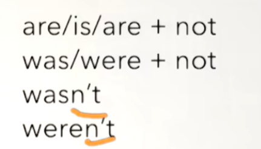
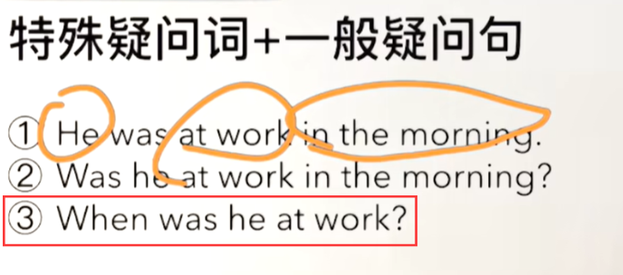

# 4、时态

英语中有多种时态，每种时态都有不同的用法和含义。以下是英语中常见的时态及其区别：

## 1、一般现在时 (Simple Present):

 \- 用法：表示习惯性、经常性或普遍真理。

 \- 例句：I $play$ tennis every Sunday.

## 2、现在进行时 (Present Continuous):

 \- 用法：表示正在进行的动作。

 \- 例句：She $is reading$ a book right now.

## 3、一般过去式(Simple Past):

​		其实可以理解为就是之前发生的事情，已经成为历史了，已经过去了

​		例如：We **were** at home in the morning -- 早晨的时候我们在家

​			They **were** not at school -- 他们之前没在学校

#### 	1、be动词的变换is--was，are--were

​			She was not thirsty -- 她之前并不渴

#### 	2、否定句

​			与一般现在时的一样，直接加not就可以

​	

#### 	3、一般疑问句

​		直接be动词提到句首就可以了

​	1、She was hungry

​	2、Was she hungry？  -- 她之前饿了吗？

​	3、did 提句首，v 变原形 -- 这个是一般过去式的一般疑问句

​			Did you love me? -- 你曾经爱我吗？

#### 	4、特殊疑问句

​	与之前的一样，特殊疑问词加句首，然后后面就是一般疑问句的结构

##### 	1、What + did + 主 + do ？

​			例句：1、What did he do yesterday afternoon？ -- 他昨天下午做了什么？

#### 	5、一般过去式 -- 助动词did

##### 		1、v -- v.ed 过去式，动词+ed就变成动词的过去式，规则的都是+ ed，不规则的后续再了解

##### 		2、如果动词的结尾是e，且结尾e不发音 我们可以直接 +d --动词过去式

##### 		3、如果是辅音字母+y结尾，y变为ied，如empty -- emptied

##### 		4、元音字母+y结尾，直接 + ed ，如play -- played

##### 		5、双写+ed，如stop -- stopped

​	一般现在时我们之前使用的是Do Does，而一般过去式 使用的是Did

​			否定句的时候是 Did + not = didn't

​			如：I **didn't talk** to him yesterday

##### 			注意：否定句的时候动词使用原形

## 4、过去进行时 (Past Continuous): L117

 \- 用法：表示过去某个时间段内正在进行的动作。

​		过去进行时：was/were + doing --- 一个动作在过去正在发生

​		我们回顾一下现在进行时是（am/is/are + doing） 而过去进行时是将be动词替换为 was/were

​		例如：I was doing my homework at 8 o'clock last night -- 我昨天晚上八点正在做我的作业

​		**否定句** ： 我们在变否定句的时候 be 后面加 not 就可以了

​		**一般疑问句** ： -- 在变一般疑问句的时候 把be动词提到句首就可以了--和之前一样

​		**特殊疑问句**：特殊疑问词提句首 + 一般疑问句--和之前规则一样

 \- 例句：They $were watching$ a movie when I called.

## 5、现在完成时 (Present Perfect):

 \- 用法：表示过去发生的与现在有关的动作或状态。

 \- 例句：I $have finished$ my homework.

​	查看新概念一的Lesson-85课

## 6、过去完成时 (Past Perfect):

 \- 用法：表示过去某个时间点之前已经发生的动作。

 \- 例句：She $had already left$ when I arrived.

## 7、将来时 (Future Tense):

####   	1、一般将来时 (Simple Future):

  \- 用法：表示将来会发生的动作或状态。

  \- 例句：They $will travel$ to Europe next month.

​	**主+am/is/are+going to do.（do动词原形）**

​	**am/is/are+主+going to do?（do就是指do）**

​	特殊疑问句：疑问词+去掉答案的一般疑问句

​	listen+to  

​	dish+es 锅碗瓢盆 

####   	2、将来进行时 (Future Continuous):

  \- 用法：表示将来某个时间段内将会正在进行的动作。

  \- 例句：This time tomorrow, we $will be flying$ to New York.

####   	3、将来完成时 (Future Perfect):

 \- 用法：表示将来某个时间点之前将会已经完成的动作。

 \- 例句：By the time you arrive, I $will have prepared$ dinner.

这些是英语中常见的时态及其区别。正确使用时态可以帮助准确表达动作发生的时间和顺序。

