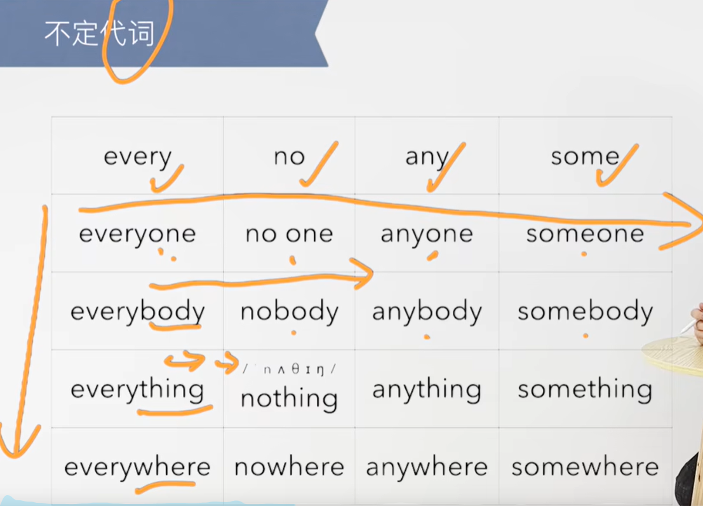

# 1、词性

## 1、副词Adv

例如：**"Certainly"** 是副词，用来修饰动词或形容词，不能单独用来结束句子。

This question is certainly **difficult.** -- **这个问题当然很难。**

This question is certainly **important.**（这个问题确实很重要。）

## 2、不定代词-新概念L115

​		代词 --- 比如，你我他其实是人称代词

​		不定代词 ---- 不确定具体指向的代词

​		例如：everyone -- 可以指 每个人，也可以指每个东西，因为它不是确定的指向某个人所以是不定代词

​				someone --- 某些人 --- 因为它也不是具体指向某一个，所以也是不定代词

