# 1、英语兔音标

​	B站地址：https://www.bilibili.com/video/BV1iV411z7Nj/?spm_id_from=333.337.search-card.all.click&vd_source=243ad3a9b323313aa1441e5dd414a4ef

#### 1、音标体系

​		国际音标

​		Dj音标

​		KK音标		

​		韦氏音标

​	学校里学的，电子词典上常见的，网络视频中使用的，往往根本不是一套统一的注音方法，以至于有人经常会问：为什么name这个词我在词典，书本，例句里面看到的注音有时候是/neim/, 有时候是/neIm/

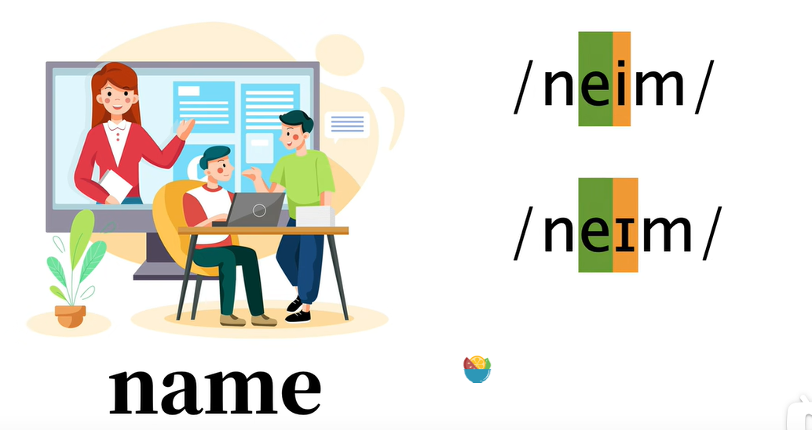

​			还有时候是nem，到底那个才是对的

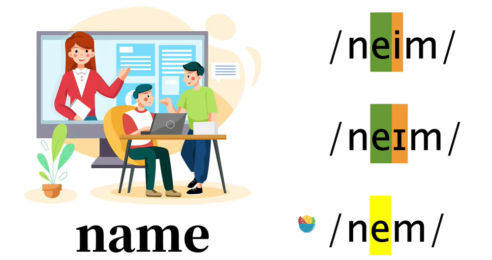

​			之所以会这么混乱，就是咱们英语学习中会遇到很多种 音标体系

​			英语发音最忌讳的，就是用咱们母语中文中的音去替代英文中独有的，但是中文中缺失的音

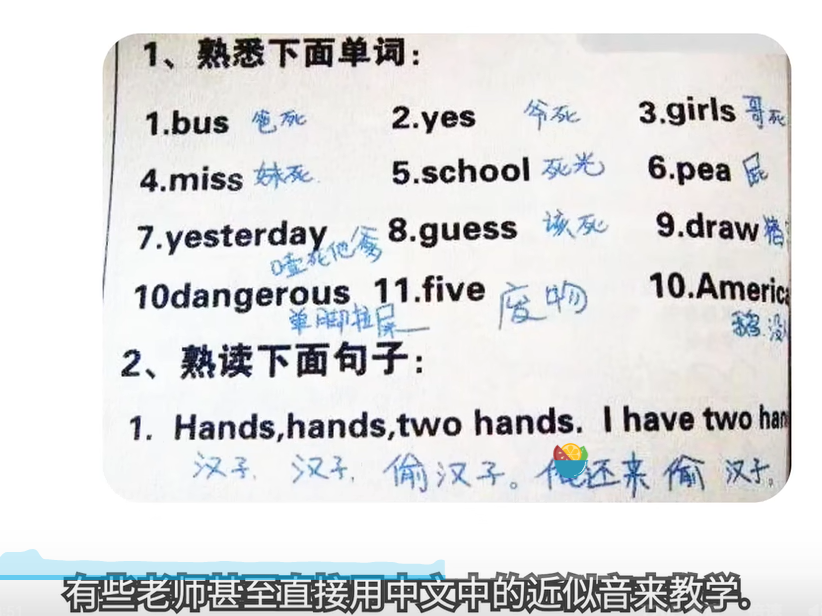

#### 2、什么是国际音标

​	

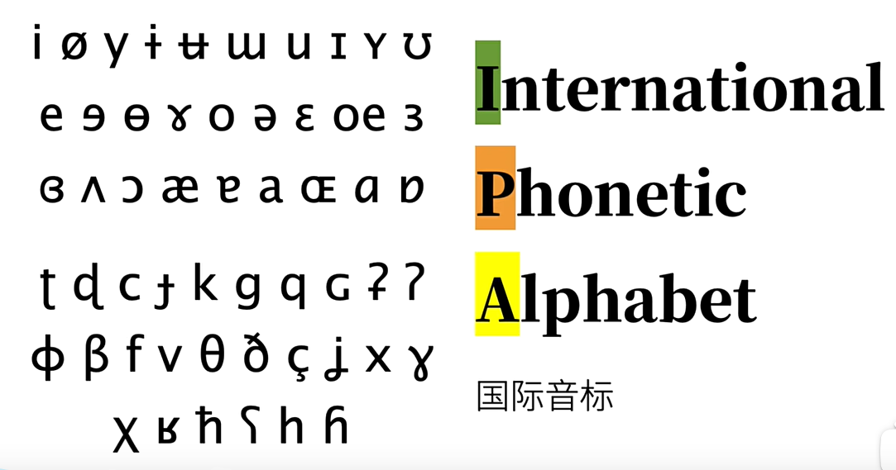

#### 3、我们平时所见的英语音标

​		

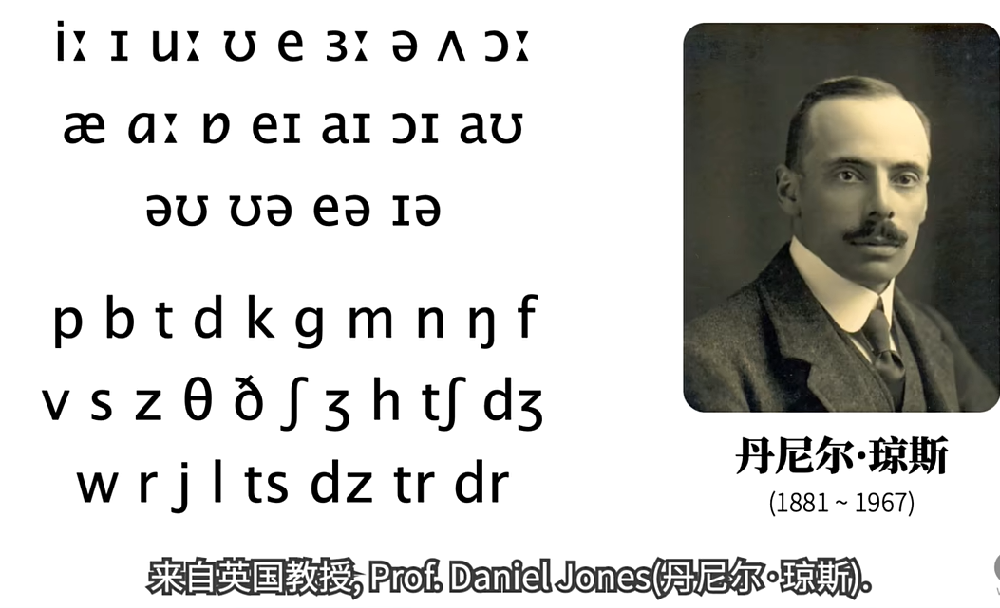

​		他给标准英式英语 PR注音

​		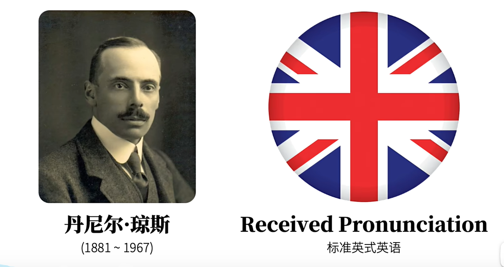

​		琼斯教授借用IPA国际音标进行稍微改动---后来也就叫做国际音标（广义国际音标）

​		为了防止混淆 琼斯教授的这套音标也 称为DJ音标

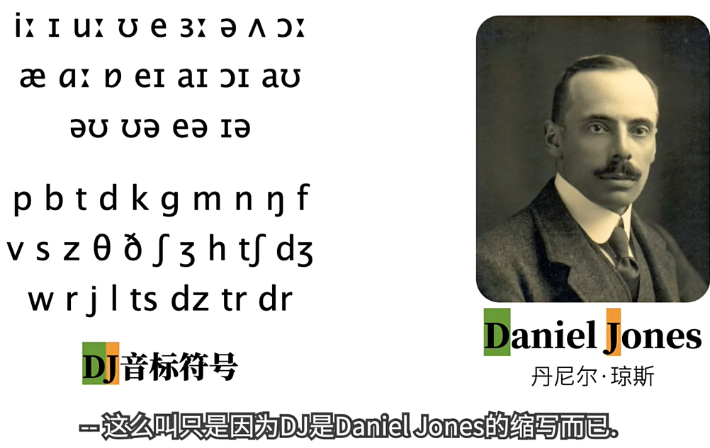

​	新旧音标的区别

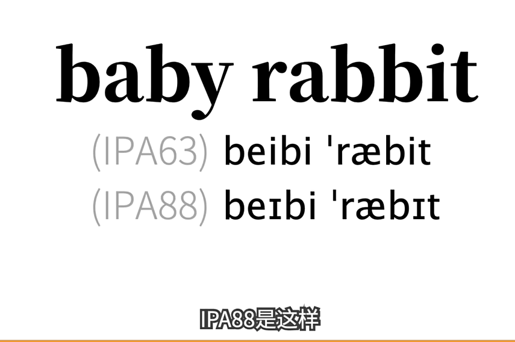

#### 4、什么是KK音标

​		是由美国俩位教授创作的音标--基础也是通过国际音标来处理的

​		KK音标在台湾地区被广泛使用，KK音标其实只是在台湾地区使用，即使在美国本土KK音标使用的也比较少

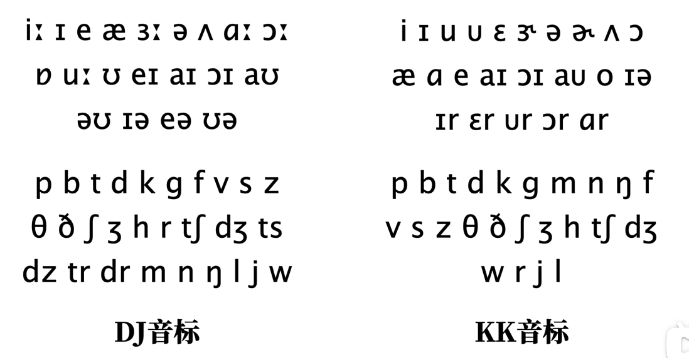

#### 	5、例如各种音标的区别

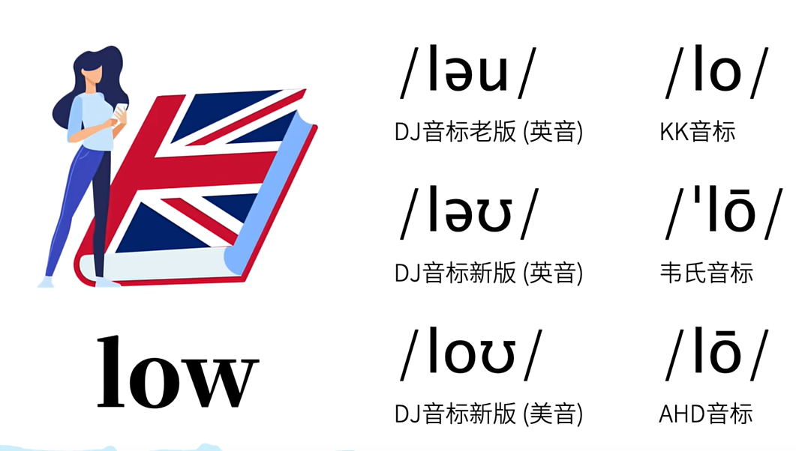

​			其实在音美这些国家，音标的普及很少，他们一般使用母语进行标注，所以他们就避免了专门学习音标的符号

例如

​		相当于在中文中这样的注音

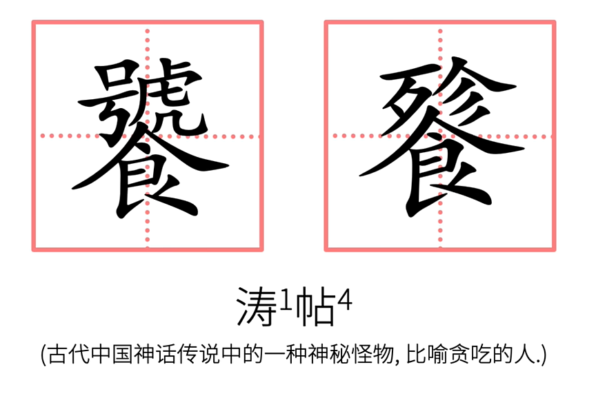

​	但是这样的注音往往就没有一个标准

#### 6、我们为什么要知道有这么多不同的音标

​			在学习英语时，的确容易对不同的音标符号产生疑问，容易有点混乱，所以我们需要了解各种音标

#### 7、我们到底要学习那套音标

​		我们建议学习还是DJ音标 -- 它被国内主流词典广泛的使用

​				

​	

