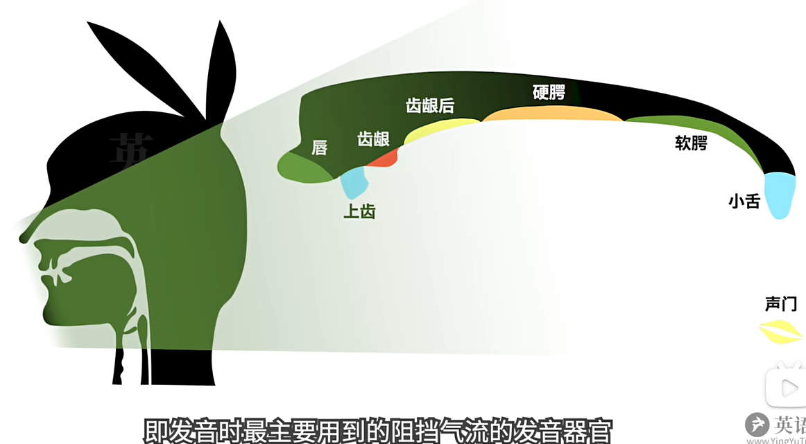

# 2、音标核心要点

​	我们使用的是DJ音标

## 1、元音

​			区分各个元音的3要素是

​			1、舌位的前后

​		2、舌位的高低

​		3、嘴唇的 “圆唇度”

#### 		1、舌位

​		

​		

​	咱们可以用普通话中的元音，即韵母，来感受一下舌位的前后高低以及圆唇度

​	而以上3个，只有 tu兔的拼音韵母是需要圆唇度的，即圆唇度很高

#### 	2、元音图

​	咱们可以把英语中不同的元音，像这样，画在所谓 “元音图”上：

​	

​	

​			**I舌位前高，但在i：的后下方**

#### 3、双元音

​			双元音是由多个单元音组合成的

​			其实咱们普通话的双韵母就是双元音

​	我们可以把双元音理解为 就是2个单元音 从前一个快速滑动到后一个发出的音

#### 4、辅音

​		三要素：

​			1、清浊，即发声时声带是否震动

​			2、所谓调音部位

​				即发音时最主要用到的主档气流的发音器官

3、调音方式

​			即以什么样的方式阻塞气流发出辅音

