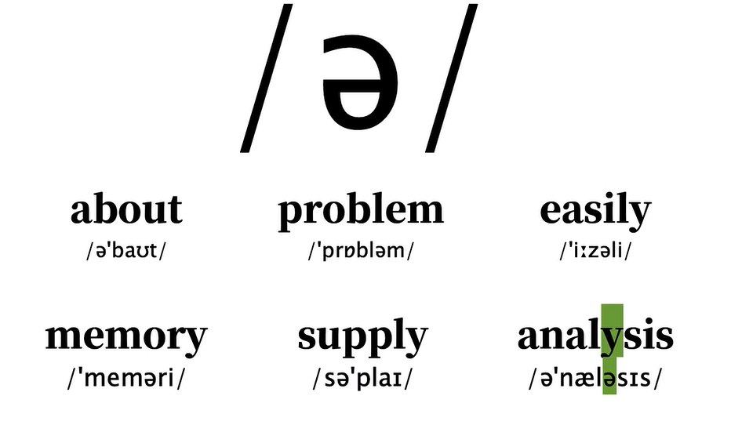

# 3、音标发音

​		具体从以下几个方面来学习音标

​			音标符号

​			发音诀窍

​			单词跟读练习

​			常见错误

​			和DJ音标对应的KK音标

#### 1、/i:/

​		ei 带有：是长音

​		

​	错误发音

#### 2、/I/

​		ei

#### 3、/u:/

#### 4、// -- book

​	区别于u

#### 5、/e/

​	an

#### 6、/3：/

#### 7、/ǝ/

​	

https://www.bilibili.com/video/BV1iV411z7Nj/?p=13&spm_id_from=pageDriver&vd_source=243ad3a9b323313aa1441e5dd414a4ef

#### 8、[ʌ]

​			a

#### 9、[ɔ：] 

​		哦

①舌尖不触下齿，口张大，舌身尽量降低并后缩。②双唇稍稍收圆

#### 10、[ae]

#### 11、【a:】

#### 12、【反a】

#### 13【eI】

#### 14、[ɔi] 

#### 15、【aI】

#### 16、【au】

#### 17、【ǝu】

#### 18、【uǝ】

​	wu e

​		uo

#### 19、【ea】

​	艾儿 air

注意没有儿话音

#### 20、【Iǝ】

​	dear

## 辅音三要素

​	元音是发音过程中气流通过口腔时不受阻碍的音，而辅音是发音过程中气流在全部时间或一部分时间被阻碍所发出的音。

https://www.bilibili.com/video/BV1iV411z7Nj/?p=27&spm_id_from=pageDriver&vd_source=243ad3a9b323313aa1441e5dd414a4ef

#### 21、【p】[b]

#### 22、[t] [d]

​	te de

#### 23、【k】 [g]

​		ke ge

#### 	24、【m】【n】【ŋ】

​		鼻辅音

​		en

https://www.bilibili.com/video/BV1iV411z7Nj/?p=31&spm_id_from=pageDriver&vd_source=243ad3a9b323313aa1441e5dd414a4ef

#### 25、【f】[v]

​	fo 

#### 26、【s】【z】

​	

#### 27、【Ɵ] [ð】

​			

​	与s的区别

#### 28、[ʃ] [Ʒ]

​		si  ri

#### 29、 [ʧ] [ʤ]

​	chi zhi

#### 30、【h】

#### 31、【w】

​	

#### 32、【r】

#### 33、【j】

​		ye

#### 34、【l】

#### 35、【ts】 【dz】

#### 36、【tr】 【dr】

​	区别

​	

## 总结

##  44个音标和48的音标的区别

​		国际上和KK音标都是44个，没有以下4个音标

​		而国内目前保留这4个音标的发音

## 总结

https://www.bilibili.com/video/BV1iV411z7Nj/?p=44&spm_id_from=pageDriver&vd_source=243ad3a9b323313aa1441e5dd414a4ef

#### 

