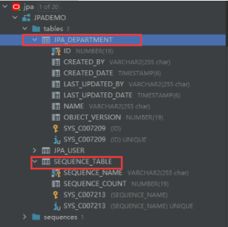
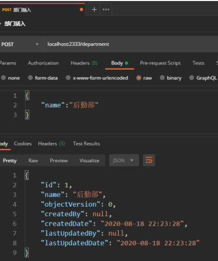

# 2.springdata-JPA进阶

```
前言
时隔一月，夏日渐离，秋风起兮，气温渐凉下，断更者忽觉不妥，似有事相忘，却不得要领，夜深，作罢，而转入被中，方得温暖，正欲入眠，忽闻窗外歌声，唱曰：断更有脸，鸽者无罪。吾大怒：谁断更啊？程序员的事，那能叫断更吗？

咕咕咕~

上一节我们讲解了spring-data-jpa最基础的架构和最简单的增删查改的实现，可以发现spring-data-jpa在简单增删查改的实现是非常友好的，甚至根本见不着sql语句的存在，让人直呼NB。

还记得上一节埋的几个坑吗，这一节就先把坑填了。


```


#### 填坑1：实体类的逐渐生成策略详解

```
	上一节讲到实体类时，介绍了很多注解的作用及其属性，举的例子是Oracle数据库的实体类。
	
	我们知道，Oracle数据库的主键不是自增的，而是依靠序列来实现主键增长，要想实现一个表的主键是自增长的，我们首先要新建一个此表的序列，让他从1开始（或者从你想要的数字开始），每次调用都让序列+1，那么也就实现了主键的自增长了。
	
```


上一节Oracle的主键自增长的主键是这样的：

#### 1.Oracle自增长主键策略：GenerationType.SEQUENCE

**使用如下:**

```java
@Id
@Column(name = "ID")
@GeneratedValue(strategy = GenerationType.SEQUENCE, generator = "JPA_USER_S")
@SequenceGenerator(sequenceName = "JPA_USER_S", name = "JPA_USER_S", allocationSize = 1)
private Long id;

```


解释一下这几个注解如何理解：

- 当生成策略为SEQUENCE时，@GeneratedValue要配合@SequenceGenerator使用
	- 首先@Id代表它下方的属性是实体类主键属性，也就是数据库的主键
	- 其次@Colum(name = "ID")代表此实体类属性对应的数据库的列名是什么，需要进行关系映射
 - 再看@SequenceGenerator(sequenceName = "JPA_USER_S", name = "JPA_USER_S" ,allocationSize = 1),它代表着需要从数据库找到一个序列并在java中映射
   	- sequenceName属性值：数据库中的序列名
      	- name属性值：这个序列名在java中要映射成的名字
      	- allocationSize属性值：这个序列的自增长步长是几
- 最后看`@GeneratedValue(strategy = GenerationType.SEQUENCE, generator = "JPA_USER_S")`，它代表着这个主键采取什么样的生成策略。
  - `strategy`属性值：采取的主键策略是什么
  - `generator`属性值：使用的序列的映射名是什么，这个映射名就是`@SequenceGenerator`中`name`的值

从上到下理解后有没有理顺这几个注解的先后呢？尤其是`@SequenceGenerator`和`@GeneratedValue`的关系。

**至此oracle的主键策略注解才算基本讲完，然而并没有结束！**

我们知道以序列作为自增长的数据库有`Oracle、PostgreSQL、DB2`，不过还有一个耳熟能详的数据库`Mysql`是可以不需要序列，直接定义主键自增长的，那么它就需要另一种生成策略。


#### 2.MySQL自增长主键策略：GenerationType.IDENTITY

使用如下：

```java
@Id  
@Column(name = "ID")
@GeneratedValue(strategy = GenerationType.IDENTITY)  
private Long id;

```


解释一下

	- 当生成策略为IDENTITY时，@GeneratedValue单独使用
	- @GeneratedValue(strategy = GenerationType.IDENTITY),只需要这一个注解就可以实现Mysql的主键自动增长，我们知道MySql建表的时候可以给主键声明，auto_increment,这就实现了自增长了，所以注解也相对简单。


在`@GeneratedValue`注解中我们只需要生成策略为`IDENTITY`，即可完成mysql数据库的主键自增长。


#### 3.万能自增长主键策略：GenerationType.TABLE

使用如下：

```java
    @Id
    @Column(name = "ID")
    @GeneratedValue(strategy = GenerationType.TABLE, generator = "sequence_table")
    @TableGenerator(name = "sequence_table",
                    allocationSize = 1, 
                    table = "sequence_table",
                    pkColumnName = "sequence_name",
                    valueColumnName = "sequence_count")
    private Long id;

```


解释一下：

	- 当生成策略为TABLE时，@GeneratedValue要配合@TableGenerator使用
 - @TableGenerator(name = "id_sequence", allocationSize = 1, table = "sequence_table",pkColumnName = "sequence_max_id", valueColumnName = "sequence_count")，它代表着需要在数据库建立一张索引表来帮助我们实现主键自增
   	- name属性值：建立的索引表在java中要映射的名字
      	- allocationSize属性值：这个序列的自增步长是几
      	- table属性值：建立的序列表的表名，缺省值：SEQUENCE
         	- `pkColumnName`属性值: 建立的序列表的第一个列的列名，此列自动填充需要序列作为主键自增长的表的表名，缺省值：SEQ_NAME
- @GeneratedValue(strategy = GenerationType.TABLE, generator = "id_sequence"),代表着这个主键采取什么样的生成策略，和Oracle中的解释一样
  - `strategy`属性值：采取的主键策略是什么
  - `generator`属性值：使用的映射名是什么，这个映射名就是`@SequenceGenerator`中`name`的值


一通解释看下来，可能会有点蒙，用示例来解释会更加直观：


### TABLE生成策略示例：

**3.1 新建一个部门实体类：JpaDepartment（属性很简单：id、部门名、五个系统字段）**

```java
@Data
@Entity
@Table(name = "JPA_DEPARTMENT")
@EntityListeners(AuditingEntityListener.class)
public class JpaDepartment {
    @Id
    @Column(name = "ID")
    @GeneratedValue(strategy = GenerationType.TABLE, generator = "sequence_table")
    @TableGenerator(name = "sequence_table",
                    allocationSize = 1, 
                    table = "sequence_table",
                    pkColumnName = "sequence_name",
                    valueColumnName = "sequence_count")
    private Long id;

    @Column(name = "NAME")
    private String name;

    @Column(name = "OBJECT_VERSION" )
    @Version
    private Long objectVersion;

    @Column(name = "CREATED_BY")
    @CreatedBy
    private String createdBy;

    @Column(name = "CREATED_DATE")
    @CreatedDate
    @JsonFormat(pattern = "yyyy-MM-dd HH:mm:ss", timezone = "GMT+8")
    private Date createdDate;

    @Column(name = "LAST_UPDATED_BY" )
    @LastModifiedBy
    private String lastUpdatedBy;

    @Column(name = "LAST_UPDATED_DATE" )
    @LastModifiedDate
    @JsonFormat(pattern = "yyyy-MM-dd HH:mm:ss", timezone = "GMT+8")
    private Date lastUpdatedDate;
}
	
```


**3.2其他的respository，service，controller的代码略过，实现的还是和用户类一样的简单的增删改查 **


这一次我并没有使用sql来新建一张表，仅仅是建立一个实体类，这个时候前面的yml配置就开始发挥他的作用了，我们对jpa的配置如下：

```yaml
spring:
  jpa:
    hibernate:
      ddl-auto: update #自动更新
    show-sql: true  #日志中显示sql语句

```


**解释一下：**

 - ddl-auto: create:启动时删除上一次生成的表，并根据实体类生成表，表中数据会被清空

 - ddl-auto: create-drop:启动时根据实体类生成表，程序关闭时表会被删除。

 - ddl-auto： update：启动时会根据实体类生成表，当实体类属性变动的时候，表结构也会更新，在初期开发阶段使用此选项。

 - ddl-auto:  validate：启动时验证实体类和数据表是否一致，在数据结构稳定时采用此选项。

 - ddl-auto: none :不采取任何措施

   建议只使用update和none，前者适合初期建表，后者适合建表完成后保护表结构

- show-sql :true,这个属性代表是否开启显示sql语句，为 true 我们就可以在每一次对数据库的操作在控制台看到所使用的sql语句了，方便找错，很方便的属性，建议开发时开启，上线后关闭


**ddl-auto: update时，jpa会根据实体类帮助我们创建表~**

**3.3 有了部门实体类JpaDepartment，让我们启动看一下实际效果：**

**3.3.1 控制台的输出：**

```sql
Hibernate: create table jpa_department (id number(19,0) not null,
                                        created_by varchar2(255 char),
                                        created_date timestamp, 
                                        last_updated_by varchar2(255 char), 
                                        last_updated_date timestamp, 
                                        name varchar2(255 char), 
                                        object_version number(19,0), 
                                        primary key (id))
                                  
Hibernate: create table sequence_table (sequence_name varchar2(255 char) not null, sequence_count number(19,0), primary key (sequence_name))

Hibernate: insert into sequence_table(sequence_name, sequence_count) values ('jpa_department',0)

```


	- 1.创建了一张名为jpa_department的表，各个列名皆为实体类属性名，长度取的默认值。
 - 2.创建了一张名为sequence_table序列表（table属性的值），
   	- 列名1：pkColumnName的值（sequence_name），代表此行索引值所属表，
      	- 列名2：valueColumn的值（sequence_count）,代表下一次插入的索引值（在插入前会提前+1）
- 3.根据`@TableGenerator`所在类映射的表名插入了一行数据，分别为`('jpa_department',0)`，也就是代表`jpa_department`这张表下一次插入的索引值是`1（0+1）`


**3.3.2 借助DateBase工具可以看到表全貌：**




缺少的表，jpa通过实体类对表的映射补全了。

新增了我们所需的`JPA_DEPARTMENT`表和一张对主键实现自增长的序列表`SEQUENCE_TABLE`


**3.3.3 进行一次插入操作**

postman




控制台输出：

```sql
Hibernate: select tbl.sequence_count from sequence_table tbl where tbl.sequence_name=? for update

Hibernate: update sequence_table set sequence_count=?  where sequence_count=? and sequence_max_id=?

Hibernate: insert into jpa_department (created_by, 
                                       created_date,
                                       last_updated_by, 
                                       last_updated_date,
                                       name,
                                       object_version, 
                                       id)
                                       values (?, ?, ?, ?, ?, ?, ?)

```


一次插入拥有三条sql语句

- 1.会等待行锁释放之后，返回`sequence_table`表的查询结果，返回`jpa_department`的当前索引值
- 2.更新操作，把`sequence_table`表中的`sequence_count`的值+1
- 3.把更新后的`sequence_count`值当成主键值插入到`jpa_department`表中作为主键值


在这三条sql语句执行后，显然`jpa_department`这一次插入的主键值为1，postman返回的json数据也证实了这一点


#### 4.AUTO自动判断主键策略（缺省策略）：

**使用如下：**

```java
    @Id
    @Column(name = "ID")
	@GeneratedValue(strategy = GenerationType.AUTO)
    private Long id;

```


**解释一下：**

	- 当生成策略为AUTO时，@GeneratedValue单独使用
 - @GeneratedValue(strategy = GenerationType.AUTO), JPA会自己从 Table策略、Sequence策略和Identity策略，三种策略中选择合适的主键生成策略。
   	- strategy 属性值：主键生成策略，什么都不写即缺省值即为AUTO


### AUTO生成策略示例：

**4.1 仍然使用的是刚刚的部门类JPA_DEPARTMENT，把已创建的表删除，修改生成策略为auto **

```java
@Data
@Entity
@Table(name = "JPA_DEPARTMENT")
@EntityListeners(AuditingEntityListener.class)
public class JpaDepartment {
    @Id
    @Column(name = "ID")
    @GeneratedValue(strategy = GenerationType.AUTO)
    private Long id;

    @Column(name = "NAME")
    private String name;

    @Column(name = "OBJECT_VERSION" )
    @Version
    private Long objectVersion;

    @Column(name = "CREATED_BY")
    @CreatedBy
    private String createdBy;

    @Column(name = "CREATED_DATE")
    @CreatedDate
    @JsonFormat(pattern = "yyyy-MM-dd HH:mm:ss", timezone = "GMT+8")
    private Date createdDate;

    @Column(name = "LAST_UPDATED_BY" )
    @LastModifiedBy
    private String lastUpdatedBy;

    @Column(name = "LAST_UPDATED_DATE" )
    @LastModifiedDate
    @JsonFormat(pattern = "yyyy-MM-dd HH:mm:ss", timezone = "GMT+8")
    private Date lastUpdatedDate;
}

```


**4.2 运行程序看一下jpa自动帮助我们做了什么**

```sql
Hibernate: create table jpa_department (id number(19,0) not null, 
                                        created_by varchar2(255 char), 
                                        created_date timestamp, 
                                        last_updated_by varchar2(255 char), 
                                        last_updated_date timestamp, 
                                        name varchar2(255 char),
                                        object_version number(19,0), 
                                        primary key (id))
Hibernate: create sequence hibernate_sequence start with 1 increment by  1

```


	- 创建了jpa_department这张表
	- 创建了一个名为hibernate_sequence的序列


显然jpa识别到了我连接的数据库是oracle数据库，所以采取的是SEQUENCE生成策略，它帮助我们建立了一个名为`hibernate_sequence`的序列，但是这个名字显然是无法一眼看出来是属于谁的序列的，不方便对序列的维护，所以不推荐使用`auto`策略哦


#### 总结-主键策略：

1.主键生成策略分为四种：SEQUENCE策略、IDENTITY策略、TABLE策略、AUTO策略；

2.SEQUENCE策略适合拥有序列的数据库，比如Oracle；

3.IDENTITY策略适合拥有主键自增长的数据库，比如Mysql；

4.TABLE策略是通过一张序列表来维护主键插入的值的，所以适合所有数据库；

5.AUTO策略是jpa自行判断使用上面三个中的哪一个作为主键生成策略；

6.推荐使用SEQUENCE和IDENTITY策略，开发人员应该自行判断使用的是何种数据库，而不是由jpa进行判断。


