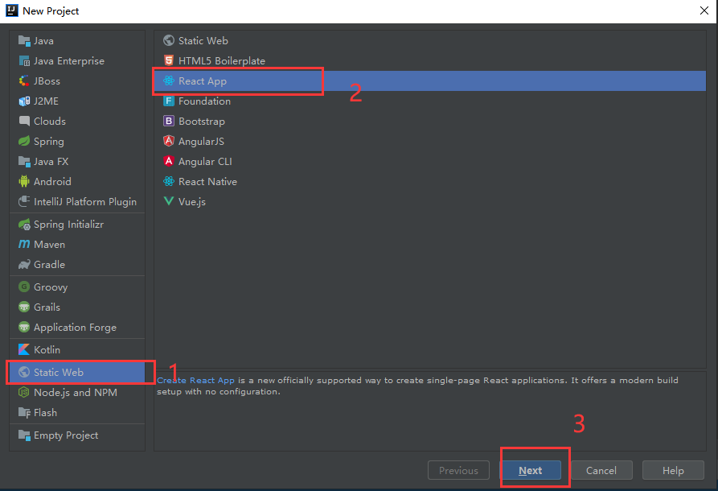
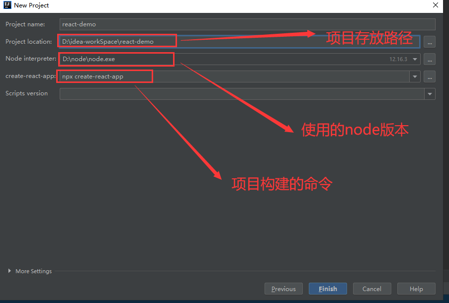
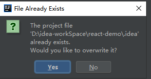
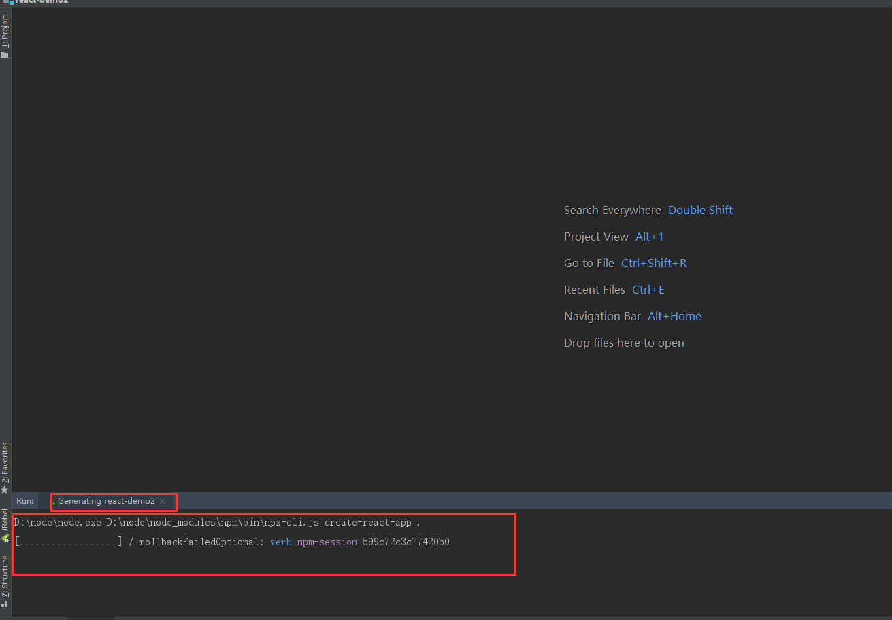
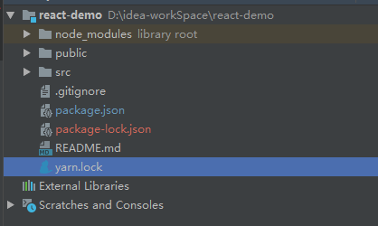
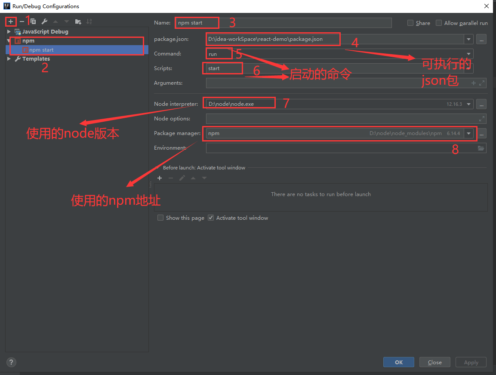
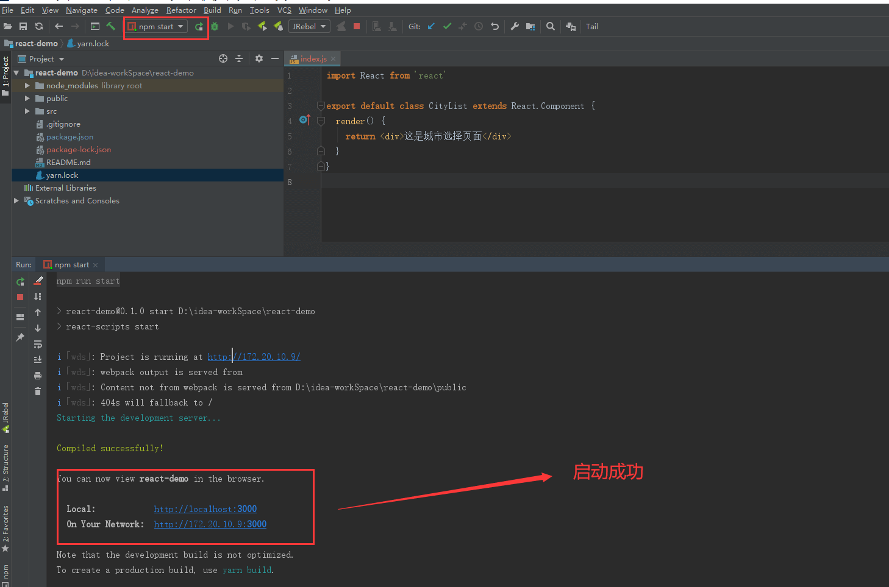

# 1.idea创建react项目


## 1.创建react项目







然后点击Finish


这个提示是项目已经有react-demo了，是否替换他，我们不替换改个名字react-demo2




项目构建中




可能会发生错误--这个原因是联网失败导致的

```shell
Error: Couldn't find package "glob@^7.1.3" required by "jest-runtime@^26.6.0" on the "npm" registry.
    at MessageError.ExtendableBuiltin (D:\yran\lib\cli.js:721:66)
    at new MessageError (D:\yran\lib\cli.js:750:123)
    at PackageRequest.<anonymous> (D:\yran\lib\cli.js:36539:17)
    at Generator.throw (<anonymous>)
    at step (D:\yran\lib\cli.js:310:30)
    at D:\yran\lib\cli.js:323:13
    at runMicrotasks (<anonymous>)
    at processTicksAndRejections (internal/process/task_queues.js:97:5)
Error: Couldn't find package "jest-validate@^26.6.2" required by "jest-runtime@^26.6.0" on the "npm" registry.
    at MessageError.ExtendableBuiltin (D:\yran\lib\cli.js:721:66)
    at new MessageError (D:\yran\lib\cli.js:750:123)
    at PackageRequest.<anonymous> (D:\yran\lib\cli.js:36539:17)
    at Generator.throw (<anonymous>)
    at step (D:\yran\lib\cli.js:310:30)
    at D:\yran\lib\cli.js:323:13
    at runMicrotasks (<anonymous>)
    at processTicksAndRejections (internal/process/task_queues.js:97:5)

Aborting installation.
  yarnpkg add --exact react react-dom react-scripts cra-template --cwd D:\idea-workSpace\react-demo2 has failed.

Deleting generated file... package.json
Done.
Done
```


连接网络-网络正常时构建，或者更换网络镜像地址达到构建需求


构建成功后的项目结构




## 2.给项目配置启动服务




#### 2.1 启动项目




