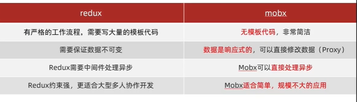
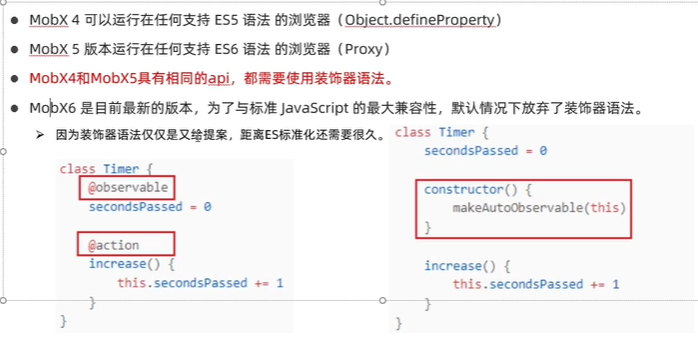

# 1.mobx介绍了解

#### 1、基本介绍

​		这个mobx一般在react的项目里面使用的比较多，一般用于做状态管理的，然后我们还需要知道另一个状态管理工具redux，mobx和redux的区别是什么？

​		mobx的基本使用：我们在react中是如何使用mobx的？

​		mobx的监听属性：

​		

​		mobx如何处理异步：

​		mobx模块化：

#### 2、mobx基本概念

​		1.mobx是一个简单，可扩展的状态管理工具（说到状态管理工具我们想到另一个状态管理工具redux）

​		2.通过运用透明的 **函数式响应编程** 使状态管理变的简单和可扩展

​				--这个响应编程就和redux不一样，mobx的理念和vue有点像，他的数据是响应式的，也就是说改完数据之后他会自动让组件进行更新的，具体的不一样我们后续举例说明

​		3.Mobx官网：https://zh.mobx.js.org/README.html

​		那么有个问题来了，既然都是状态管理工具 redux和mobx，我们就使用redux不就可以了，为什么还要学习mobx呢？下面我们对比一下mobx和redux

​	mobx的版本说明：

​			在Mobx6之前主要使用的是Mobx4，在4和5版本都是使用同样的api，但是4使用的是Object.defineProperty对浏览器数据劫持处理，而5是代理的方式，所以4支持的浏览器也可以是低版本的，而5使用的是ES6语法，还有就是4,5他们的语法都是使用的装饰器语法，比如@action描述方法.

​		Mobx6放弃使用装饰器语法，因为装饰器语法在ES标准语法中有分歧，因为想要做ES的标准化

https://www.bilibili.com/video/BV18S4y1L7uT?spm_id_from=333.337.search-card.all.click&vd_source=243ad3a9b323313aa1441e5dd414a4ef

