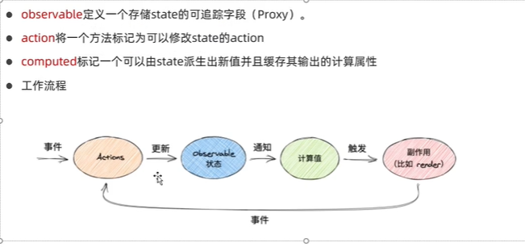

# 2.mobx基本使用

#### 1.环境配置

​		首先我们使用Mobx得先去配置一下环境

​		我们先初始化项目，然后安装mobx的2个核心包，mobx-react这个库是用来连接mobx和react的，因为默认 mobx和react其实是没有关系的，mobx也不一定要在react里使用，但是如果想在react中使用就需要安装mobx-react这个包

​		mobx-react这个包支持函数组件也支持类组件，mobx-react-lite只支持函数组件--但体积小一些

​	添加依赖包

​		现在我们的环境就配置好了，也就是说我们初始化好了一个react项目并且安装了mobx的依赖包

#### 2、核心概念

​		主要有三个核心概念，1.observable--被observable修饰后就变成一个可观察的，响应式的属性了，内部是通过ES6的Proxy实现的，将来的状态变更就会自动的追踪到这个状态变更

​				2、action--是修饰一个函数，他主要是用来修改state状态的。

​				3、computed--如果你有一些状态，想根据这些状态能够计算出新的值，那我们就需要用到计算属性，而且这个计算属性还可以把值缓存起来--多次使用只会计算一次

​	工作流程：首先触发某个事件，会掉一个Action，通过action去修改我们的状态，改完状态我们对应的计算属性会重新计算，最后会触发一些页面的副作用处理render

#### 3、使用mobx

​	创建store，mobx里的store是一个class，因为类可以有属性也可以有方法

​	注意每个store只能初始化一次

​	因为每个store只能初始化一次，所以我们使用export  default new Counter这样我们就不是导出一个类，而是一个实例

​	有个这个store之后，我们在页面中引入store

​	现在我们点击了页面的+1没有效果，因为现在我们的页面和组件还没有关联，所以我们就需要使用到另一个库里的方法mobx-react里面的observer是一个高阶组件函数，他需要包裹一个组件，这样这个组件就是响应式的，也就是说被包裹这个组件才可以正常的被更新

​	我们查看一下页面的效果：點擊+1有效果 了，点击重置也没有问题可以正常

​	这里有报一个警告就是，严格模式下面你是不允许直接修改这个数据的-如果没有在一个action里面

​	这是为什么呢，因为我们刚刚increment方法是action，而reset没有标记为action，所以要记得如果要修改状态值，方法一定要标记为action

​		其实到这里mobx就学会使用了

##### this指向的问题

​	因为我们现在Mobx是在class中使用的，默认class中的方法不会绑定this的，this指向取决于如何调用

​	因为我们以上是通过counter.increment()，通过counter组件调用的方法this指向肯定没有问题

​	如果我们去掉箭头函数--这个时候就会有问题

​	其实还是会指向这个counter组件中的increment方法，但是这个方法里的this就会有问题

​	我们测试一下--果然报错了

那么为什么会这样呢？因为我们把counter.increment传给了Onclick，最终调的就是onclick，那这个时候这个counter类组件里面的this指向就会有问题，这个时候怎么办，我们可以在函数上添加bound，加了bound之后，这个函数里面的this指向就直接定死了，就指向当前的这个类

