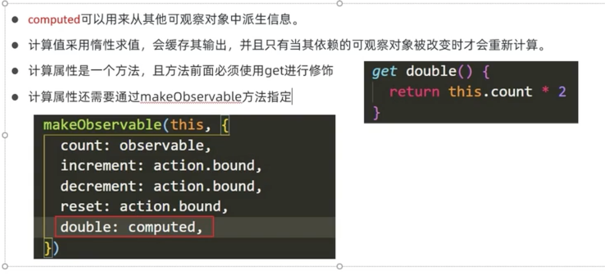
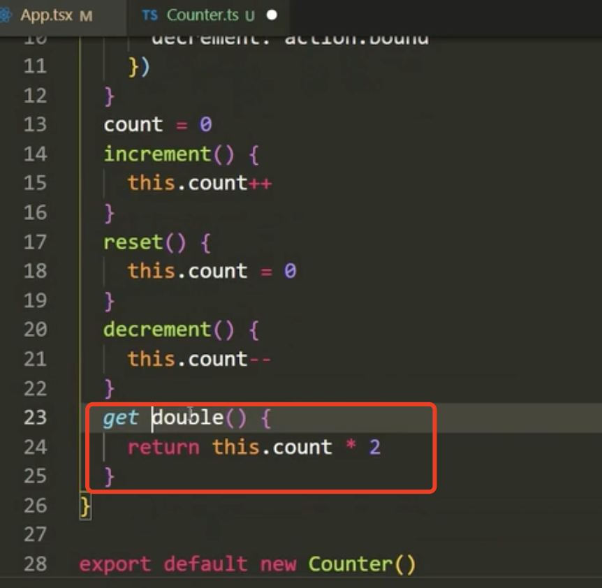
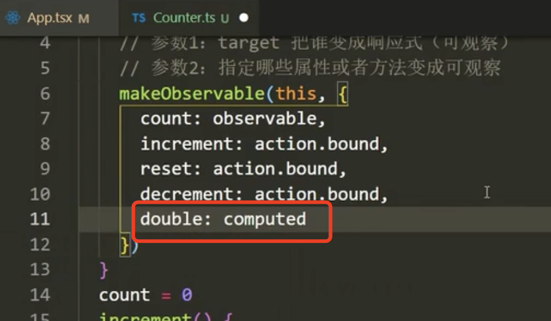
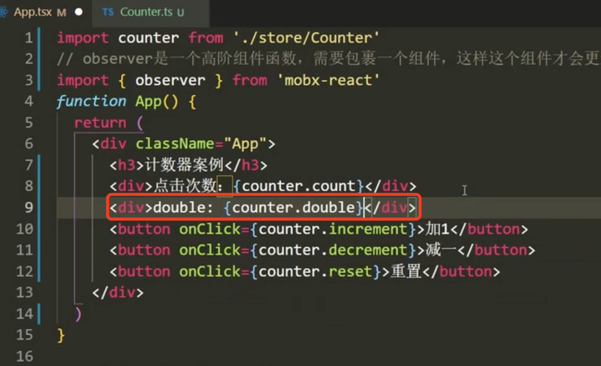
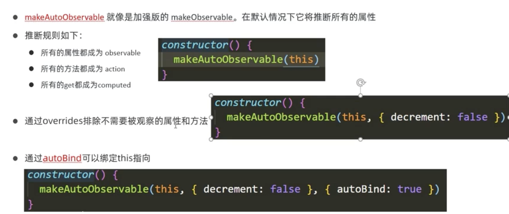
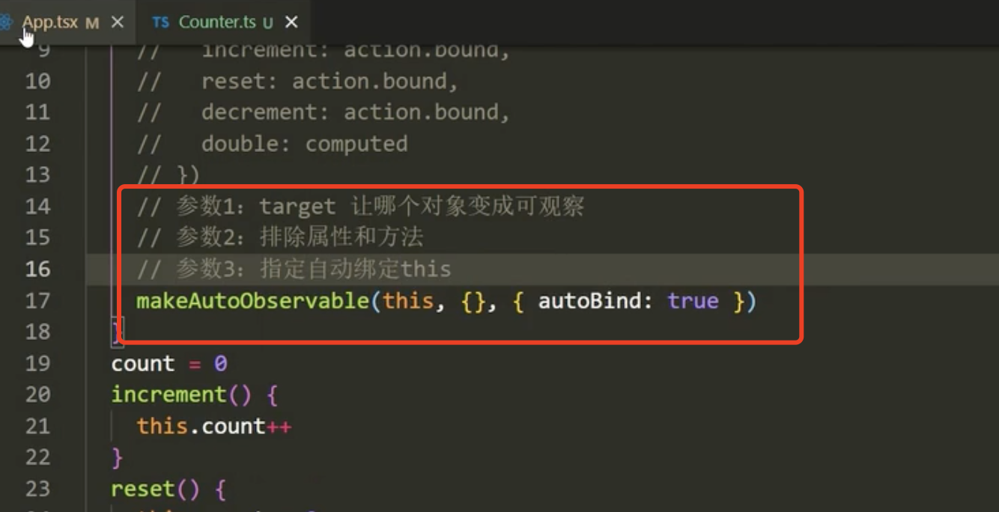
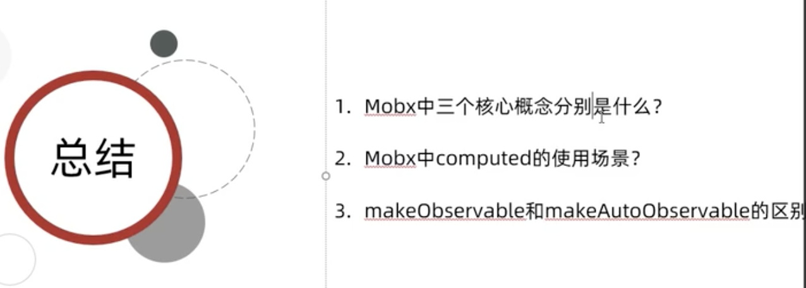

# 3.mobx基本使用2

​	

#### 1、计算属性的使用

​	computed可以用来从其他的属性，去得到一些新的属性，相当于派生出一些新的属性

​	计算值采用惰性求值--也就是说只会求一次就会缓存下来，只有值发生变化才会重新计算

​	计算属性写的时候注意是一个方法，且方法前必须使用get进行修饰

​	最后我们在makeObservable中把这个计算属性描述为computed

例如：

​	加速描述修饰

事件添加：

页面查看效果：

刚刚我们想要数据是响应式的使用的是makeObservable

#### 2、makeAutoObservable的使用

​		我们可以理解为就是一个加强版的makeObservable

​		使用makeAutoObservable之后我们就再也不需要指定这些action，observable，和computed了

​		我们还可以通过他的第二个参数来排除一些不需要被观察的属性和方法了

​		可以通过autoBind可以绑定this指向，他是makeAutoObeservable的第三个参数

​		如果不指定参数3那么就需要使用箭头函数的方式调用了

总结：

视频是在1小时09分的时间段

https://www.bilibili.com/video/BV18S4y1L7uT?spm_id_from=333.337.search-card.all.click&vd_source=243ad3a9b323313aa1441e5dd414a4ef

