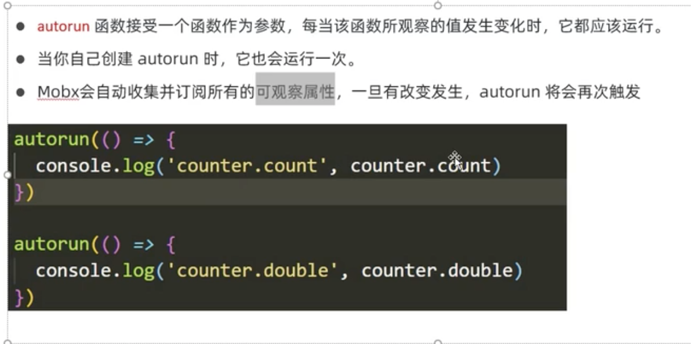
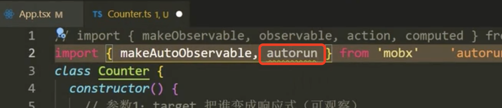
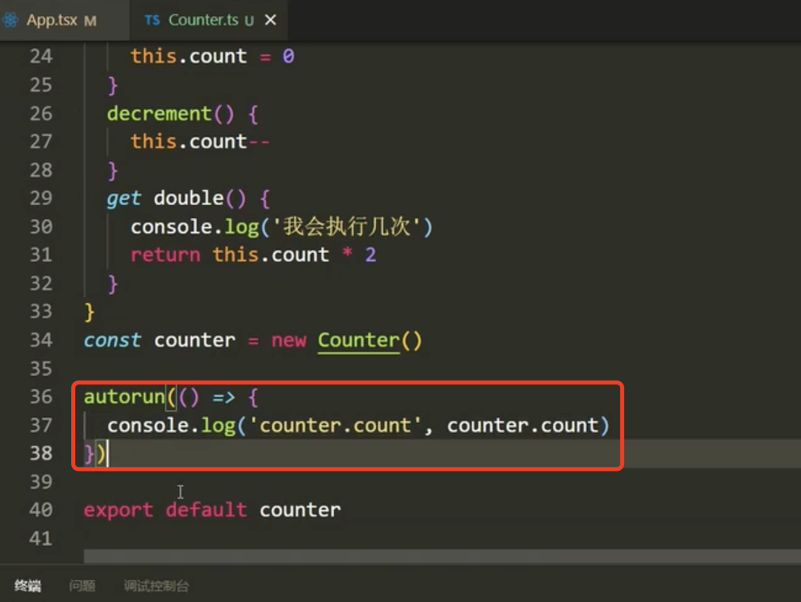
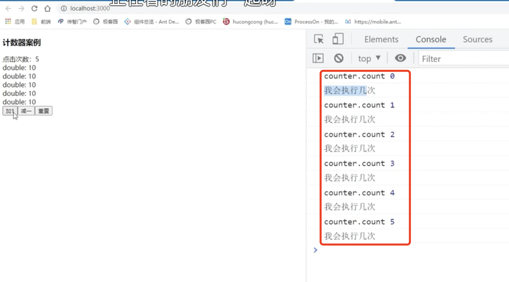
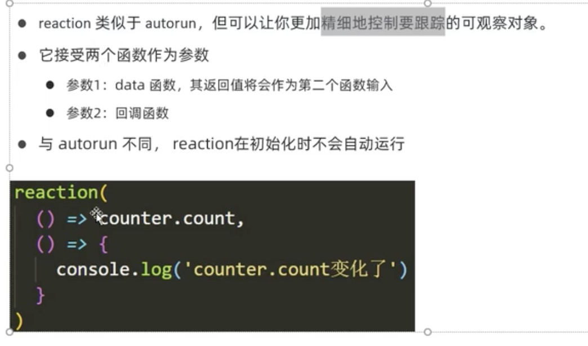
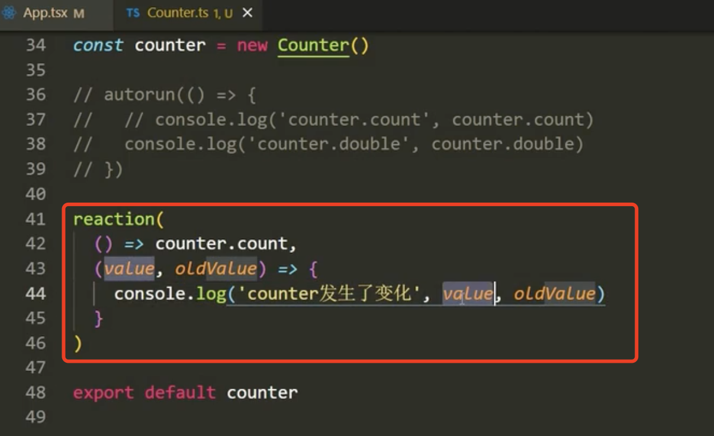
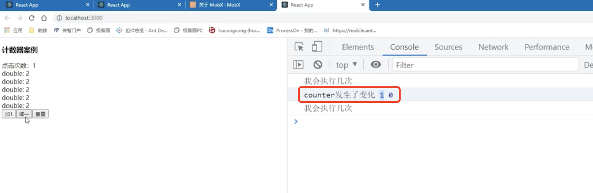

# 4.mobx监听属性

​		监听属性有俩种方式去实现可以使用autorun还可以使用reaction

#### 1、autorun的使用

​	

​	应用场景--比如count发生变化的时候，我们想做一些处理比如打印一下count

​	引入一下

页面结果：每次发生变化都会执行

#### 2、reaction的使用

​	reaction可以更精确的控制对象，意思就是可以精确的监听某一个属性（因为之前我们使用autorun他监听的对象如果是因为其他属性发生的改变而产生的变化，也是会执行的），而且他第一次不会执行

代码演示：

页面显示：

