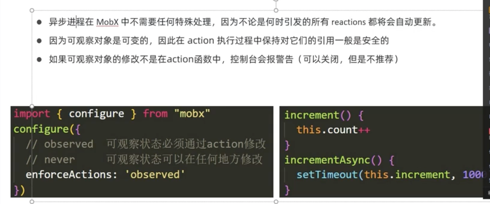
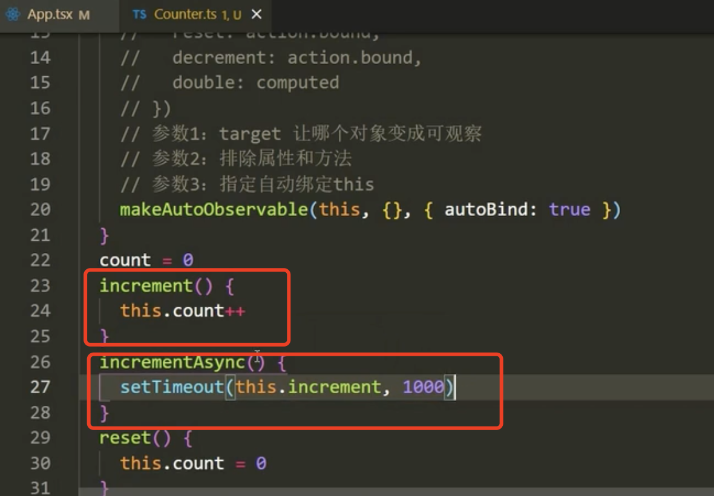
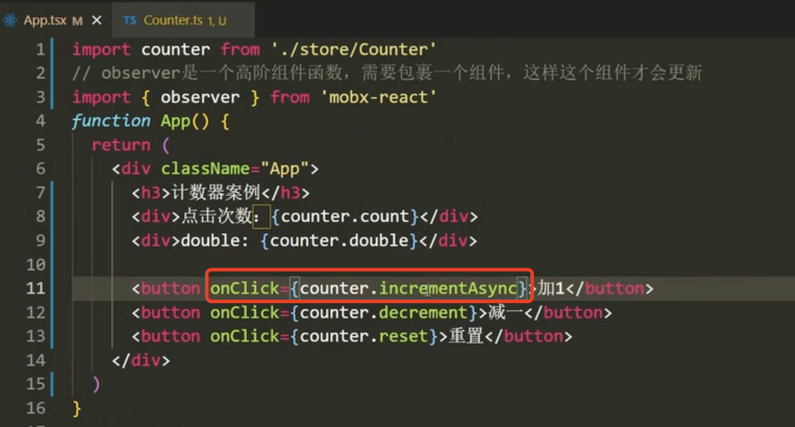
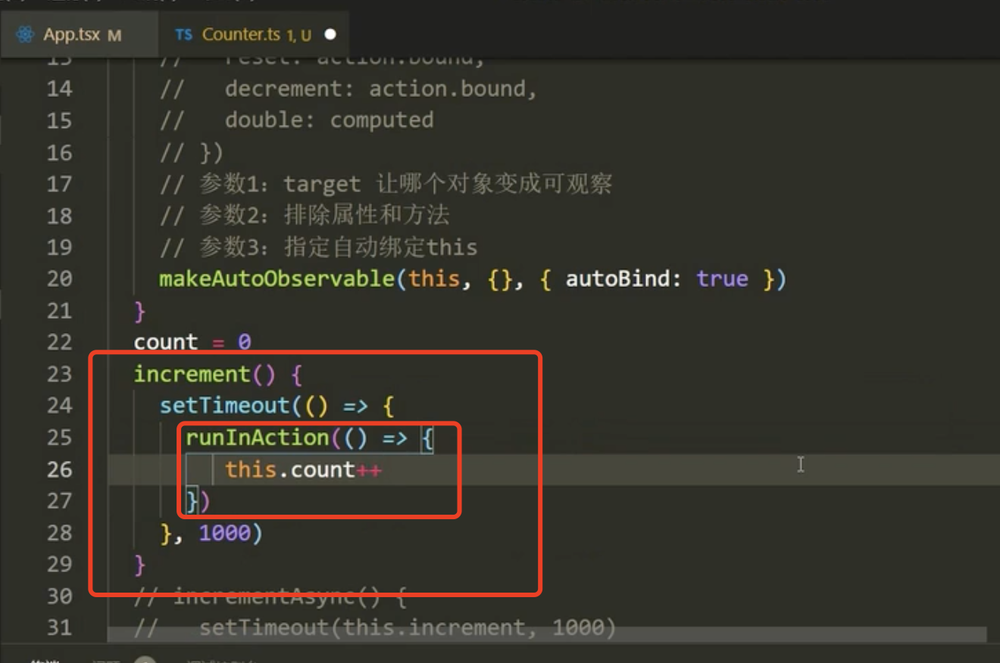

# 5.mobx处理异步

​	视频在1小时16分开始

​	其实在mobx中可以不用管异步，异步代码在Mobx里面，无论什么时候引发的reaction的变化都将会自动更新

​	这个可观察对象是可变的，哪怕是在异步中修改也没问题，但是我们应该遵循一个规范，想要改我们的数据就应该在action函数中改，如果没在action中改，控制台会报警

​	我们题一个需求就是我们点击按钮+1，我们想在1秒之后再加，而不是立马就加

​	我们修改的时候是在action中修改的，我们有一个异步的方法1秒后调用这个 increment方法也叫action方法

​	我们调用的时候--也是调用的这个异步的方法

#### 2、runInAction的使用

​	这是mobx处理异步的第二种方式，我们刚刚是以拆分2个函数实现的异步，如果我们不想拆我们使用这个runInAction方法就可以了

​	runInAction顾名思义就是让我们的异步代码可以在action中运行的意思

​	runInAction中有个回调函数，在这个回调函数中改这个数据就行

​		这么改的话，我们这个this.count就等价于在action中改的，这个runInAction我们后面会使用的比较多

总结：

​	

