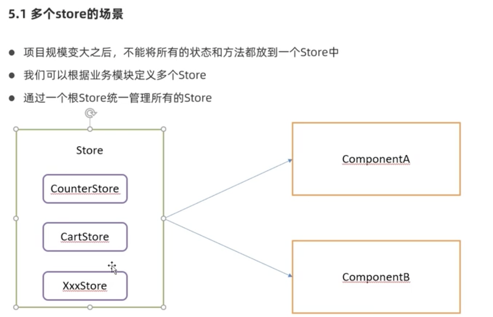
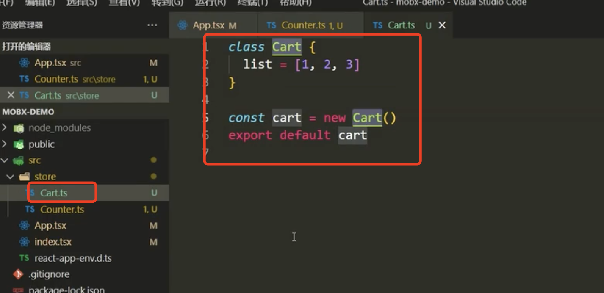
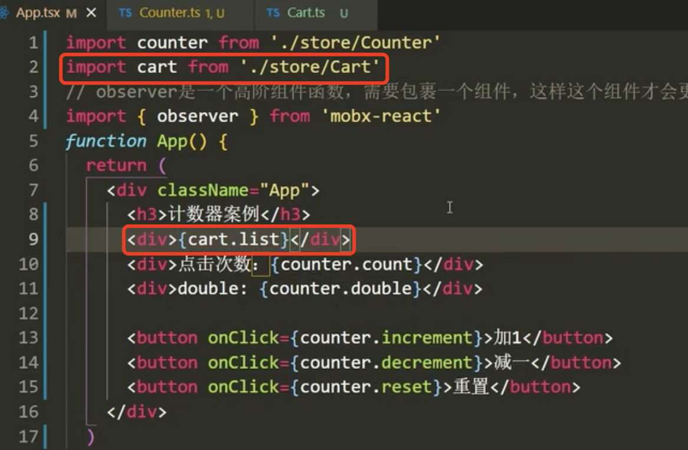
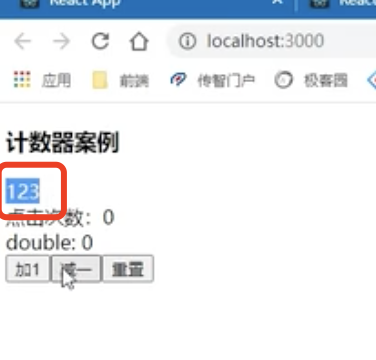
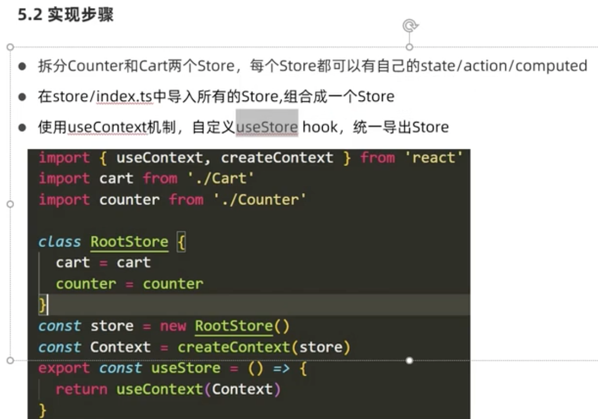
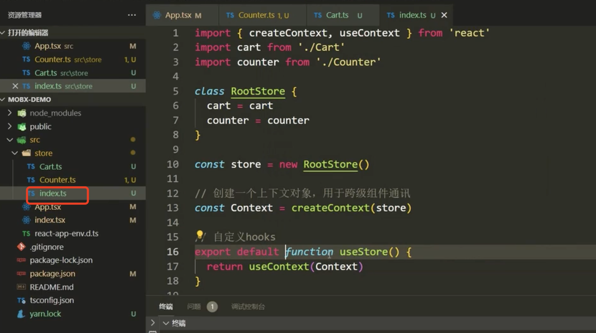
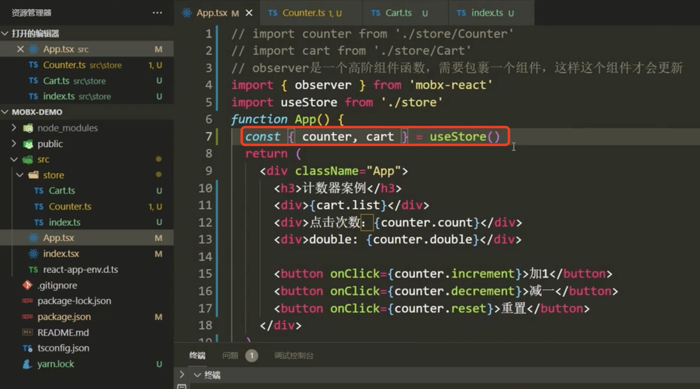

# 6.mobx模块化

​	视频在1小时28分

​	我们在后续的开发中会有很多模块，比如用户，系统各种业务模块等等，我们每个模块都会有数据，因为我们不可能把数据存在一个store里面，那么我们就可以一个模块使用一个store--（这里于redux不同redux只有一个store），当然我们最后会通过一个根store统一管理所有的store。

​	比如我们现在又新增了一个store

​	我们想用这个cart的时候，先引入这个store，然后直接就可以使用cart了

​	显示没有问题

​	但是现在这样使用有一些缺陷，一个模块对应一个store没有问题，但是现在每个store都是独立的，那么说就是将来如果我有个模块要用到多个store，那就会有问题，我们现在就需要react做一些封装，将这些store交给一个根store统一的管理

​	我们这里会使用到useContext跨级组件通讯，就是任意组件都可以用，然后封装一个useStore的hook

​	然后我们可以使用这个hooks方法直接结构出这俩个store

​	那么以后不管那个组件要使用store，我们调一个useStore就可以了

​	这样的话，我们的模块化其实就实现了

​	

​	1小时 40分

