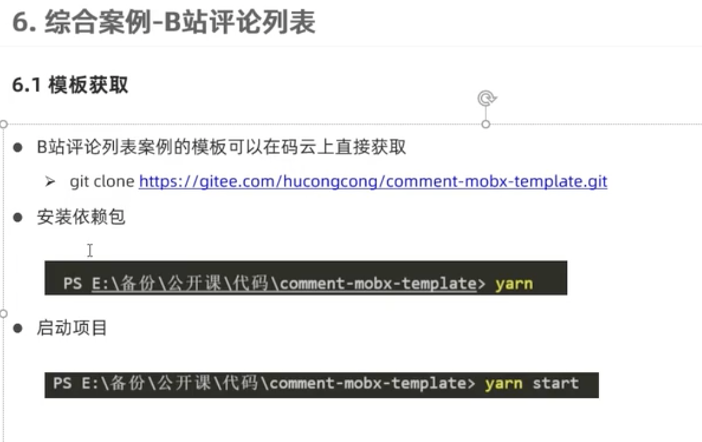
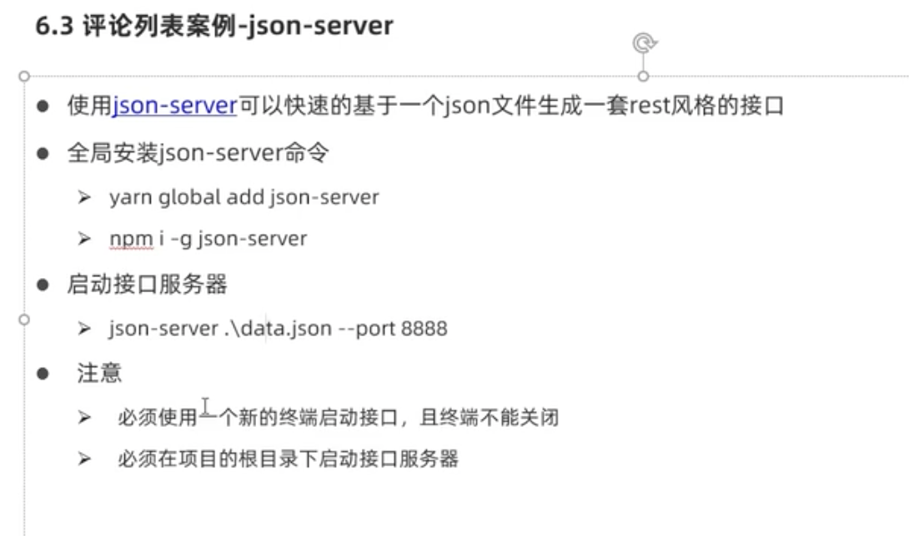
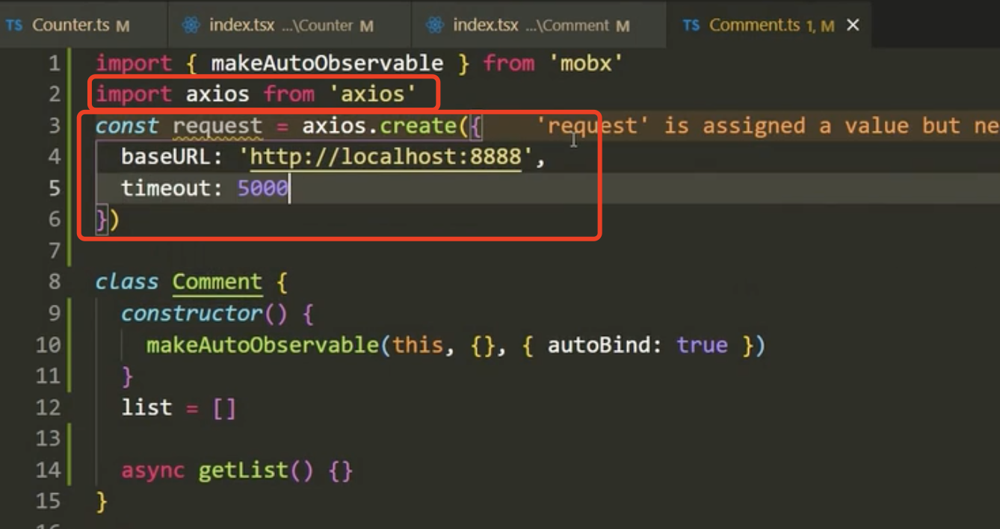
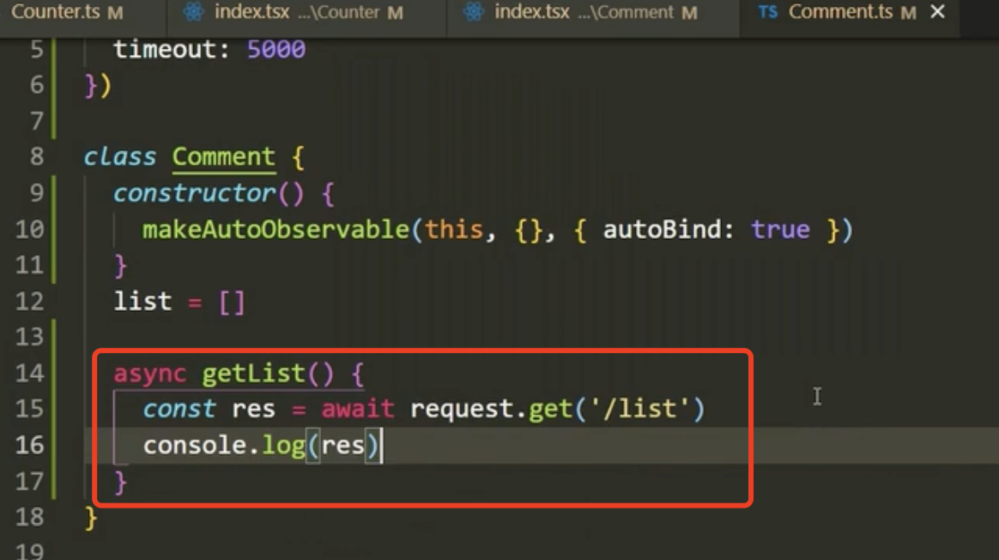
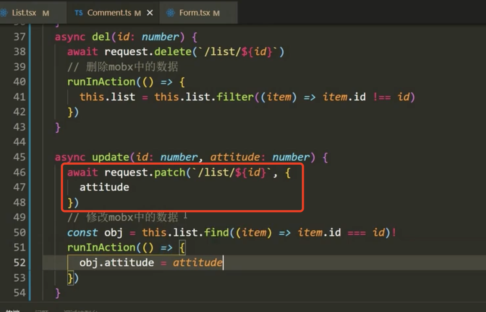
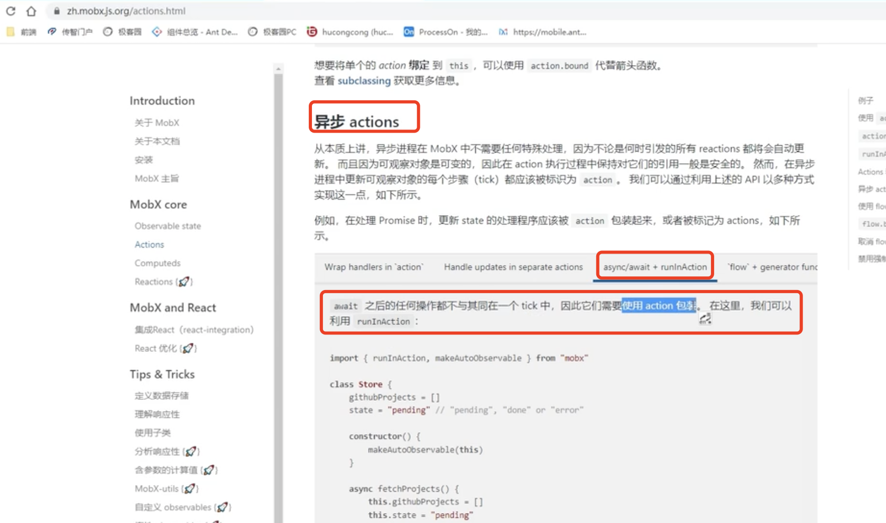

# 7.综合案例

​	视频在1小时40分

​		我们基于模板进行一个模仿B站的评论开发

​	然后我们使用json-server作为后端

引入axios使用他发起请求---设置基础路径baseURL，和超时时间

​	发送请求获取数据列表

​	我们要记住，发完请求如果还需要修改数据的时候就需要使用runInAction方法，因为在异步代码里面改数据就得这么写，否则会报警告提醒

​		因为我们使用mobx改数据是需要在action里面改的，如果不在action里面修改我们就需要加runInAction---有人就有疑问了我现在不就是在action中吗？为什么还得使用runInAction--因为await之后的操作都不与其在同一个tick中，因此需要action包装

​	runInAction方法的官网解释

​		

