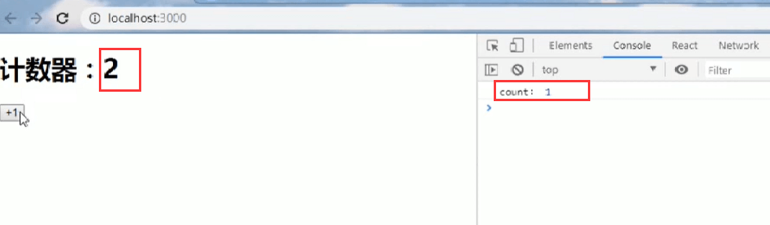
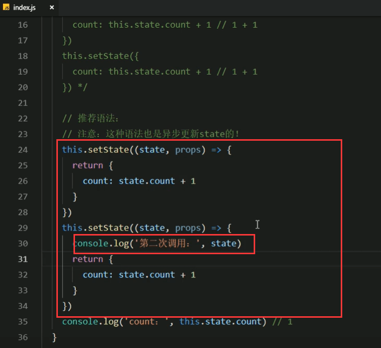
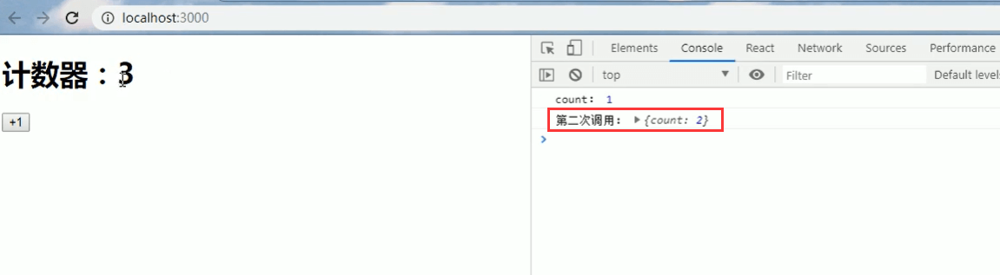
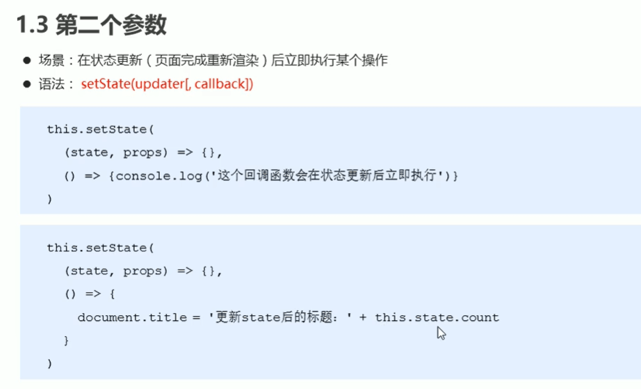
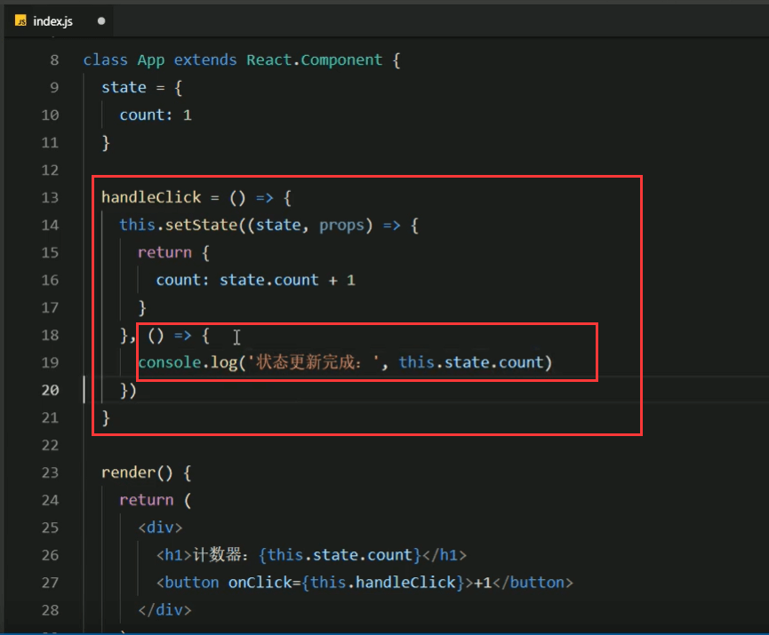
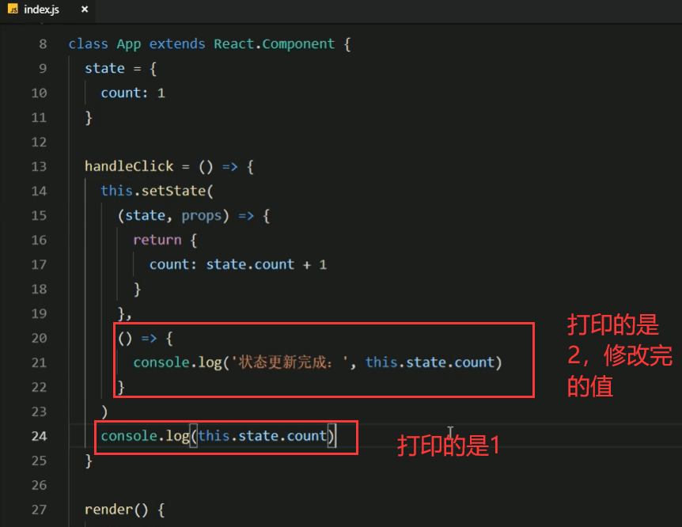
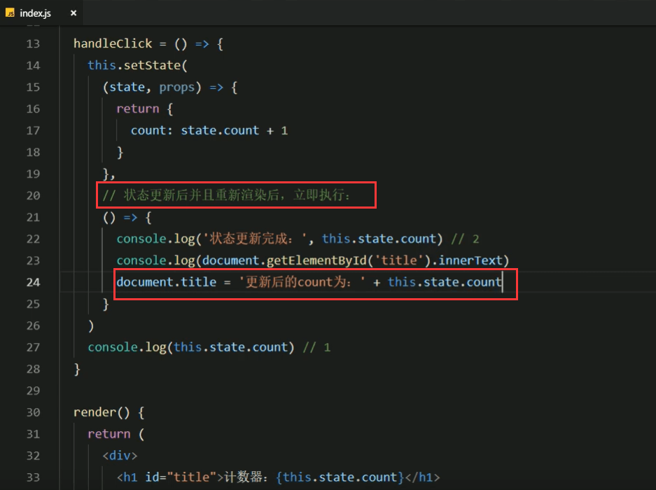

# 2.setState方法的说明

```
	我们在更新的数据的时候调用的setState方法，当我们调用完修改值后立即打印新值，发现还是原来的旧值，那么发现原来他是异步操作的。
```


代码验证：


我们发现并没有及时更新




比如：setState是可以调用多次的，假如我们调用2次


调用俩次结果不应该是3吗？结果是2


因为是异步更新的，所以拿到的值是还没有更新过的值


我们调用了多次setState那么他自动调用render的次数是几次呢？

测试：


发现render是执行了一次


为什么会这么做呢？其实是为了性能的考虑，如果调用一次setState就掉render渲染一次，会很消耗资源的，如果是调用多次setState的话他会进行多次后的合并，然后调用一次render进行渲染展示最终的setState


#### 2.推荐语法


传一个回调函数进来，有2个参数state-代表最新的state，props-代表最新的props

然后再return一个新的对象，将来这个回调函数返回的这个状态就是要更新的对象 了。

通过state就可以拿到最新的值了，就不需要之前this。state的取值了


他也是异步更新的


他和之前的区别就是使用回调函数，那么使用回调函数有什么区别呢？就是如果调用多次的话，每次的新值是最新的，多次调用逻辑上不会发生问题，如果是之前不使用回调的方式，多次调用发现值都是一样的





我们发现第二次调用的state是最新的值，是第一次state处理过的新值了




那么这样写的方式，稍微比之前不使用回调函数的方式复杂了一些，但是这样写符合我们思维方式的逻辑性写代码过程，如果state可能改变多次也是符合要求的。


#### 3.setState的第二个参数

​		如果你希望在状态更新和页面渲染之后 做一些事情的话，可以使用setState的第二个参数











我们看看是在渲染之前还是渲染之后获取到的值，就是先渲染，还是先获取到修改的值再渲染


也就是说拿到的已经是渲染过的数据了


那就说明：是更新完成，并且渲染完成后我们可以使用setState的第二个参数，进行一些操作





标题发生改变


