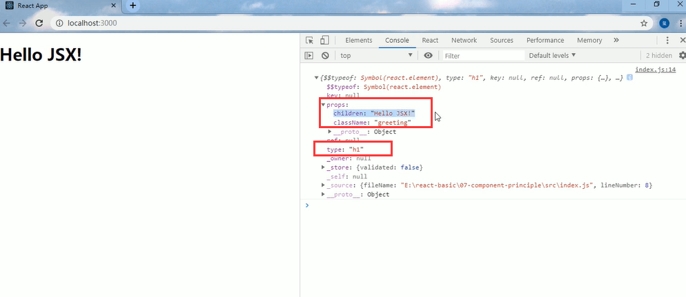

# 3.JSX转化的过程

```
	JSX仅仅是createElement()方法的语法糖--语法糖其实就是简化语法的意思
	
	JSX语法被@babel/preset-react插件编译为createElement()方法
	
	React元素：是一个对象，用来描述你希望在屏幕上看到的内容
	
	
```


代码验证：





##### 2.通过React.createElement（）方式创建元素


生成的结构其实是一样的


