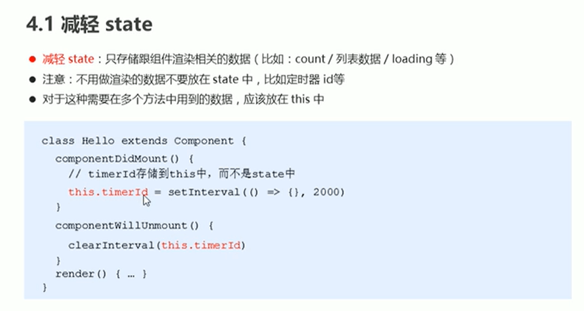
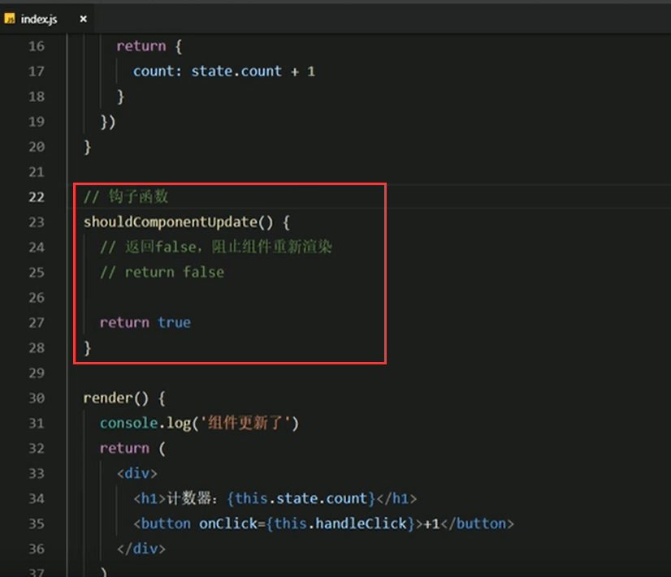
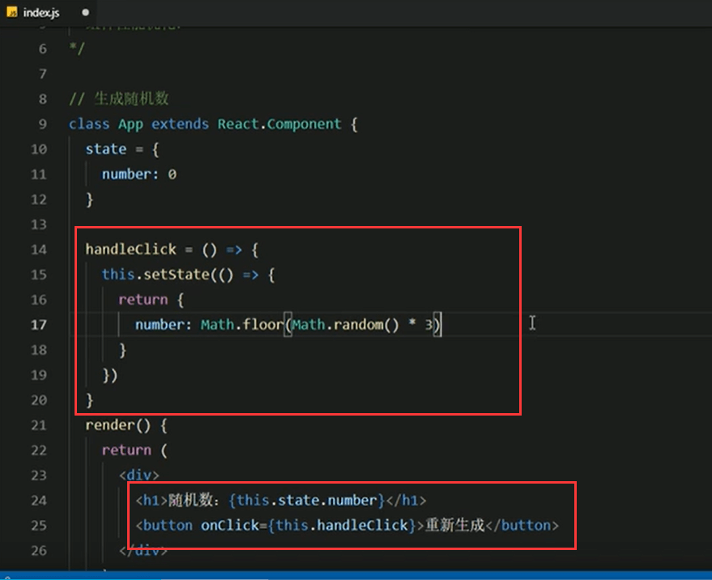
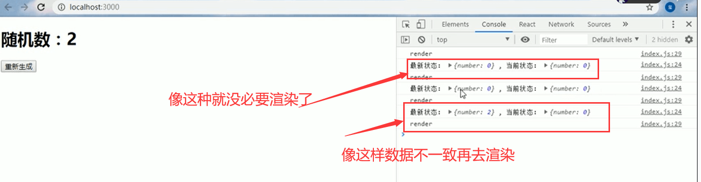
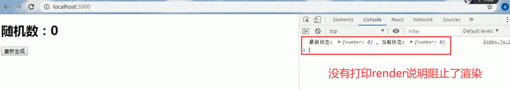
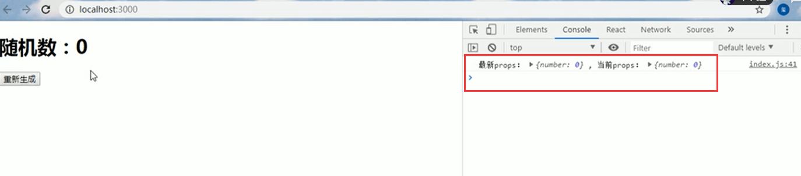
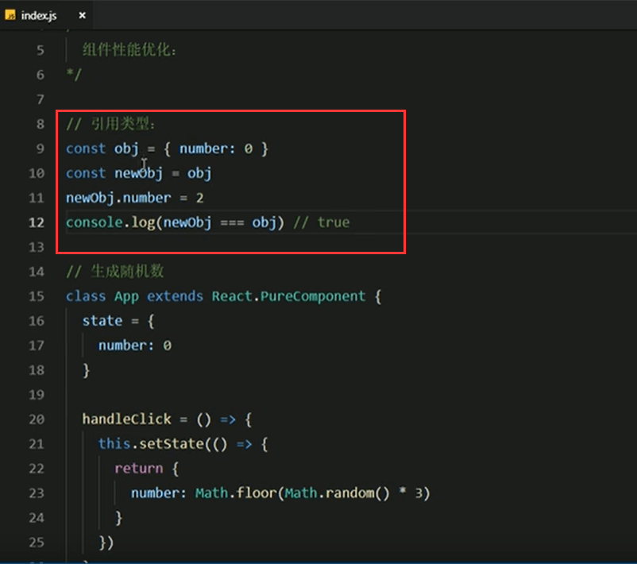
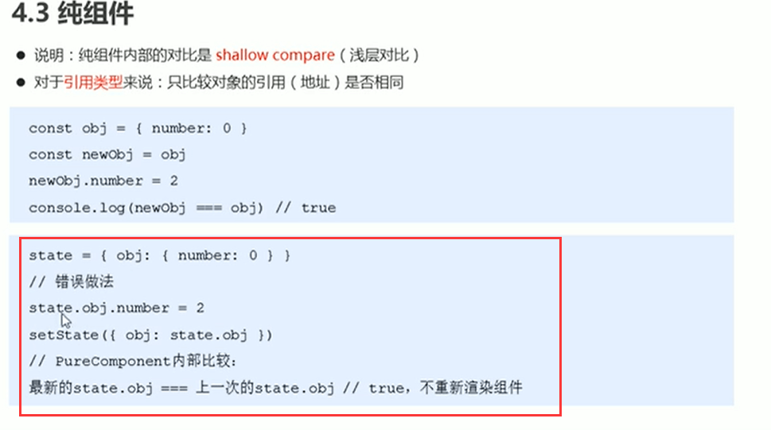

# 5.组件性能优化

### 1.减轻state

### 2.避免不必要的重新渲染

https://www.bilibili.com/video/BV14y4y1g7M4?p=82&spm_id_from=pageDriver

这个钩子函数的俩个参数

 

如果是用this.state取值的话获取的是旧值--就是更新前的数据值

### 3.避免不必要的重新渲染2-案例

案例生成随机数0-2

我们发现，在重新点击的时候有可能数值是一样的，那么其实就没有必要重新渲染了

我们进行优化

可以优化为一行代码

小结：

### 3.通过props防止重复渲染

改造一下代码，新建一个组件

通过props判断

没有更新

### 4.纯组件

比较的结构是true，使用===，因为对象比较的是引用地址，他们的引用地址是一样的

注意这种类型比较的错误情况

正确的做法是：

...this.state.obj其实就是对象的所有属性，number:** 其实就是修改this.state.obj对象的number的值，然后再setState将新对象赋值给旧的对象

