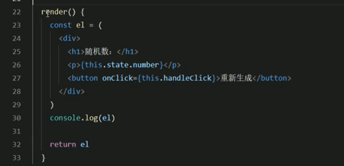
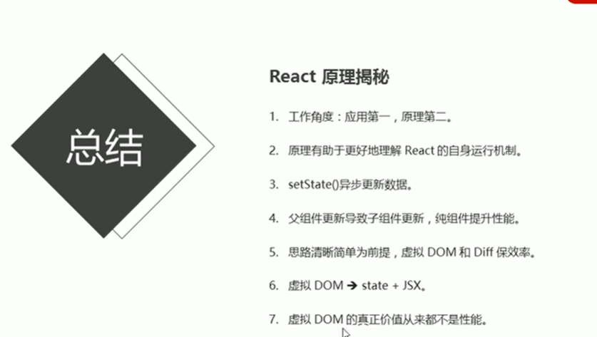

# 6虚拟DOM和Diff算法

**让我们来了解一下React框架内部的核心内容原理**

#### 虚拟DOM和Diff算法：

**虚拟DOM**

虚拟dom就是用来描述html内容的。

**执行过程**

通过上图可以看出数据变化后，会重新生成一个虚拟dom树，然后虚拟dom树会新旧比较找不同，这个就是Diff算法，然后找到需要更新的内容。

​	5.最终，React只将变化的内容更新（patch）到DOM中，重新渲染到页面（只把变化的地方重新渲染，这样就做到了部分渲染的工作了）

#### 代码演示：

其实每次调用render方法的时候，都会先执行diff算法，找不同进行部分更新，如果没有不同是不更新的，图中el其实就是虚拟dom对象，render方法的调用并不意味着浏览器的重新渲染 

#### 总结：

虚拟Dom最大的价值是让React脱离了浏览器环境的束缚，虚拟dom并不是真正的dom而他仅仅是JS里面的对象，所以说只要可以运行js的地方就可以运行react了，那么这样的话我们的react就可以脱离浏览器运行的环境来运行了。这也为React跨平台提供了一个应用的保障。

https://www.bilibili.com/video/BV14y4y1g7M4?p=89&spm_id_from=pageDriver

!

