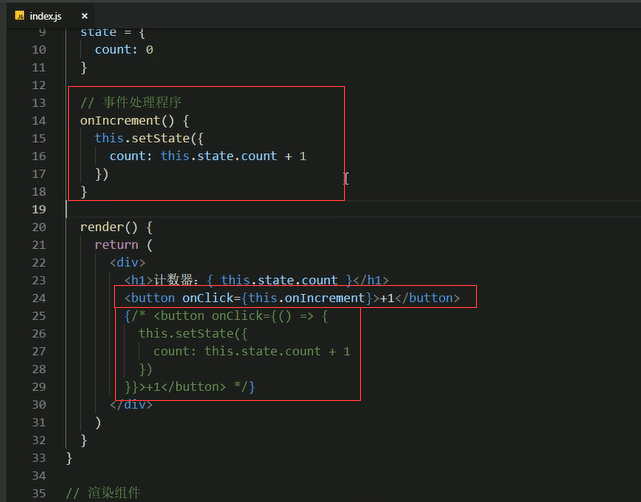
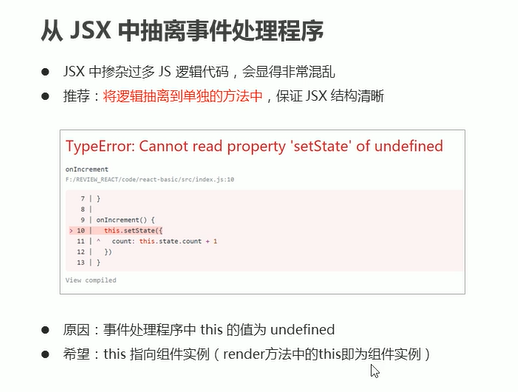
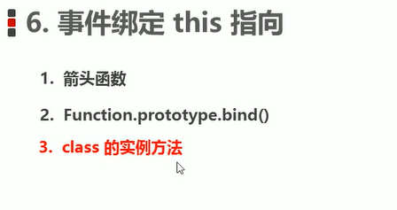
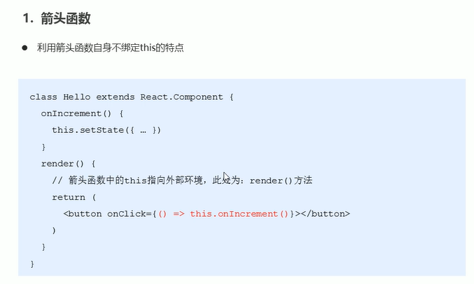
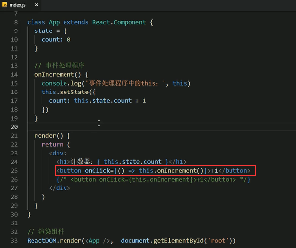
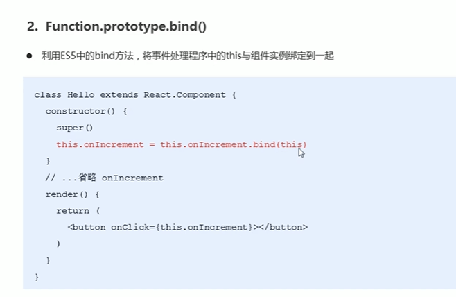
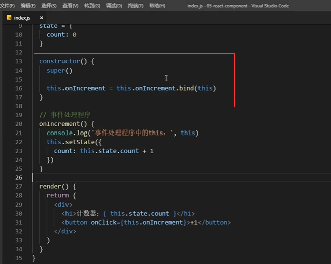
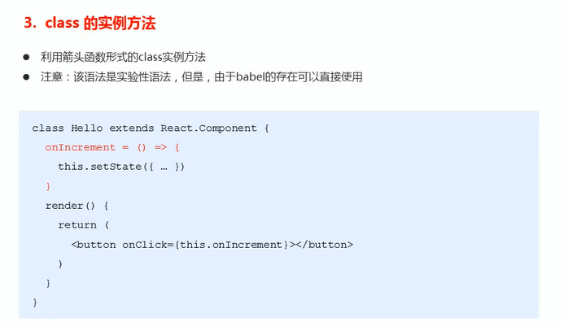
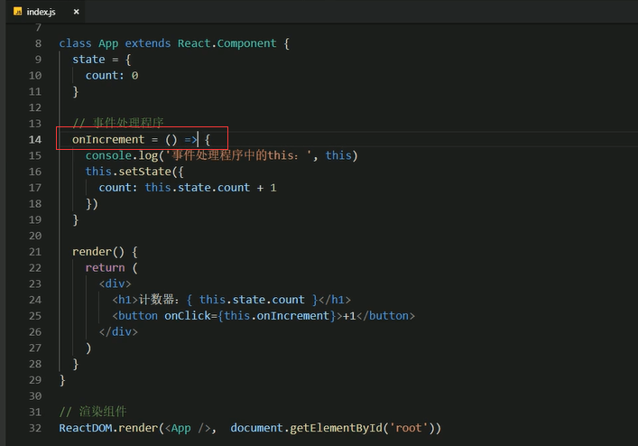
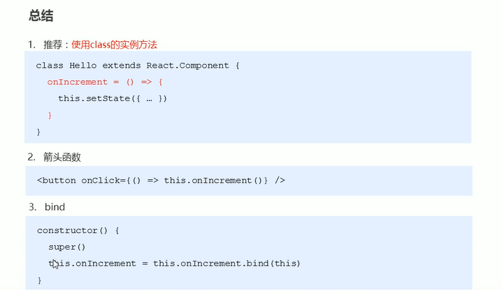

# 12.组件中的state和setState

**将事件处理抽离出去**

这样会发生报错：undefined

#### 解决this绑定指向的问题

视频地址https://www.bilibili.com/video/BV14y4y1g7M4?p=30&spm_id_from=pageDriver

**使用箭头函数解决this指向的问题**

箭头函数里面的this指的是render，而onIncrement函数里面的this是指向使用者的，相当于指向了箭头函数，那么也就相当于指向了render，render里面是有setState方法的，这样就不会发生错误了。

 

#### 第二种方式利用bind的方式解决this指向的问题

#### 第三种方式class的实例方法解决this指向的问题

