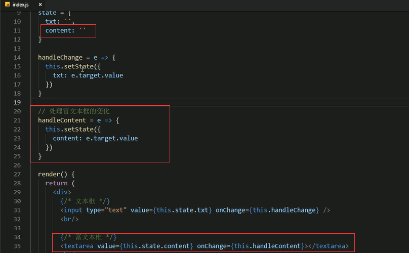
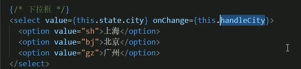
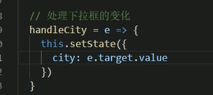
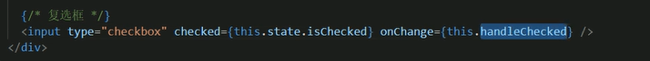
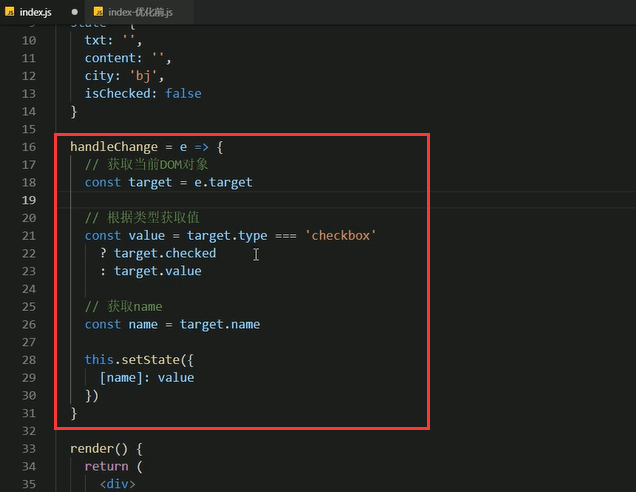
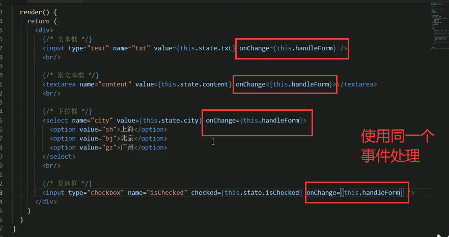
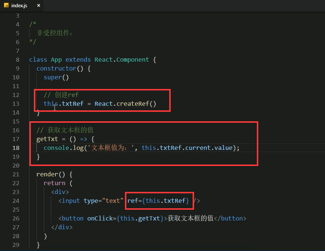

# 13.表单的处理

#### 在React中有俩种表单处理的方式

#### 1.受控组件

		最终是由React的state来接管了表单的value的值，无论是表单的还是非表单的都交给state来处理，这样就符合React的思想了。我们将这种受到React控制的叫做受控组件，因为这个表单的元素受到了React的控制。

##### 步骤：

##### 代码实现：

	获取当前输入值是 e.target.value 他是事件对象，通过事件对象可以获取到当前输入的值

通过React插件可以看清楚state中的变化

##### 受控组件其他示例（文本框，富文本框，下拉框，复选框）

**富文本框**

**下拉框，需要注意区别**

	注意这个city的状态值是默认选中的

**复选框**

注意获取当前值的方式 是 e.target.checked

##### 多表单元素优化

**代码实现**

#### 2.非受控组件（DOM方式）

